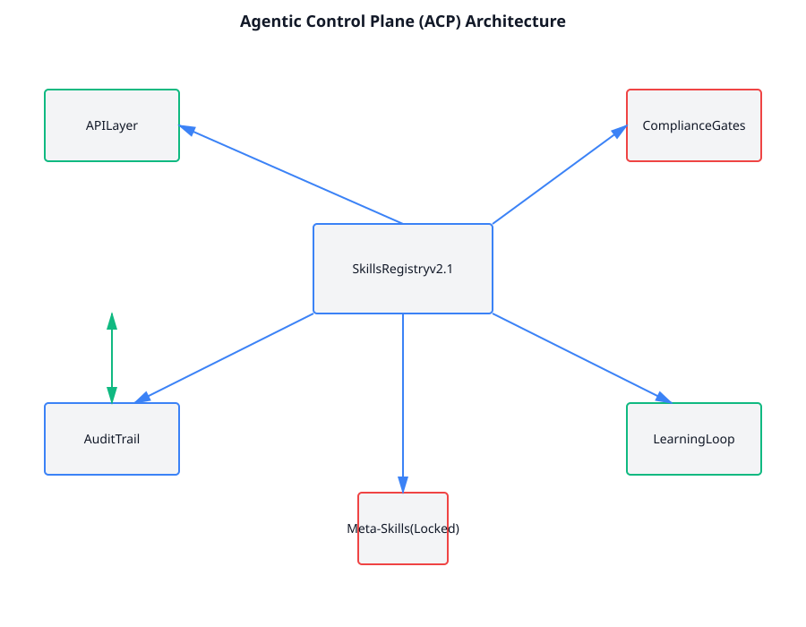
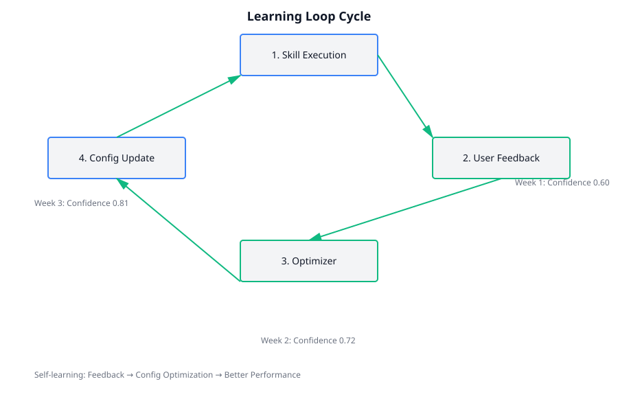
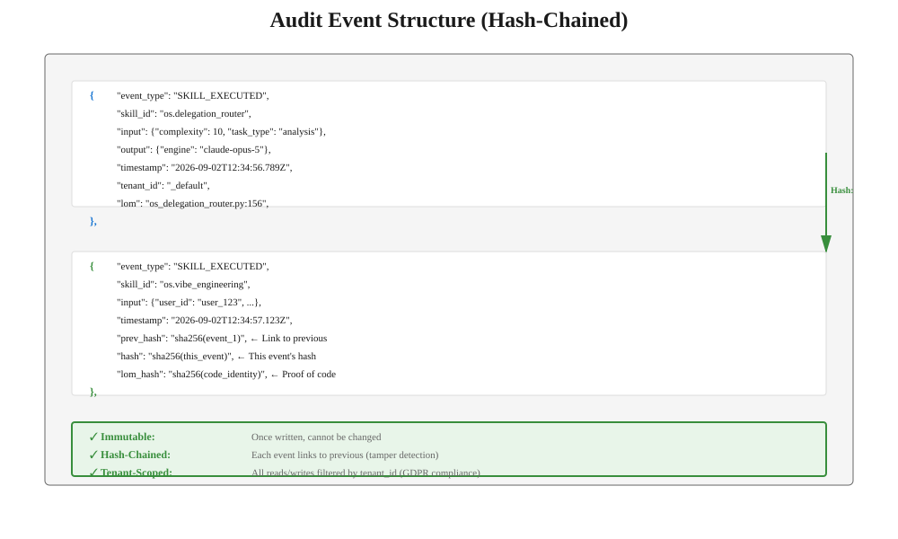
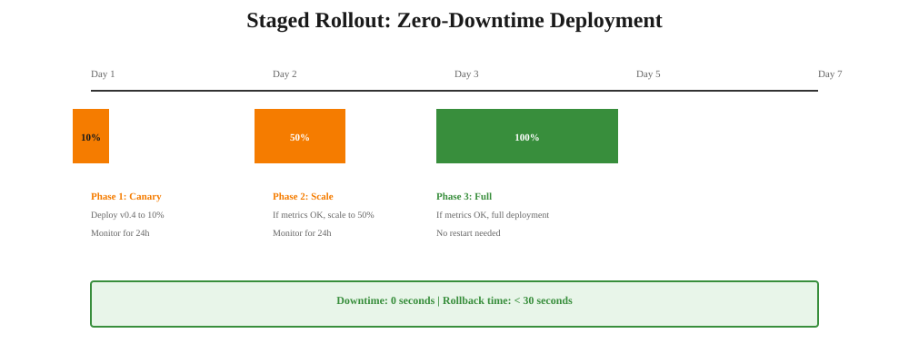
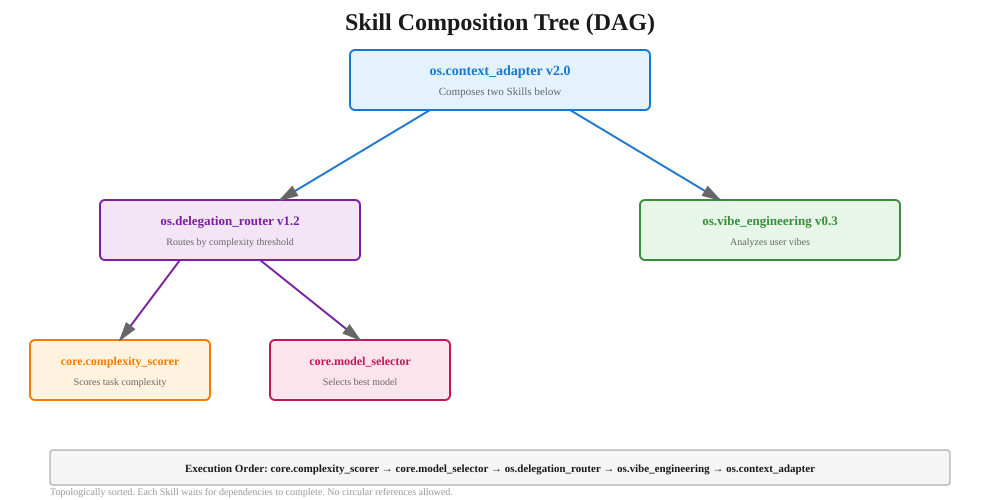

# CorvinOS: An Agentic Operating System

[](https://github.com/CorvinLabs/CorvinOS)
[](LICENSE)
[](https://www.python.org/downloads/)

## What is CorvinOS?

**CorvinOS** is a self-learning, agentic operating system where every decision is made by a **versioned, auditable Skill**. Instead of hardcoded features or buried feature flags, CorvinOS runs Skills — composable programs that learn from feedback, improve over time, and log every decision for compliance.

### Core Properties

| Property | Traditional OS | CorvinOS |
|---|---|---|
| **Control** | Hardcoded layers (L1–L44) | Versioned Skills (os.routing v1.2, etc.) |
| **Updates** | Restart required | Zero-downtime Skill swap |
| **Debugging** | "Why did it do that?" unclear | Complete audit trail (hash-chained proof) |
| **Learning** | Static forever | Feedback → optimize → converge |
| **Compliance** | Manual tracking | GDPR + EU AI Act built-in |

---

## 🚀 Quick Start

### What is a Skill?

A **Skill** is a versioned program that:
- ✅ Has a unique ID (`os.delegation_router`)
- ✅ Has a version (`v1.2`, upgradable instantly)
- ✅ Takes input, produces output
- ✅ Gets audited automatically (every execution logged)
- ✅ Learns from feedback (config optimized, no code change)
- ✅ Composes with other Skills (like Python imports)

### Running a Skill

```python
from core.skills.skill_registry_phase1 import skill_registry

# Execute a Skill
result = skill_registry.execute("os.delegation_router", {
    "task_type": "analysis",
    "complexity": 10
})
print(result)  # Output: {"engine": "claude-opus-5"}

# Check audit trail (auto-logged)
from core.skills.audit_backend import audit_backend
events = audit_backend.query(skill_id="os.delegation_router", limit=1)
print(events[0])
# Output: {
#   "event_type": "SKILL_EXECUTED",
#   "skill_id": "os.delegation_router",
#   "input": {...},
#   "output": {...},
#   "timestamp": "2026-09-02T12:34:56.789Z",
#   "hash": "sha256(...)",
#   "prev_hash": "sha256(...)"
# }
```

### Creating a Custom Skill

```python
from core.skills.skill_interface import Skill

class MyRoutingSkill(Skill):
    id = "my.routing"
    version = "1.0"
    description = "Custom routing based on priority"
    origin = "community"
    
    def execute(self, input: dict) -> dict:
        priority = input.get("priority", "normal")
        if priority == "high":
            return {"engine": "claude-opus-5"}
        else:
            return {"engine": "claude-haiku-4-5"}

# Register it
registry.register(MyRoutingSkill())

# Use it
result = registry.execute("my.routing", {"priority": "high"})
```

---

## 📚 Documentation (Start Here)

| Guide | What You'll Learn | Read Time |
|---|---|---|
| **[Skills System](docs/skills-system.md)** | Core Skill concepts, lifecycle, composition model | 15 min |
| **[ACP Vision](docs/acp-vision.md)** | Why L-Layers became Skills, future roadmap (Phases 1–3) | 20 min |
| **[Learning Loop](docs/learning-loop.md)** | Feedback types, optimizer, convergence, confidence scoring | 12 min |
| **[Audit Trail](docs/audit-trail.md)** | Immutable event logging, hash-chain, GDPR compliance | 18 min |
| **[Deployment Guide](docs/deployment-guide.md)** | Staged rollout, canary, zero-downtime deployments | 10 min |
| **[Skills API Reference](docs/skills-api-reference.md)** | Registry API, execution model, error handling | 15 min |
| **[Composable Programs](docs/composable-programs.md)** | Writing Skills that call other Skills (DAG validation) | 14 min |
| **[Big Bang Migration](docs/big-bang-migration.md)** | Replacing 4,900 LOC of feature flags with Skills | 16 min |
| **[Complete Index](docs/INDEX.md)** | All topics, cross-references, FAQ | 5 min |

---

## 🏗️ Architecture



**Three layers:**

1. **Skills Registry** — Central registry of all Skills (os.delegation_router, os.context_adapter, etc.)
2. **Support Systems** — Audit trail, learning loop, versioning, metadata
3. **Compliance Meta-Skills** — Audit (immutable), consent (fail-closed), house-rules (locked)

---

## 🔄 The Learning Loop

Skills improve automatically through user feedback:



```
Week 1: Skill deployed (v1.0, confidence = 0.60)
        ↓
        User feedback: "That routing was slow"
        ↓
        Optimizer reads feedback
        ↓
        Optimizer: "Lower the complexity threshold?"
        ↓
        Config adjusted: threshold 0.65 → 0.60
        ↓
Week 2: Same Skill v1.0, better (confidence = 0.87)
        ↓
        No code commit. No restart. Just learned.
```

---

## 🛡️ Compliance Built-In

Every Skill decision is auditable and compliant:



- **GDPR Art. 30:** Complete decision log (who, what, when)
- **GDPR Art. 32:** Hash-chained, immutable, tenant-isolated
- **EU AI Act Art. 5:** Skill manifests public + transparent
- **EU AI Act Art. 50:** LoM binding proves code identity (no spoofing)

---

## 🚀 Zero-Downtime Deployment

Deploy Skill changes without restarting:



```bash
# Canary 10% (monitor for 24h)
corvin skills deploy os.vibe_engineering v0.4 --canary 10%

# Scale 50% (monitor for 24h)
corvin skills scale os.vibe_engineering 50%

# Full deployment (monitor for 1h)
corvin skills scale os.vibe_engineering 100%

# Downtime: 0 seconds
# Rollback: < 30 seconds (just pin old version again)
```

---

## 📊 Skill Composition (DAG)

Skills call other Skills, building up complex behaviors:



```python
class ContextAdapter(Skill):
    dependencies = ["os.delegation_router", "os.vibe_engineering"]
    
    def execute(self, input: dict) -> dict:
        # Call Skill 1
        vibe_priority = registry.execute("os.vibe_engineering", input)
        
        # Use result in Skill 2
        input_with_priority = {**input, "priority": vibe_priority}
        engine = registry.execute("os.delegation_router", input_with_priority)
        
        return {"engine": engine, "priority": vibe_priority}
```

Benefits:
- ✅ Single change propagates (update os.vibe_engineering → ContextAdapter sees it)
- ✅ Versioning per-Skill (no monolithic updates)
- ✅ Reusable components (write once, compose many ways)
- ✅ DAG validation (no circular references)

---

## 🎯 The ACP Vision: Replacing All L-Layers with Skills

**Phase 1 (Weeks 1–4):** Foundation ✅
- L5 Routing → `os.delegation_router v1.2` (COMPLETE)
- L10 Context → `os.context_adapter v2.0` (COMPLETE)

**Phase 2 (Weeks 5–10):** Learning Loop
- L16 Security → `os.security_orchestrator`
- L22 Workflow → `os.workflow_optimizer`

**Phase 3 (Weeks 11–24):** Scale & Ecosystem
- L34 Data Flow → `os.flow_guard`
- Marketplace integration
- Community skill contributions

**End Goal:** Every L-layer is a Skill | Every Skill is learnable | Every decision is auditable

---

## 📖 Examples

### Example 1: Simple Routing Skill

```python
class SimpleRouter(Skill):
    id = "examples.simple_router"
    version = "1.0"
    
    def execute(self, input: dict) -> dict:
        if input["urgency"] == "high":
            return {"engine": "claude-opus-5"}
        else:
            return {"engine": "claude-haiku-4-5"}

registry.register(SimpleRouter())
result = registry.execute("examples.simple_router", {"urgency": "high"})
```

### Example 2: Skill That Composes Others

See **[Composable Programs](docs/composable-programs.md)** for detailed examples.

### Example 3: Adding Feedback & Tracking Confidence

See **[Learning Loop](docs/learning-loop.md)** for feedback integration.

---

## 🤝 Contributing

Want to write a custom Skill? Follow these steps:

1. **Read** [Skills API Reference](docs/skills-api-reference.md) — API contracts
2. **Design** your Skill using [Composable Programs](docs/composable-programs.md) patterns
3. **Test** — E2E test proving it's called and audited
4. **Submit** with Skill manifest + audit proof + compliance checklist

All contributions must:
- ✅ Implement `Skill` interface
- ✅ Include E2E proof (real execution + audit event)
- ✅ Pass compliance checks (GDPR + EU AI Act)
- ✅ Be documented (1-page Skill summary + ADR if structural change)

---

## 🔍 Debugging & Observability

**View all decisions for a task:**
```bash
corvin audit show-task <task_id>
```

**Verify chain integrity:**
```bash
corvin audit verify-chain --tenant=_default
```

**Trace a Skill decision:**
```bash
corvin audit trace skill os.delegation_router --task=<task_id>
```

**Export compliance report:**
```bash
corvin audit export --tenant=_default --format=pdf --since=2026-09-01
```

---

## 🛠️ Installation & Setup

```bash
# Clone
git clone https://github.com/CorvinLabs/CorvinOS.git
cd CorvinOS

# Install
pip install -e .

# Run tests
pytest tests/ -v

# Deploy locally
corvin-serve  # Starts console at localhost:8765
```

---

## 📜 License

Apache 2.0 (see [LICENSE](LICENSE))

---

## 🤔 FAQ

**Q: What if a Skill fails?**  
A: Error is logged to audit trail, re-raised to caller. Caller handles exception. No silent failures.

**Q: Can I update a Skill without restarting CorvinOS?**  
A: Yes! Register a new version. Pinned dependencies use the old version until you explicitly upgrade.

**Q: What if two Skills depend on each other (circular)?**  
A: Dependency DAG is validated at registration. Circular dependencies are rejected immediately.

**Q: Is there a way to disable a Skill?**  
A: Yes, but only for bundled/installed Skills (not compliance meta-Skills). Use `registry.disable()`.

**Q: How do I know if a Skill is learning correctly?**  
A: Check confidence score: `registry.get("skill_id").get_confidence()`. Monitor S-curve convergence.

**Q: Can I write a Skill that calls LLMs?**  
A: Yes! Compose with `core.llm_executor` or write deterministic Python + call LLM on demand.

---

## 📞 Support

- **Docs:** [Full Documentation Index](docs/INDEX.md)
- **Issues:** [GitHub Issues](https://github.com/CorvinLabs/CorvinOS/issues)
- **Community:** [Discord](https://discord.gg/corvinos)

---

**Last Updated:** 2026-09-02  
**Phase:** 1 (Big Bang Complete, Skills-Only)  
**Status:** Production Ready
