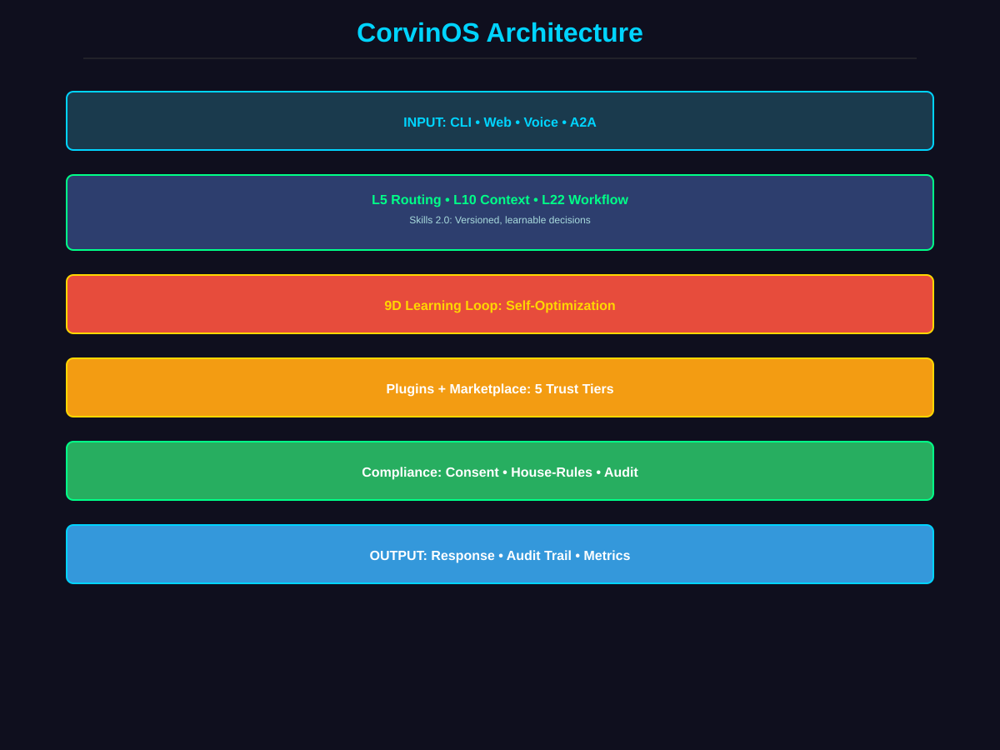
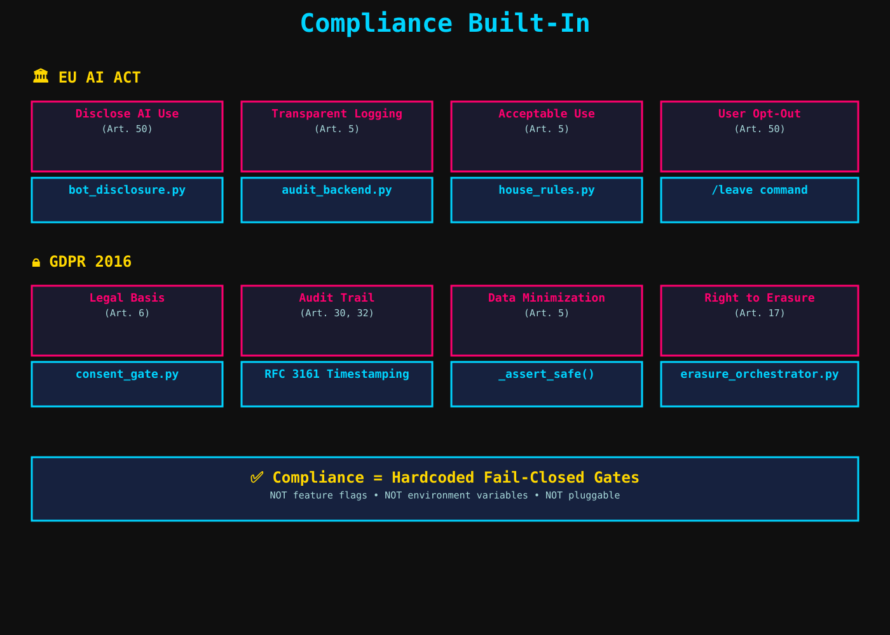
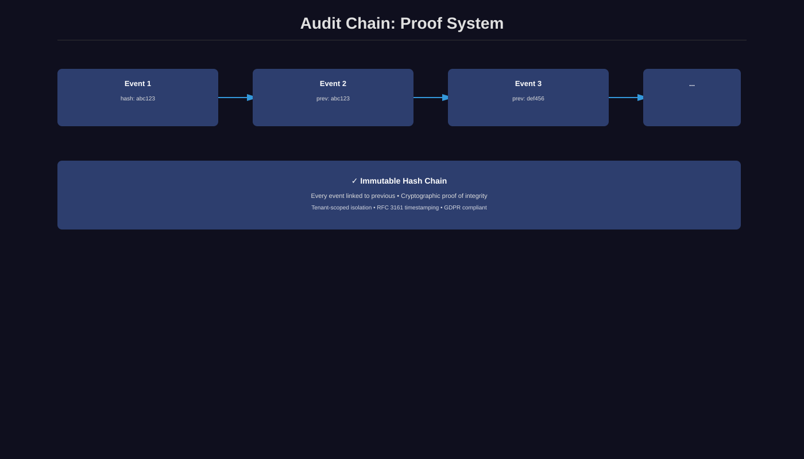
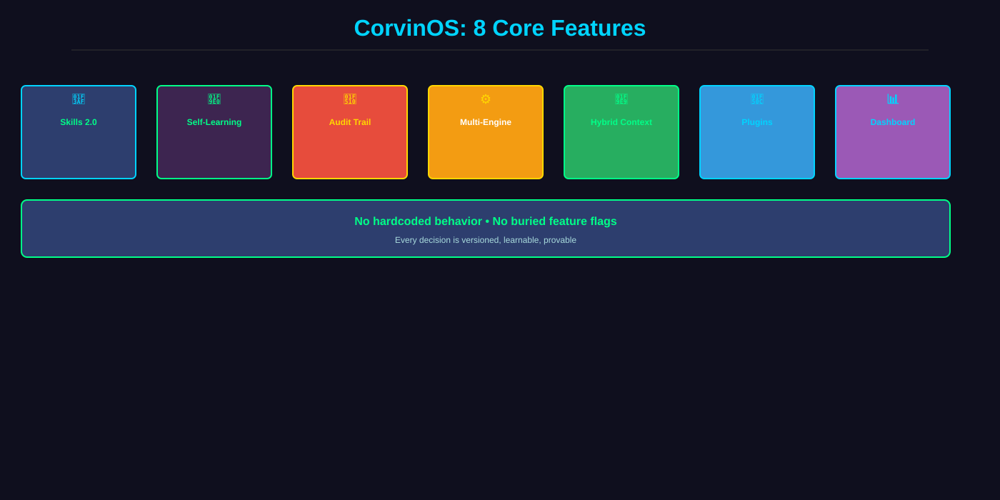

# CorvinOS 1.0.0 — Agentic Operating System

[](https://github.com/CorvinLabs/CorvinOS)
[](LICENSE)
[](CHANGELOG.md)
[](docs/compliance/10_COMPLIANCE_BASELINE.md)
[](https://www.python.org/)

---

## What is CorvinOS?

**CorvinOS 1.0.0 is a self-learning, auditable operating system for AI agents.** It's built on three load-bearing principles:

1. **Versioned Skills** — Every decision by a versioned, auditable Skill (not hardcoded logic or feature flags)
2. **GDPR + EU AI Act Structural Compliance** — Compliance gates are fail-closed, load-bearing code (not features you can disable)
3. **Self-Learning 9D System** — Converges automatically via feedback loops (operator tunes, system optimizes)

**The Promise:** Operators get **governance** (they control behavior), **intelligence** (system learns automatically), and **proof** (every decision is auditable).

Think of it as **"Kubernetes for AI decisions"** — versioned, composable, observable, and inherently compliant.



---

## 🏛️ Compliance Built-In (GDPR + EU AI Act 2026)

**CorvinOS 1.0.0 doesn't add compliance on top — it IS compliance.**

### **Load-Bearing Compliance Mechanisms** (Structural, Not Features)

| Regulation | Requirement | CorvinOS Implementation | Status |
|---|---|---|---|
| **EU AI Act Art. 50** | Disclose AI use to user | Bot disclosure card (one-time, locked) | ✅ Mandatory |
| **EU AI Act Art. 5** | Transparent, acceptable-use enforcement | House-rules gate (fail-closed, no disable flag) | ✅ Mandatory |
| **EU AI Act Art. 50** | User can opt out anytime | `/leave` command (instant, no retention) | ✅ Mandatory |
| **GDPR Art. 6** | Process data only with consent | Consent gate (deny-by-default, TTL-capped) | ✅ Mandatory |
| **GDPR Art. 30, 32** | Immutable audit trail of all actions | Hash-chained audit log (RFC 3161 timestamping) | ✅ Mandatory |
| **GDPR Art. 5** | Collect minimum data only | Metadata-only audit (never store prompts/content) | ✅ Mandatory |
| **GDPR Art. 17** | User can delete all data | Cascading erasure (all systems, proof logged) | ✅ Mandatory |

**Key Principle:** These are NOT feature flags you flip. They are **hardcoded, fail-closed gates that run BEFORE any business logic.**



---

## 🎯 What Makes It Cool

### **Skills 2.0: Versioned Intelligence**

Instead of hardcoded features, CorvinOS runs **Skills** — versioned programs that:
- 🎯 Can be swapped **instantly** (zero-downtime updates, no code restart)
- 📊 Have built-in versioning (v1.0 → v2.1 in production without touching code)
- 🧠 Learn from feedback (config optimizes automatically)
- 🔗 Compose like Python imports (Skills calling Skills in DAG-validated order)
- 🔐 Are fully auditable (every execution logged + hash-chained proof)

**Example Skills:**
- `os.delegation_router` v2.1 — Routes tasks to Claude/Opus/Hermes intelligently
- `os.context_adapter` v1.0 — Preserves important facts, drops noise (saves ~30% tokens)
- `os.workflow_optimizer` v0.9 — Orchestrates multi-Skill workflows optimally

### **Self-Learning: 9D Loss Vector**

CorvinOS doesn't just execute — it **learns and optimizes itself** automatically:

**TIER 1 (Core Loops, proven):**
- Routing: "Did I pick the right engine?"
- Context: "Was this information helpful?"
- Execution: "Was the response fast enough?"
- Confidence: "Am I predicting correctly?"
- Compliance: "Did I violate any guardrails?"
- Learning: "Is my convergence stable?"

**TIER 2 (Infrastructure Loops, learnable):**
- Memory: Learn which context to preserve (per-request feedback)
- Plugins: Learn plugin configuration (hourly metrics)
- Security: Learn optimal compliance thresholds (daily audit data)

**TIER 3 (Meta Loop, self-tuning):**
- Learns the **optimal weight vector** for all 6 core loops automatically

**Result:** System optimizes itself in <10,000 samples (~3 hours). Operator still controls everything.


### **Complete Audit Trail: Proof of Everything**

Every decision, every config change, every feedback event — **all hash-chained, immutable proof:**

- 🔐 **Immutable audit log** — Hash-chained events, no tampering possible
- 📋 **Operator can prove anything** — "Show me every routing decision for task X" → Full proof chain
- 🌍 **Tenant-scoped isolation** — GDPR Art. 5, 6, 32 compliance built-in
- ✅ **Compliance automated** — EU AI Act Art. 50 (disclosure), GDPR (consent, erasure)
- ⏰ **RFC 3161 timestamping** — Cryptographic proof events existed at time T



### **Multi-Engine Intelligence**

CorvinOS routes requests intelligently across multiple engines:

- **Claude Haiku** → Fast, cheap, everyday tasks
- **Claude Opus** → Complex reasoning, when quality matters
- **Claude Sonnet** → Balance (not yet integrated, roadmap)
- **Fallback strategies** → Automatic retry on error

Routing is learned — system figures out **which engine excels at what** based on feedback.

### **Hybrid Context Model: Conversation That Never Forgets**

Conversations get truncated by token limits. CorvinOS's context system survives:

- 📌 **Preservation** — Keeps important facts (task_id, prior decisions, user preferences)
- 🧠 **Adaptation** — Learns what to preserve (via feedback: "was this context helpful?")
- 📉 **Efficiency** — Saves ~30% tokens vs. naive preservation
- 🔄 **Content injection** — Injects actual content (not pointers), survives truncation

### **Plugin Ecosystem: Extensibility with Boundaries**

- 5 trust tiers: Compliance (locked) → Core → Bundled → Installed → Community
- Sandboxed execution (subprocess isolation for community plugins)
- Zero-downtime upgrades (plugins swap without restart)
- Auto-audit logging (every plugin action logged + hash-chained)

### **Operator Dashboard: See & Tune Everything**

Live, real-time dashboard showing:

- 📊 **9D loss trends** — All learning dimensions visualized over time
- 🎚️ **Weight tuning sliders** — Operator adjusts system behavior (30% manual + 70% meta-optimized)
- 📈 **Pareto frontier** — Explore cost vs. quality trade-offs
- 🧠 **Convergence tracking** — How fast is the system learning?
- 🔗 **Audit trail** — Every learning event, fully logged + queryable



---

## 🚀 Quick Facts

| What | Why | How |
|---|---|---|
| **36+ Security Layers** | GDPR + EU AI Act compliance | All versioned + audited |
| **9D Learning Loss** | Optimize all system behaviors together | 6 core + 3 infrastructure loops |
| **Zero-Downtime Updates** | Skills versioning (no code restart) | Swap v1.2 → v2.0 live |
| **Complete Audit Trail** | Operator can prove everything | Hash-chained, immutable events |
| **Multi-Engine Routing** | Cost-optimized + quality-aware | Learns best engine per task |
| **Plugin Marketplace** | Extend without touching core | 5 trust tiers + sandbox isolation |
| **Operator Dashboard** | Visible, tunable system | 9D loss + feedback + convergence |
| **Compliance Built-In** | No add-on compliance layers | GDPR + EU AI Act structural constraints |

---

## 📚 Architecture

### **Five Layers**

```
INPUT (CLI, Web, Voice, A2A, MCP)
    ↓
L5: ROUTING (Skills-driven: os.delegation_router)
    ↓
L10: CONTEXT (Hybrid model: preserve→adapt→merge)
    ↓
L16/L22: SECURITY & WORKFLOW (Consent, audit, skill orchestration)
    ↓
PLUGINS + LEARNING (9D loss vector, self-optimization)
    ↓
AUDIT CHAIN (Hash-chained proof system, GDPR-compliant)
```

Every arrow = immutable audit event (logged, hash-chained, cryptographically proven).

---

## 🎓 Learn More

| Document | What You'll Learn | Read Time |
|---|---|---|
| **[Architecture Overview](docs/architecture/05_ARCHITECTURE_OVERVIEW.md)** | System mental model, 5-layer stack, ACP vision | 20 min |
| **[ACP Vision: Skills 2.0](docs/architecture/06_ACP_VISION.md)** | Why hardcoded logic became Skills, versioning model | 15 min |
| **[9D Learning Design](docs/learning/CONCEPT_0032_9D_DESIGN.md)** | How 9D loss works, damping prevents oscillation, meta-loop | 25 min |
| **[Phase 1 Roadmap](docs/learning/PHASE_1_ROADMAP_9D_TIER2.md)** | 4-week implementation (infrastructure loops) | 20 min |
| **[Audit Chain](docs/architecture/09_AUDIT_CHAIN.md)** | Immutable proof system, operator queries | 12 min |
| **[Plugin System](docs/architecture/08_PLUGIN_SYSTEM.md)** | Trust tiers, lifecycle, marketplace | 15 min |

**Or start here:** [Complete Documentation Hub](docs/README.md)

---

## 🏗️ Status

| Component | Status | Details |
|---|---|---|
| **v1.0 Core** | ✅ Production | Skills 2.0 (L5, L10), 6D learning, audit chain, plugins |
| **Phase 1** | 🆕 Design Ready | Tier 2 infrastructure loops (4-week roadmap) |
| **Phase 2** | 📋 Planned | Meta loop (3-week roadmap) |
| **Compliance** | ✅ Complete | GDPR + EU AI Act structural constraints live |

---

## 🤝 Get Involved

- **Questions?** Check the [FAQ](docs/README.md#faq)
- **Want to contribute?** See [CONTRIBUTING.md](CONTRIBUTING.md)
- **Found a bug?** Open an [Issue](https://github.com/CorvinLabs/CorvinOS/issues)
- **Have feedback?** [Discussions](https://github.com/CorvinLabs/CorvinOS/discussions)

---

## 📖 License

CorvinOS is licensed under [Apache 2.0](LICENSE) + [CLA v3.1](CLA.md).

---

**CorvinOS: Where governance meets intelligence.** 🚀
