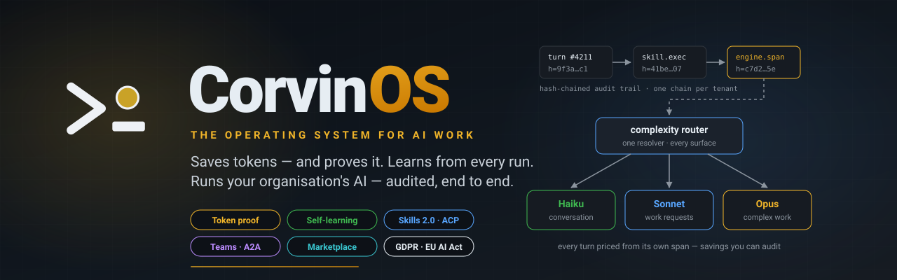
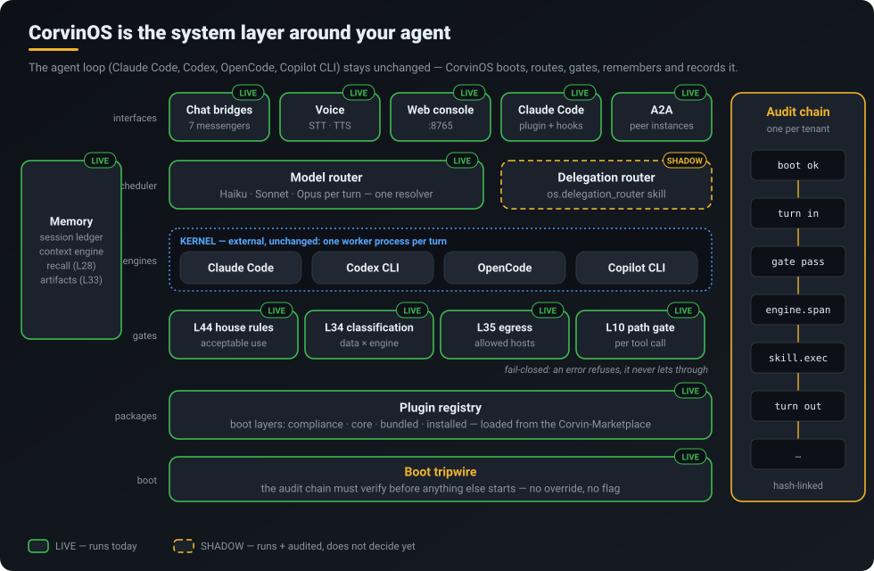
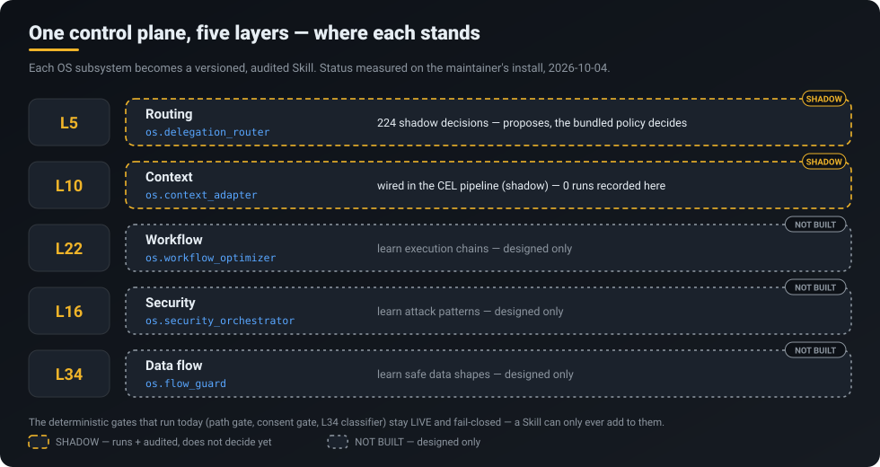
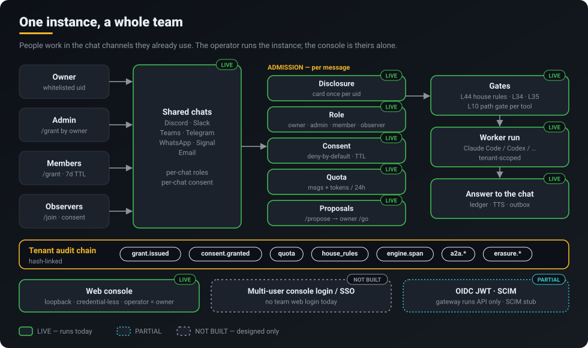
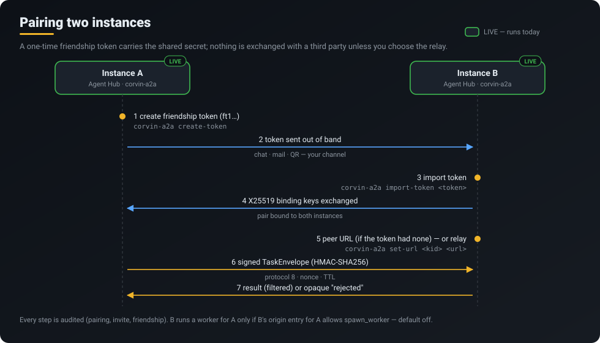
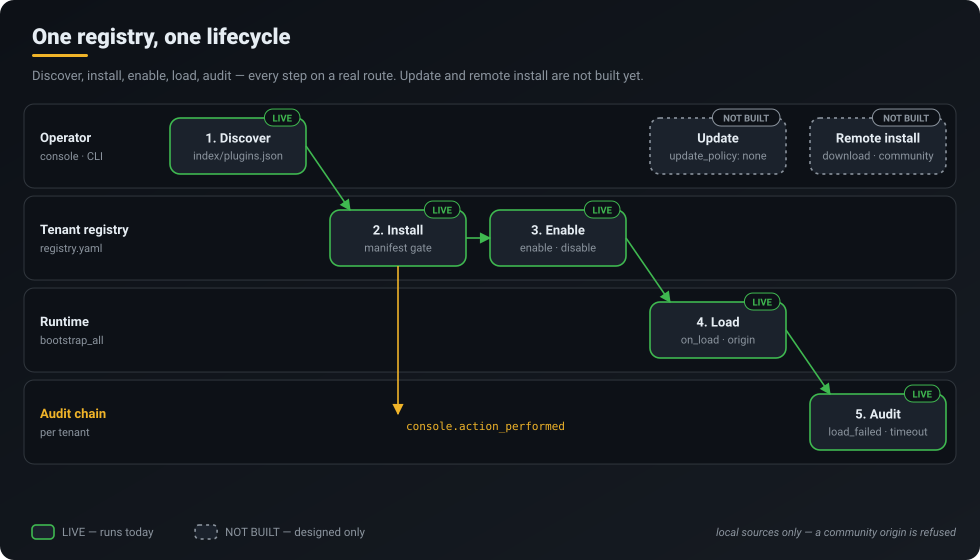
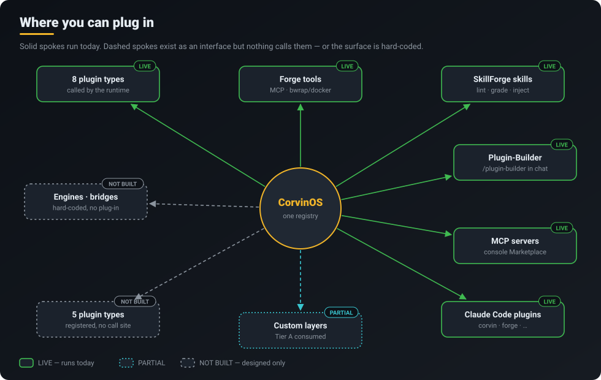

<p align="center">
  
</p>
<p align="center">
  <strong>The operating system for AI work.</strong><br/>
  It routes every turn to the cheapest model that fits — and proves the saving from its own audit log.<br/>
  It remembers, learns in the shadow before it decides, and runs your team's agents behind fail-closed gates.
</p>

<p align="center">
  <a href="https://www.youtube.com/watch?v=4sXl26Hr1pA&t=22s" title="Watch on YouTube: Compliance in the AI era">
    
  </a><br/>
  <sub>▶ <a href="https://www.youtube.com/watch?v=4sXl26Hr1pA&t=22s">Compliance in the AI era</a> (YouTube)</sub>
</p>

<p align="center">
  <a href="LICENSE"></a>
  
  
  
  
</p>

<p align="center">
  <code>git clone https://github.com/CorvinLabs/CorvinOS.git && cd CorvinOS && ./install.sh</code>
</p>

<p align="center">
  <a href="docs/overview/token-savings.md"><strong>Token savings</strong></a> &middot;
  <a href="docs/overview/self-learning.md">Self-learning</a> &middot;
  <a href="docs/overview/skills-acp.md">Skills 2.0 &amp; ACP</a> &middot;
  <a href="docs/overview/operating-system.md">CorvinOS as an OS</a> &middot;
  <a href="docs/overview/organizations.md">Organizations</a> &middot;
  <a href="docs/overview/a2a.md">A2A</a> &middot;
  <a href="docs/overview/video.md">Video</a> &middot;
  <a href="docs/overview/marketplace.md">Marketplace &amp; plugins</a> &middot;
  <a href="docs/overview/extensibility.md">Extensibility</a> &middot;
  <a href="#-installing-via-claude-code">Claude Code</a> &middot;
  <a href="docs/setup/INSTALLATION.md">Install guide</a>
</p>

---

## ⚡ Quick Start

**TL;DR** — you need `git`; the installer brings everything else (Python via `uv`, Node.js, Claude Code).
Everything runs from your clone of this repository: there is no download installer and no PyPI package.

| | Linux · macOS · WSL | Windows (PowerShell) | Claude Code |
|---|---|---|---|
| **Install** | `git clone https://github.com/CorvinLabs/CorvinOS.git && cd CorvinOS && ./install.sh` | `git clone https://github.com/CorvinLabs/CorvinOS.git; cd CorvinOS; .\install.ps1` | `/corvin:install` |
| **Update** | `sh update.sh` | `.\update.ps1` | `/corvin:update` |
| **Uninstall** | `bash uninstall.sh` | `.\uninstall.ps1` | — |

The console opens at **http://127.0.0.1:8765/console/** once it really serves the app.
Install and update are safe to re-run. Your data and configuration (`.corvin/` inside the clone —
git-ignored — and `~/.config/corvin-voice`) are never touched by an update.

<details>
<summary><b>Install — what it does and its options</b></summary>

1. Refuses to run outside a CorvinOS clone (no `.corvin_repo` / `pyproject.toml`) — before anything is downloaded.
2. Bootstraps `uv` (pinned, checksum-verified) and a local Node.js; installs your clone with `uv tool install --editable`, plus the offline voice models.
3. Installs Claude Code if it is missing.
4. Builds and starts the console, waits for an HTTP 200 with the app shell **and** a working local login, then opens the browser. If that proof does not come it says why instead of reporting success ([Windows errors](docs/windows-installation-errors.md)).

Because the install is editable, the code that runs **is** your clone.

```bash
./install.sh --editable /path/to/CorvinOS   # install another clone
./install.sh --lan                          # allow pairing over LAN
./install.sh --no-claude-code               # skip Claude Code
./install.sh --preset minimal               # console only
./install.sh --autostart                    # start the console at login
./install.sh --always-on                    # run as a service that survives reboot
```

```powershell
.\install.ps1 -Editable C:\path\to\CorvinOS   # install another clone
.\install.ps1 -Port 8790                     # different port (URL is always 127.0.0.1)
.\install.ps1 -RebuildWeb                    # force a console rebuild
.\install.ps1 -NoStart                       # install only, start nothing
.\install.ps1 -DryRun                        # report every step, change nothing
```

**Windows:** if PowerShell answers "running scripts is disabled on this system", allow local scripts once
(`Set-ExecutionPolicy -Scope CurrentUser RemoteSigned`, or only for this window:
`Set-ExecutionPolicy -Scope Process Bypass -Force`) and run `.\install.ps1` again.
Full reference: [docs/setup/INSTALLATION.md](docs/setup/INSTALLATION.md) ·
[docs/windows-installation-guide.md](docs/windows-installation-guide.md)

</details>

<details>
<summary><b>Update — what it does and its options</b></summary>

`update.sh` / `update.ps1` pull `main` into your clone, reinstall, rebuild the console, restart, and prove
the new build is served (`scripts/verify_install.py`). If not, they **roll back** automatically.
Local changes are stashed and re-applied; a force-pushed `main` leaves your old HEAD as branch
`corvin-update-backup-<timestamp>`. Reload open console tabs with Ctrl+Shift+R afterwards.

```bash
sh update.sh --rebuild-only   # no pull: rebuild + restart the code you have
sh update.sh --no-rollback    # keep the new code even if verification fails
```

Exit codes: `0` updated · `1` failed, rolled back · `2` rollback failed too · `3` another install/update runs.
Update never installs: with nothing installed (or a legacy PyPI install) it prints the install steps above.
More: [docs/setup/UPGRADE_GUIDE.md](docs/setup/UPGRADE_GUIDE.md)

</details>

<details>
<summary><b>From inside Claude Code — <code>/corvin:install</code> and <code>/corvin:update</code></b></summary>

Step-by-step: [Installing via Claude Code](#-installing-via-claude-code) below.

</details>

<details>
<summary><b>Uninstall</b></summary>

`uninstall.sh` / `uninstall.ps1` stop the services, archive everything you cannot re-download (secrets,
bridge pairings, the audit chain, sessions, voice models) to `~/corvin-backup-<timestamp>.tar.gz`
(mode 600; restore with `tar -xzf <file> -C /`), remove the rest, and exit 1 if a leftover scan finds
anything. Your clone is kept. `--dry-run` shows what would go, `--verify-only` only scans.
`corvin-uninstall` runs the same script.

</details>

## 🧩 Installing via Claude Code

CorvinOS is also a Claude Code plugin marketplace, so you can install, verify and update
a full CorvinOS instance without leaving Claude Code. This is in addition to `install.sh` /
`install.ps1` above, not instead of them — `/corvin:install` runs that same installer for you.

**Prerequisite:** a local clone of this repository (`git clone
https://github.com/CorvinLabs/CorvinOS.git`), and Claude Code started inside it (or pointed
at it).

1. **Add this repository as a plugin marketplace** (one time):
   ```text
   /plugin marketplace add /path/to/CorvinOS
   ```
2. **Install the `corvin` plugin:**
   ```text
   /plugin install corvin
   ```
3. **Install CorvinOS:**
   ```text
   /corvin:install
   ```
   This finds your checkout and runs its own `install.sh` (Windows: `install.ps1`) —
   nothing is downloaded from a website — then waits for the console to answer a real
   HTTP 200 with the app shell (not just "the port is open") before opening
   `http://127.0.0.1:8765/console/` in your browser. Safe to re-run: on an already-healthy
   install it only re-verifies instead of reinstalling.
4. **Keep it updated**, whenever you like:
   ```text
   /corvin:update --check   # report commits/version behind origin/main — changes nothing
   /corvin:update           # pull, reinstall, rebuild, restart, verify — rolls back on failure
   ```
   After an update, run the `/plugin marketplace update …` command `/corvin:update` prints
   (refreshes Claude Code's own copy of the plugin) and reload any open console tab
   (Ctrl+Shift+R).

There is no `/corvin:uninstall` yet — run `uninstall.sh` / `uninstall.ps1` from a terminal
for that (see "Uninstall" above). Full technical reference:
[docs/setup.md](docs/setup.md#alternative-as-a-claude-code-plugin).

---

## The problem we solve

AI is now doing real work — answering customers, writing code, drafting documents, running across teams. Four things go wrong almost everywhere:

1. **Tokens are burned on the biggest model.** "Just use the best model to be safe" turns every greeting into an Opus call — and nobody can show afterwards what was actually spent, on what.
2. **Nobody can prove what the AI did.** Logs are scattered, editable and incomplete. For GDPR and the EU AI Act, "trust us" is not an answer.
3. **Agents forget and never improve.** The chat transcript gets compacted or reset; what worked yesterday is not remembered tomorrow.
4. **It doesn't scale past one person.** Teams need roles, consent, quotas, shared channels and agents that can work with other agents — without opening a hole in the perimeter.

**CorvinOS is the system layer that fixes these around the agent you already use.**

---

## What CorvinOS is

You bring the agent — **Claude Code** by default, or Codex, OpenCode or Copilot CLI. CorvinOS boots it behind a compliance tripwire, routes every turn onto a model, puts fail-closed gates in front of what it may touch, keeps a ledger of every conversation, and writes every step into a hash-chained audit log — one per tenant. You talk to it through seven chat apps, voice, a web console, Claude Code, or another CorvinOS instance.

<p align="center"></p>

<p align="center"><a href="docs/overview/operating-system.md"><strong>→ CorvinOS as an operating system</strong></a></p>

---

## 💰 Token savings — with the receipts

One resolver picks the model for every turn on every surface: conversation → Haiku, ordinary work → Sonnet, ADR, review and document work → the newest Opus. Pins always win. Every turn's four token counts land in the audit chain, and the console prices them against a reference model **with the counting window printed next to the total**.

<p align="center"></p>

Measured on the maintainer's install (607 priced turns, 2026-09-24 → 10-04): **$414 actual vs. $629 for the same tokens on Opus 5.5 (−34 %)** and $1,181 on Opus 5 (−65 %). Since three-tier routing went live on 2026-09-28: **−24 %** vs. Opus 5.5. Re-add it yourself from the chain — the page shows how, and what the numbers do *not* say.

<p align="center"><a href="docs/overview/token-savings.md"><strong>→ Token savings, the proof path and how to read the numbers</strong></a></p>

---

## 🧠 Self-learning — in the shadow first

CorvinOS learns the safe way round: a new learner first runs **in the shadow** — it decides alongside the rules, every decision and its outcome are recorded and joined in the audit chain, but it changes nothing until it has proven itself on enough real turns. Only then may it act. What learns today: **skill memory** — experience distilled into SkillForge skills that are injected into future turns only after they earned a grade.

<p align="center"></p>

On the maintainer's install: 224 shadow routing decisions with a 0.98 outcome join rate (2026-09-28 → 10-04); the gate to let it decide needs ≥ 500.

<p align="center"><a href="docs/overview/self-learning.md"><strong>→ Self-learning: what learns today, what waits in the shadow</strong></a></p>

---

## 🧩 Skills 2.0 & the Agentic Control Plane

In CorvinOS a Skill is not a prompt — it is a **versioned program** with an id, a semantic version and an `execute()` that runs under a timeout and writes every execution into the audit chain with a line-of-responsibility hash. The Agentic Control Plane (ACP) is the plan to turn the OS's own subsystems — routing, context, workflows, security, data flow — into such Skills, one layer at a time, each earning its way out of the shadow.

<p align="center"></p>

<p align="center"><a href="docs/overview/skills-acp.md"><strong>→ Skills 2.0 & ACP: anatomy of a Skill, the five layers, the gate</strong></a></p>

---

## 🏢 CorvinOS in organizations

Teams work with CorvinOS where they already talk: Discord, Slack, Teams, Telegram, WhatsApp, Signal, email. Every chat carries roles (owner · admin · member · observer), quotas, consent, a one-time AI disclosure and proposals the owner approves — and every grant, refusal and turn is in the tenant's audit chain. GDPR erasure (Art. 17) runs across all stores.

<p align="center"></p>

<p align="center"><a href="docs/overview/organizations.md"><strong>→ Organizations: roles, tenants, compliance</strong></a></p>

### 🔗 A2A — agents across instances

Separate CorvinOS instances pair as peers with a friendship token and exchange **signed task envelopes** (HMAC-SHA256, protocol v8, replay-protected, audit-first). A peer may run work on your instance only if you explicitly allow it — and then only under a per-peer tool denylist.

<p align="center"></p>

<p align="center"><a href="docs/overview/a2a.md"><strong>→ A2A: pairing, the inbound pipeline, what is gated</strong></a></p>

### 🎬 Video producer

A Marketplace plugin turns a text task into a narrated MP4 with captions: storyboard by an LLM (local Ollama by default), narration, slides and an ffmpeg cut — behind the same house-rules, data-class and egress gates as every other turn.

<p align="center"></p>

<p align="center"><a href="docs/overview/video.md"><strong>→ Video: pipeline, setup, limits</strong></a></p>

---

## 🛒 Marketplace & plugin system

One registry, one lifecycle: plugins are discovered from the **Corvin-Marketplace**, installed through a manifest gate, enabled per tenant and loaded in a fixed boot order — every step audited. Three independent axes describe each plugin: **boot layer** (load order, can it be switched off), **tier** (capability and licence), **origin** (who vouches for it).

<p align="center"></p>

<p align="center"><a href="docs/overview/marketplace.md"><strong>→ Marketplace & plugins: lifecycle, the three axes, numbers</strong></a></p>

### 🔧 Extensibility — build your own

Typed plugins scaffolded from templates (`corvin plugin new <type> <id>`, then `corvin plugin check`), runtime-generated tools over MCP in a sandbox (Forge), self-written skills (SkillForge), a chat-driven `/plugin-builder`, MCP servers from the console, and Claude Code plugins — pick the smallest extension point that does the job.

<p align="center"></p>

<p align="center"><a href="docs/overview/extensibility.md"><strong>→ Extensibility: every extension point and how to use it</strong></a></p>

---

## 🔐 Compliance by design (GDPR + EU AI Act)

| Mechanism | What it guarantees |
|---|---|
| **Boot tripwire** | The audit chain must verify before anything starts — no override, no flag |
| **Hash-chained audit log, one per tenant** | Every recorded step is linked to the one before it; tampering breaks the chain (GDPR Art. 30, 32) |
| **AI disclosure + opt-out** | Every chat user is told once that they talk to an AI and can leave with `/pass` or `/leave` (EU AI Act Art. 50) |
| **Consent gate** | Deny-by-default, time-limited consent before personal data is processed (GDPR Art. 6, 7) |
| **House rules** | Acceptable-use gate in front of every turn, fail-closed, cannot be switched off (EU AI Act Art. 5) |
| **Data classification × engine** | A turn's data class decides which engines may see it; an error refuses (fail-closed) |
| **Right to erasure** | One orchestrator removes a person's data across all stores and records that it did (GDPR Art. 17) |
| **Content-free telemetry** | Anonymous, opt-out signals only; anything that looks like personal data is dropped before sending |

Reference: [`docs/claude-ref/compliance-baseline.md`](docs/claude-ref/compliance-baseline.md)

---

## Status at a glance

What runs today and what is still on the way — the overview pages give the details and the evidence.

| Area | Today |
|---|---|
| Per-turn model routing + priced token proof | **LIVE** |
| Fail-closed gates (house rules, data class, egress, path guard), consent, disclosure, erasure | **LIVE** |
| Per-tenant hash-chained audit chain + boot tripwire | **LIVE** |
| Session ledger, conversation recall, artifacts | **LIVE** |
| Skill memory (grade-gated SkillForge injection) | **LIVE** |
| Learning delegation router | **SHADOW** — recording, not deciding |
| ACP layers for workflows, security, data flow | **NOT BUILT** |
| Chat-team roles, quotas, proposals across 7 messengers | **LIVE** |
| Multi-user console login / SSO | **NOT BUILT** |
| A2A pairing + signed envelopes | **LIVE** · remote worker execution **GATED** (off by default) |
| Plugin install / enable / load | **LIVE** · plugin update path **NOT BUILT** |
| Video producer (Marketplace plugin) | **LIVE** · YouTube upload **NOT BUILT** |

---

## Learn more

| Page | What it answers |
|---|---|
| [Token savings](docs/overview/token-savings.md) | How the model is chosen, what it saved, how to verify it |
| [Self-learning](docs/overview/self-learning.md) | What learns today and what waits in the shadow |
| [Skills 2.0 & ACP](docs/overview/skills-acp.md) | What a Skill is and how the OS becomes Skills |
| [CorvinOS as an OS](docs/overview/operating-system.md) | The system layer, mapped to real code |
| [Organizations](docs/overview/organizations.md) · [A2A](docs/overview/a2a.md) · [Video](docs/overview/video.md) | Teams, instance-to-instance agents, video |
| [Marketplace & plugins](docs/overview/marketplace.md) · [Extensibility](docs/overview/extensibility.md) | Installing and building extensions |
| [Install guide](docs/setup/INSTALLATION.md) · [Upgrade guide](docs/setup/UPGRADE_GUIDE.md) · [Windows](docs/windows-installation-guide.md) | Getting it running |

---

<p align="center">
  <a href="LICENSE">Apache-2.0</a> &middot;
  <a href="CONTRIBUTING.md">Contributing</a> &middot;
  <a href="CLA.md">CLA</a> &middot;
  <a href="SECURITY.md">Security</a> &middot;
  <a href="CHANGELOG.md">Changelog</a>
</p>
