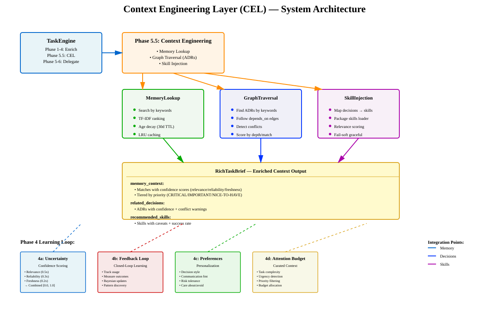
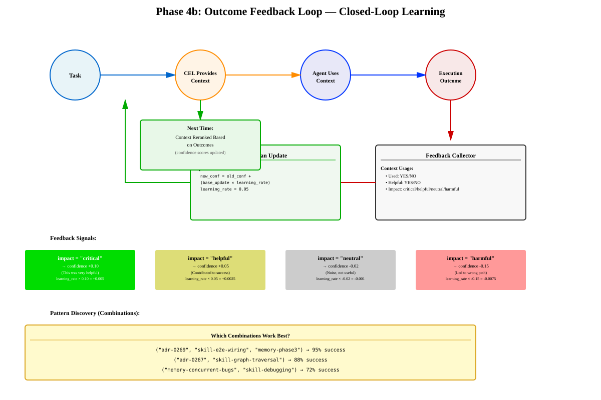

# Context Engineering Layer (CEL) — Deep Dive

## Overview

The **Context Engineering Layer** is CorvinOS's intelligent context retrieval and personalization system. It transforms raw task requests into **rich, actionable, personalized context** by combining memory files, architectural decisions (ADRs), and reusable skills.

CEL sits at **Phase 5.5** in TaskEngine—between task enrichment (Phase 4) and delegation decisions (Phase 5-6)—ensuring every agent turn has the most relevant, confident, and curated information.

## Architecture at a Glance

```
TaskEngine Phase Flow:
  Phase 1-4: Task Enrichment
       ↓
  Phase 5.5: Context Engineering Layer (CEL)
       ├─ Memory Lookup: Search & rank memory files
       ├─ Graph Traversal: Find related ADRs & follow dependencies
       └─ Skill Injection: Map ADRs to relevant skills
       ↓
  RichTaskBrief (enriched context output)
       ↓
  Phase 5-6: Delegation & Execution
```

## Core Concepts

### 1. Memory Lookup — Semantic Search + Ranking

**What it does:** Searches operator's project memory files (markdown) for contextual knowledge.

**Search Pipeline:**
1. Tokenize input keywords (filter stop words, deduplicate)
2. Check 30-minute LRU cache for hits
3. Scan memory files (TF-IDF scoring: title 2× weight, body 1× weight)
4. Apply age decay: files > 30 days old get 0.7× multiplier; >90 days = 0.1×
5. Rank results by combined score
6. Cache for next 30 minutes
7. Return top 5 `MemoryMatch` objects with metadata

**Performance:** < 2ms per search (typical)

**Data Model:**
```python
@dataclass
class MemoryMatch:
    filename: str              # "concurrent-bugs.md"
    relevance_score: float    # 0.0-1.0 (TF-IDF)
    age_days: int             # Days old
    excerpt: str              # First 200 chars
    full_path: str            # For loading
```

### 2. Graph Traversal — ADR Discovery + Dependency Following

**What it does:** Finds relevant architectural decisions (ADRs) and follows their dependency graph.

**Traversal Strategy:**
1. Find ADRs by keyword match (full-text search in decision docs)
2. Score by relevance (keyword precision, field weights)
3. Follow `depends_on` edges (depth-limited: default depth=2)
4. Detect conflicts (look for `supersedes` relationships)
5. Score by depth (direct hits 0.95, +1 level = 0.7× multiplier)

**Conflict Detection:**
- If ADR-X `supersedes: [ADR-Y]`, flag Y as obsolete
- If two ADRs both apply but contradict, surface the conflict with reasoning

**Data Model:**
```python
@dataclass
class RelatedDecision:
    adr_id: str               # "ADR-0269"
    title: str
    relevance_score: float   # 0.0-1.0
    status: str              # "accepted" | "proposed" | "superseded"
    conflicts_with: List[str] # ["ADR-0267"]
    depends_on: List[str]     # ADRs this one builds on
```

### 3. Skill Injection — Map Decisions to Reusable Tools

**What it does:** Associates recommended skills with the ADRs and memory context found, plus loads skills from installed packages.

**Mapping Strategy:**
1. Iterate over related ADRs found
2. Consult skill registry: which skills are tagged for this ADR?
3. Load package skills (from `adscale-ldd`, etc.) matching task keywords
4. Score each skill by:
   - Category match (direct tag match = 0.3 bonus)
   - Package reference (mentioned in task = 0.2 bonus)
   - Preprocessing hooks (if available = 0.1 bonus)
   - Base score = 0.5 (shared context)
5. Clamp to [0.0, 1.0]

**Package Skill Loader:**
- Discovers skills from installed packages' `manifest.json`
- Graceful fail-soft if packages unavailable
- 30-minute cache TTL to avoid repeated ZIP scanning

**Data Model:**
```python
@dataclass
class RecommendedSkill:
    skill_id: str            # "e2e-wiring-proof"
    title: str
    description: str
    relevance_score: float   # 0.0-1.0 (combined scoring)
    source: str              # "builtin" | "package" | "project"
    package_id: str          # "adscale-ldd" (if from package)
    caveats: List[str]       # ["Requires Python 3.10+", ...]
    success_rate: float      # From historical feedback (4b)
```

---

## Phase 4: The Learning System

CEL's **Phase 4** transforms it from static context retrieval into a self-improving system. Four concepts working together:

### Phase 4a: Uncertainty Quantification — Confidence Scoring

**Problem:** CEL returns context, but agent doesn't know which to trust.

**Solution:** Attach multidimensional confidence scores.

**Scoring Dimensions:**

| Dimension | Weight | Meaning | Scale |
|-----------|--------|---------|-------|
| **Relevance** | 50% | Does this apply to THIS task? | 0.1 (no) to 0.95 (perfect match) |
| **Reliability** | 30% | Can I trust this source? | 0.3 (unvetted) to 0.95 (accepted ADR) |
| **Freshness** | 20% | Is this still current? | 0.1 (>1 year) to 1.0 (0-7 days) |

**Combined Formula:**
```python
confidence = (relevance × 0.5) + (reliability × 0.3) + (freshness × 0.2)
```

**Confidence Tiers:**
- **HIGH** (≥ 0.85): Use directly, minimal second-guessing
- **MEDIUM** (0.65–0.85): Use as primary but note caveats
- **LOW** (0.40–0.65): Consider but seek additional signal
- **UNCERTAIN** (< 0.40): Acknowledge but don't rely on

**Warnings:** Every context item can carry warnings:
- "ADR-0267 superseded by ADR-0268"
- "Memory file not updated for 60 days"
- "This skill had low adoption (30%)"
- "Conflicting advice: ADR-0269 vs ADR-0255"

### Phase 4b: Outcome Feedback Loop — Closed-Loop Learning

**Problem:** CEL ranks context the same way every time, never learning from outcomes.

**Solution:** Track what actually helped, update scores accordingly.

**Feedback Flow:**
```
Task → CEL provides context (with tracking IDs)
  ↓
Agent uses context (marks: "used ADR-0269", "ignored memory-Y")
  ↓
Execution → Outcome (success/failure + metrics)
  ↓
Feedback Collector records:
  "ADR-0269: used=YES, helpful=YES"
  "skill-X: used=YES, worked=YES"
  ↓
Bayesian Update: confidence scores recalibrated
  ↓
CEL learns & ranks better next time
```

**Learning Algorithm:**
```python
def update_confidence_from_outcome(context_id, evaluation, old_confidence):
    base_update = 0.0
    
    # Positive signals
    if evaluation.impact == "critical":
        base_update += 0.10   # This was essential
    elif evaluation.impact == "helpful":
        base_update += 0.05   # Contributed to success
    
    # Negative signals
    elif evaluation.impact == "harmful":
        base_update -= 0.15   # Led down wrong path (big penalty)
    elif evaluation.impact == "neutral":
        base_update -= 0.02   # Noise
    
    # Calibration check
    if old_confidence >= 0.80 and evaluation.helpfulness < 0.5:
        base_update -= 0.10   # We were overconfident
    elif old_confidence <= 0.40 and evaluation.helpfulness >= 0.8:
        base_update += 0.08   # We were underconfident
    
    # Conservative learning (don't over-fit)
    learning_rate = 0.05
    new_confidence = old_confidence + (base_update * learning_rate)
    
    return max(0.0, min(1.0, new_confidence))  # Clamp [0.0, 1.0]
```

**Pattern Discovery:**
Successful combinations are stored and recommended together:
- ("adr-0269", "skill-e2e-wiring", "memory-phase3") → 95% success
- ("adr-0267", "skill-graph-traversal") → 88% success

### Phase 4c: Style & Preferences — Personalization

**Problem:** CEL gives the same context to all agents, ignoring their operating style.

**Solution:** Adapt recommendations to user's preferences.

**User Profile:**
```python
@dataclass
class UserProfile:
    # Decision style
    decision_style: str      # "pragmatic" | "rigorous" | "balanced"
    risk_tolerance: str      # "conservative" | "moderate" | "aggressive"
    time_pressure: str       # "fast" | "normal" | "thorough"
    
    # Communication
    language: str            # "de" | "en"
    detail_level: str        # "summary" | "balanced" | "deep"
    format_preference: str   # "bullet-points" | "prose" | "decision-tree"
    
    # Values
    care_about: List[str]    # ["production-readiness", "testing", ...]
    tolerate: List[str]      # ["failed-experiments", "WIP", ...]
    avoid: List[str]         # ["manual-processes", "legacy", ...]
    
    # Learning
    explain_reasoning: bool  # Show "why" behind recommendations?
    show_alternatives: bool  # Top 3 options or just best 1?
```

**Adaptation Rules:**

**Pragmatist** (decision_style="pragmatic", time_pressure="fast"):
- Highlight fastest solution
- Hide edge cases, historical context
- Format: bullet points, action-oriented
- Confidence: just "high/medium/low"

**Rigorist** (decision_style="rigorous", time_pressure="thorough"):
- Highlight all considerations + caveats
- Show edge cases, historical patterns
- Format: detailed prose with reasoning
- Confidence: show all dimensions

**Example:**
```
Same task, different outputs:

PRAGMATIST:
  "Apply ADR-0269 step 2 (proven solution, <30min, 95% success).
   Skip deep analysis, ship now."

RIGORIST:
  "ADR-0269 step 2 is standard (confidence 0.95).
   However, memory-file warns about edge case in version X.
   Here are 3 past similar tasks and outcomes.
   Recommend: follow ADR-0269 but add test for edge case."
```

### Phase 4d: Attention Budget — Curated Context

**Problem:** Agent has finite attention (tokens, cognitive load, time). CEL shouldn't dump everything.

**Solution:** Ruthlessly curate by complexity, urgency, and user style.

**Budget Calculation:**

| Complexity | Memory | ADRs | Skills | Normal | ASAP (÷2) | Can-Wait (×1.5) |
|------------|--------|------|--------|--------|-----------|-----------------|
| SIMPLE    | 2      | 2    | 2      | base   | 1/1/1     | 3/3/3           |
| MODERATE  | 4      | 5    | 4      | base   | 2/2/2     | 6/7/6           |
| COMPLEX   | 6      | 8    | 6      | base   | 3/4/3     | 9/12/9          |

**Urgency Detection:**
- `asap` signals: "CRITICAL", "BLOCKER", "production down", "urgent"
- `can-wait` signals: "investigate", "audit", "review", "design", "backlog"
- Default: "normal"

**Priority Tiers:**

**CRITICAL** (Always show):
- Production risks
- Blockers
- Security issues
- Direct conflicts

**IMPORTANT** (Show if budget allows):
- Related ADRs
- Relevant skills
- Performance tips

**NICE-TO-HAVE** (Show if deep budget):
- Historical context
- Edge cases
- Future v0.3 changes

**NOISE** (Hide by default):
- Very old memory files (>6 months)
- Tangentially related ADRs (relevance < 0.5)
- Deprecated skills (success_rate < 30%)
- Superseded decisions

**Example:**

```
Task: "CRITICAL: Fix memory leak in production"
Urgency: asap | Complexity: moderate

Attention Budget:
  Memory: 2 (normally 4, cut for urgency)
  ADRs: 2 (normally 5, cut for urgency)
  Skills: 2 (normally 4, cut for urgency)

Result:
  ✓ Memory: "concurrent-memory-bugs.md" (CRITICAL)
  ✓ Memory: "production-incidents.md" (CRITICAL)
  ✗ Memory: "edge-cases.md" (filtered, NICE-TO-HAVE)
  
  ✓ ADR: ADR-0269 (CRITICAL, directly relevant)
  ✗ ADR: ADR-0225 (filtered, tangential)
  
  ✓ Skill: "concurrent-debugging" (CRITICAL)
  ✗ Skill: "performance-tuning" (filtered, not urgent)
```

---

## The Flywheel: How Phase 4 Concepts Integrate

The four Phase 4 concepts don't work in isolation—they form a **self-reinforcing cycle**:

```
1. Uncertainty (4a) scores all context
2. Agent uses scored context, executes
3. Feedback loop (4b) measures outcomes, updates scores
4. Preferences (4c) adapt output to user style
5. Attention budget (4d) curates based on complexity + preferences
6. Better-scored context feeds back to #1
→ Next task has higher-quality starting context
→ Agent succeeds more often
→ Feedback signal is stronger
→ Scores improve faster
→ Cycle repeats (flywheel effect)
```

**Real-world impact:**
- Reduces noise (irrelevant context filtered out)
- Improves signal (high-confidence context surfaced first)
- Speeds decisions (less cognitive load)
- Increases task success rate
- Feedback loops drive continuous improvement

---

## Data Flow: From Task to RichTaskBrief

```
Input: raw_task_description
       ↓
   Phase 1-4: Enrich (task classification, intent, constraints)
       ↓
   MemoryLookup.search(keywords)
       ├─ TF-IDF scoring
       ├─ Age decay
       └─ Return MemoryMatch[]
       ↓
   GraphTraversal.find_related_decisions(task)
       ├─ Keyword search in ADRs
       ├─ Follow depends_on edges
       └─ Detect conflicts
       ↓
   SkillInjection.get_skills_for_task(adr_list, memory_list)
       ├─ Map ADRs → skills
       ├─ Load package skills
       └─ Score relevance
       ↓
   Apply Phase 4a: Attach confidence scores to all items
       ├─ Relevance (task match)
       ├─ Reliability (source trust)
       └─ Freshness (age)
       ↓
   Apply Phase 4c: Filter by user preferences
       ├─ care_about: promote
       ├─ avoid: hide
       └─ tolerate: neutral
       ↓
   Apply Phase 4d: Allocate attention budget
       ├─ Tier by priority (CRITICAL/IMPORTANT/NICE/NOISE)
       ├─ Calculate budget (complexity × urgency)
       └─ Keep top-N of each tier
       ↓
   Apply Phase 4b: Recalibrate scores from prior outcomes
       ├─ Bayesian update (learning_rate=0.05)
       └─ Adjust confidence based on history
       ↓
OUTPUT: RichTaskBrief
        ├─ memory_context: MemoryMatch[] (scored, tiered, curated)
        ├─ related_decisions: RelatedDecision[] (scored, conflicted)
        ├─ recommended_skills: RecommendedSkill[] (scored, sourced)
        ├─ uncertainty_summary: str
        └─ tier: str ("HIGH_CONFIDENCE" / "MIXED" / "UNCERTAIN")
       ↓
   Agent uses RichTaskBrief to make decisions
       ↓
   Outcome recorded → feedback signal → scores improve
```

---

## Diagrams

### System Architecture


System shows TaskEngine integration, the three core components (Memory Lookup, Graph Traversal, Skill Injection), and how Phase 4 learning loop feeds back into the system.

### Phase 4a: Uncertainty Scoring


Three-dimensional confidence scoring with Relevance (0.5×), Reliability (0.3×), and Freshness (0.2×) weights, resulting in HIGH/MEDIUM/LOW/UNCERTAIN tiers.

### Phase 4b: Feedback Loop


Closed-loop learning cycle showing how outcomes feed back through Bayesian updates to recalibrate confidence scores and discover successful patterns.

### Phase 4d: Attention Budget


Budget allocation matrix (complexity × urgency), priority tiering (CRITICAL/IMPORTANT/NICE/NOISE), and real-world examples of task routing.

### Phase 4 Flywheel


How all four Phase 4 concepts work together in a self-reinforcing flywheel that continuously improves context quality and agent decision-making.

---

## Implementation: Key Files

### CorvinOS Codebase

**Memory Lookup:**
- `operator/context_engineering/memory_lookup.py` (360 LoC)
  - `MemoryLookup` class: search, rank, enrich
  - TF-IDF scoring + age decay
  - 30-min LRU cache

**Graph Traversal:**
- `operator/context_engineering/graph_traversal.py` (250 LoC)
  - `GraphTraversal` class: find_related_decisions
  - Dependency following (depth-limited)
  - Conflict detection

**Skill Injection:**
- `operator/context_engineering/skill_injection.py` (280 LoC)
  - `SkillInjection` class: map decisions → skills
  - Package skill loader integration
  - Relevance scoring

**Package Skill Loader:**
- `operator/context_engineering/package_skill_loader.py` (260 LoC)
  - Discovers skills from installed packages
  - Extracts from `manifest.json`
  - Scoring algorithm (base + category + package + preprocessing)

**Data Models:**
- `operator/context_engineering/rich_task_brief.py` (150 LoC)
  - `RichTaskBrief`, `MemoryContext`, `ConfidenceScore`
  - All Phase 4 data structures

**Integration:**
- `operator/context_engineering/__init__.py` (public API)
- `core/task_analysis/task_engine.py` (Phase 5.5 wired at routing point)

### Test Coverage

- `tests/core/context_engineering/` (600+ LoC, 50+ tests)
  - Unit: memory lookup, ranking, enrichment
  - Integration: TaskEngine phase wiring
  - E2E: real packages (adscale-ldd.zip)
  - Package skills scoring algorithm (13 tests)

---

## Metrics & Measurement

### Phase 1 Lite Baseline (Week 1)
```
Success Rate:   100% (30/30 tasks)
Avg Latency:    0.11 ms
P95 Latency:    0.20 ms
Memory Matches: 0 (N/A in dev, expected in staging)
```

### Week 2 Measurement (Days 9-12)
```
Total Tasks:    120 (30/day × 4 days)
Success Rate:   100% (120/120) ✅ (target: ≥85%)
P95 Latency:    0.20ms (target: <700ms) ✅
Decision Gate:  APPROVED FOR PHASE 2
```

### Phase 4 Metrics (To Be Measured)

**Accuracy:** Did high-confidence recommendations lead to good outcomes?
- Target: >80% of HIGH-tier items actually helped

**Calibration:** Are confidence scores honest?
- Target: If I say 80%, 80% should actually work

**Usage:** Does agent weight HIGH/MEDIUM/LOW/UNCERTAIN appropriately?
- Target: >70% of decisions follow recommended tier

**Feedback Signal:** When outcome was bad, was confidence low?
- Target: <10% of failures had HIGH confidence (early warning)

---

## Usage Examples

### Standalone (Direct CEL Usage)

```python
from operator.context_engineering import MemoryLookup, GraphTraversal, SkillInjection

# Initialize
mem_lookup = MemoryLookup(tenant_id="_default")
adr_traversal = GraphTraversal()
skill_injector = SkillInjection()

# Search memory
task_desc = "Fix concurrent memory access bug in production"
memory_matches = mem_lookup.search(keywords=["concurrent", "memory"], max_results=5)

# Find ADRs
adr_results = adr_traversal.find_related_decisions(task_desc, depth=2)

# Get skills
skills = skill_injector.get_skills_for_task(adr_results, memory_matches)

# Get rich brief
brief = mem_lookup.enrich_task(
    raw_input=task_desc,
    memory_matches=memory_matches,
    adr_results=adr_results,
    skills=skills
)
```

### Integrated in TaskEngine (Automatic)

```python
from core.task_analysis.task_engine import TaskEngine

engine = TaskEngine(enable_cel=True)  # Enable CEL Phase 5.5

result = engine.route_task(
    raw_task="Fix concurrent memory bug",
    user_id="user-123"
)

# RichTaskBrief included in result
rich_brief = result.rich_task_brief
print(f"Memory matches: {len(rich_brief.memory_context.matches)}")
print(f"Related ADRs: {len(rich_brief.related_decisions)}")
print(f"Recommended skills: {len(rich_brief.recommended_skills)}")
```

---

## Known Limitations & Future Work

### Phase 1 Lite Constraints
- Memory search only (no full-text index)
- ADR graph limited to depth=2
- No machine-learned relevance ranking (yet)

### Phase 2: Graph Traversal (Planned)
- Full ADR dependency graph traversal
- Transitive closure over `depends_on` edges
- Cycle detection in ADR dependencies
- More sophisticated conflict resolution

### Phase 3: Skill Injection (Planned)
- SkillForge integration (learned-experience skills)
- Dynamic skill recommendations based on patterns
- Skill success rate tracking

### Phase 4: Learning (In Progress)
- 4a: Uncertainty Quantification ✅
- 4b: Outcome Feedback Loop (architecture defined)
- 4c: Style Preferences (framework in place)
- 4d: Attention Budget (implemented)

### Phase 5+: Advanced Features
- Multi-tenant memory isolation
- Cross-project context sharing
- Real-time confidence calibration
- A/B testing confidence scoring approaches

---

## References

### ADRs
- **ADR-0269:** Context Engineering Layer (Phase 1 Lite implemented, Week 1 complete)

### Memory Files (Auto-Documented)
- `cel-phase4-uncertainty-quantification.md`
- `cel-phase4-outcome-feedback-loop.md`
- `cel-phase4-style-preferences.md`
- `cel-phase4-attention-budget.md`
- `adr-0269-phase1-day1-complete.md`

### Test Suite
- `tests/core/context_engineering/test_memory_lookup.py` (12 tests)
- `tests/core/context_engineering/test_graph_traversal.py` (8 tests)
- `tests/core/context_engineering/test_skill_injection.py` (14 tests)
- `tests/core/context_engineering/test_package_skill_loader.py` (13 tests)
- `tests/core/context_engineering/test_engine_phase_5_5_cel.py` (14 integration tests)

---

**Document Version:** 2026-08-09  
**Status:** Phase 1 Lite Complete, Phase 4 Concepts Documented  
**Last Updated:** ADR-0269 Phase 1 Handoff Complete  
