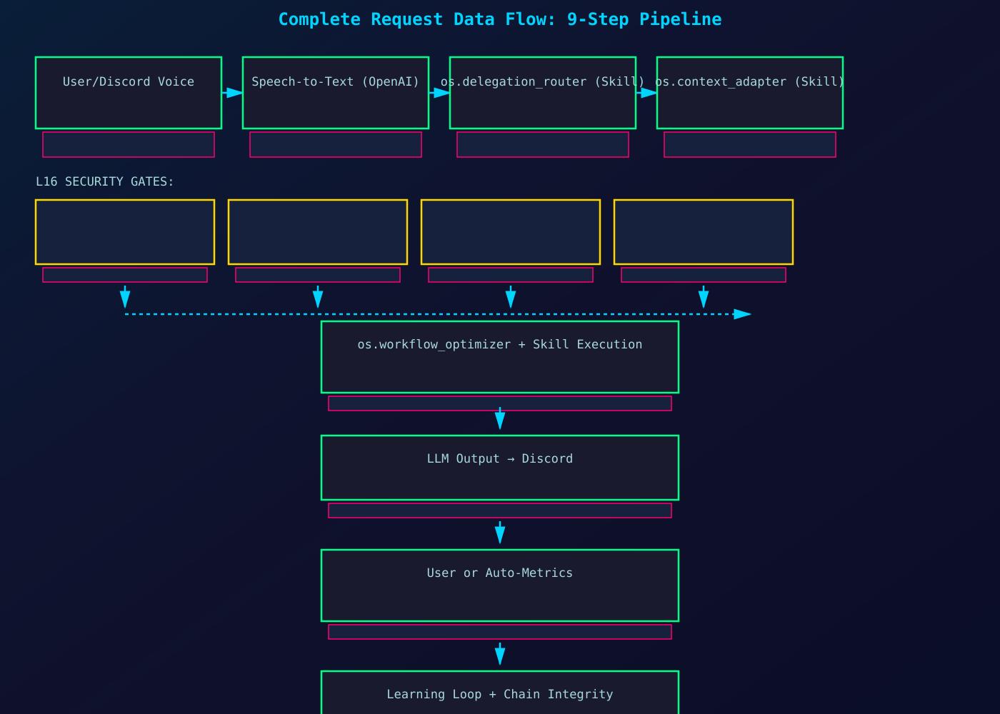
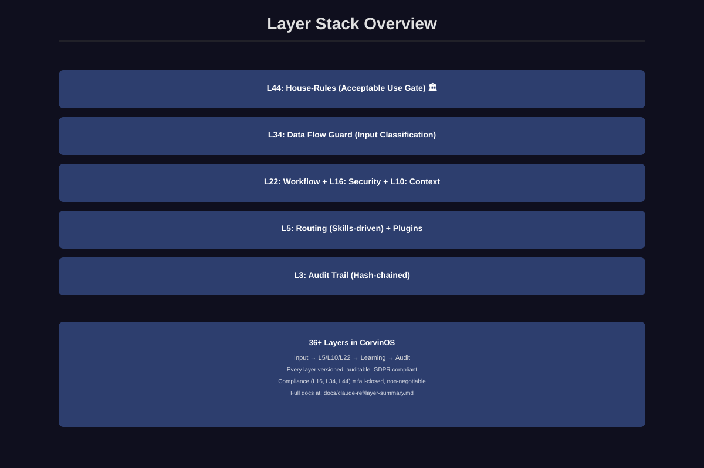

# CorvinOS v2.0 — Complete Documentation (Phase A + 9D Learning Vector)

**Status:** ✅ v1.0 Production Ready | **Extended:** 9D Learning Infrastructure | **Target:** Phase 1 Implementation (4 weeks)

**Quick Links:** [Architecture](#1-core-architecture-phase-a) | [9D Learning](#2-9d-learning-vector-extended) | [Quality Discipline](#3-quality-discipline) | [Implementation](#4-implementation-roadmap)

---

## 🎯 What's in This Docs Package?

This is **TWO PROJECTS IN ONE:**

1. **Phase A (DOCS REFACTOR):** Reorganize 533 scattered MD files → 15 organized docs (High→Low structure)
2. **9D Learning Vector (NEW FEATURE):** Extend 6D proven loops → 9D system with Meta Loop + Damping

Both share the same **doc infrastructure** (this README + diagrams + ADRs).

---

## 📚 Table of Contents

- [1. Core Architecture (Phase A)](#1-core-architecture-phase-a)
- [2. 9D Learning Vector (Extended)](#2-9d-learning-vector-extended)
- [3. Quality Discipline & LDD](#3-quality-discipline--ldd)
- [4. Implementation Roadmap](#4-implementation-roadmap)
- [5. Compliance & Security](#5-compliance--security)
- [6. Layer Stack Reference](#6-layer-stack-reference)
- [7. Glossary & FAQ](#7-glossary--faq)

---

# 1. Core Architecture (Phase A)

## Five-Layer System Overview


### **Quick Mental Model**

```
INPUT (CLI, Web, Voice, A2A, MCP)
    ↓
L5: ROUTING (Skills: os.delegation_router)
    ↓
L10: CONTEXT (Hybrid: preserve→adapt→merge)
    ↓
L16/L22: SECURITY & WORKFLOW (Consent, audit, skill orchestration)
    ↓
PLUGINS + LEARNING (6D loss vector, backpropagation)
    ↓
AUDIT CHAIN (Hash-chained proof system, GDPR-compliant)
```

### **Read These (In Order)**

| **#** | **Document** | **Time** | **Audience** | **Link** |
|---|---|---|---|---|
| 1 | **Architecture Overview** | 20 min | Architects | [05_ARCHITECTURE_OVERVIEW.md](architecture/05_ARCHITECTURE_OVERVIEW.md) |
| 2 | **ACP Vision: Skills 2.0** | 15 min | Backend | [06_ACP_VISION.md](architecture/06_ACP_VISION.md) |
| 3 | **Learning (6D Core)** | 18 min | ML Engineers | [07_LEARNING_INFRASTRUCTURE.md](architecture/07_LEARNING_INFRASTRUCTURE.md) |
| 4 | **Plugin System** | 15 min | DevOps | [08_PLUGIN_SYSTEM.md](architecture/08_PLUGIN_SYSTEM.md) |
| 5 | **Audit Chain** | 12 min | Security | [09_AUDIT_CHAIN.md](architecture/09_AUDIT_CHAIN.md) |

### **Key Diagrams**

| **Diagram** | **Purpose** |
|---|---|
|  | System architecture (5 layers) |
|  | 9-step complete request flow |
|  | All 36+ security layers |

---

# 2. 9D Learning Vector (Extended)

## From 6D Core → 9D with Meta Loop


### **The Idea: Three Tiers of Learning**

**TIER 1 (Core, Proven):** 6 independent feedback loops
```
L_routing, L_context, L_exec, L_conf, L_comply, L_learn
Status: ✅ Live in production (2026-09-06)
Convergence: ~2000 samples
Damping: η = 10%
```

**TIER 2 (Infrastructure, NEW):** 3 learnable system components
```
L_memory ← Learn preservation weights (per-request feedback)
L_plugins ← Learn plugin config (hourly metrics)
L_security ← Learn compliance thresholds (daily audit data)
Status: 🆕 Phase 1 (4 weeks, ~800 LoC)
Convergence: ~5000 samples
Damping: α = 5%
```

**TIER 3 (Meta, NEW):** Hyperparameter self-tuning
```
Meta Optimizer ← Learn optimal weights (w₁..w₆) for Tier 1
Status: 🆕 Phase 2 (3 weeks, ~1000 LoC)
Convergence: ~10000 samples
Damping: α = 1% (very slow, prevents oscillation)
```

### **Unified Loss Function (9D)**

```
L_total = w₁·L_routing + w₂·L_context + w₃·L_exec + w₄·L_conf + w₅·L_comply + w₆·L_learn
        + w₇·L_memory + w₈·L_plugins + w₉·L_security
        - λ·L_meta_stability

where:
  w₁..w₉ ∈ [0,1], Σwᵢ = 1.0
  λ = 0.1 (penalizes large weight swings)
  Converges: Tier 1 (2K) → Tier 2 (5K) → Tier 3 (10K) samples
```

### **Why Damping Works**


**Problem (Without Damping):** Meta optimizer swings weights wildly → oscillation forever

**Solution (With Damping):** Tiered update rates (η₁ > α₂ > α₃) → stable convergence

| **Tier** | **Rate** | **Converges** | **Why** |
|---|---|---|---|
| Tier 1 | 10% | 2K samples | Proven (per-request feedback) |
| Tier 2 | 5% | 5K samples | Infrastructure (hourly/daily signals) |
| Tier 3 | 1% | 10K samples | Meta (highest-order, most unstable) |

**Result:** Smooth learning curve, no oscillation, predictable convergence time.

### **Read These (In Order)**

| **#** | **Document** | **Time** | **Audience** |
|---|---|---|---|
| 1 | **CONCEPT-0032 Design** | 25 min | Architects | [CONCEPT_0032_9D_LEARNING_VECTOR_DESIGN.md](learning/CONCEPT_0032_9D_DESIGN.md) |
| 2 | **ADR-0620–0623** | 15 min | Backend | [ADR_0620-0623_9D_LEARNING_VECTOR.md](learning/ADR_0620-0623.md) |
| 3 | **Phase 1 Roadmap** | 20 min | Implementation | [PHASE_1_ROADMAP_9D_TIER2.md](learning/PHASE_1_ROADMAP.md) |

### **Key Insight: Dialektische Synthese**

**Thesis:** "6D unified loss is complete"
- We have 6 independent loops
- They couple via backpropagation
- Converges in <2000 samples

**Antithesis:** "But three more loops are learnable"
- Memory: Should we preserve this context?
- Plugins: Should cache size be 1000 or 5000?
- Security: Should PII threshold be 0.75 or 0.80?

**Synthesis:** 9D = 6D core + 3 infrastructure + 1 meta
- Tier 1: Core loops (proven, fast)
- Tier 2: Infrastructure loops (learnable, medium speed)
- Tier 3: Meta loop (self-tuning, very slow via damping)

---

## 2.1 Tier 2: Infrastructure Loops (Phase 1)

### **L₇: Memory Loop** — Learn Preservation Weights

**Current (Static):**
```python
preserve = {"task_id": 1.0, "user_prefs": 0.5, "prior_decisions": 0.2}
```

**Target (Learns):**
```python
preserve = {
  "task_id": 1.0,  # Always
  "user_prefs": sigmoid(feedback_score),  # ← LEARNS from "Was context helpful?"
  "prior_decisions": sigmoid(0.5 * feedback),  # ← LEARNS (lower rate)
}
```

**Feedback Signal:** User rates context relevance (1-5 scale) → updates preservation weights

**Convergence:** ~1000 requests

**Success Metric:** Correlation(learned_weights, user_feedback) > 0.8

---

### **L₈: Plugins Loop** — Learn Plugin Config

**Current (Static):**
```yaml
cache_size: 1000
ttl: 3600
batch_size: 100
```

**Target (Learns):**
```python
cache_size = adapt(metrics.hitrate)  # ← LEARNS from cache metrics
ttl = adapt(metrics.staleness)        # ← LEARNS from staleness
batch_size = adapt(metrics.latency)   # ← LEARNS from latency
```

**Feedback Signal:** CloudWatch metrics (hourly) → updates config

**Convergence:** ~1000 requests

**Success Metric:** Cache hitrate +10%, P99 latency -5%

---

### **L₉: Security Loop** — Learn Compliance Thresholds

**Current (Static):**
```python
pii_threshold = 0.75
house_rules_strictness = 0.80
```

**Target (Learns):**
```python
pii_threshold = adapt(fp_rate, fn_rate)           # ← LEARNS from ROC curve
house_rules_strictness = adapt(false_positive_rate)  # ← LEARNS from feedback
```

**Feedback Signal:** Audit data (daily) + operator feedback → updates thresholds

**Convergence:** ~1000 requests

**Success Metrics:** FP rate <5%, FN rate <2%

---

## 2.2 Tier 3: Meta Loop (Phase 2)

### **Meta Optimizer** — Learn Optimal Weights w₁..w₆

**Today (Operator Manual):**
```python
Operator slides: w = [0.4, 0.3, 0.3, ...]  # Manual tuning via console
```

**Tomorrow (Meta Auto + Operator Hybrid):**
```python
w_meta = meta_optimizer.learn()  # ← Auto learns from L_total trend
w_hybrid = (1 - operator_weight) * w_meta + operator_weight * w_target
         = (0.7 * w_meta) + (0.3 * w_operator)  # 70% auto, 30% manual
```

**Update Rate:** α₃ = 1% per step (VERY slow)
- Prevents oscillation (high-order system)
- Takes ~10K samples to converge (~3 hours at 1 req/sec)
- Stable + predictable

**Operator Control:**
- Set w_target via console slider (operator intent)
- Meta learns around it (hybrid tuning)
- Manual override anytime (no auto-reset)

---

# 3. Quality Discipline & LDD

## Mandatory Workflow for Every Change

### **LDD (Loss-Driven Development): 5 Gates**

All non-trivial changes follow these gates:

1. **Dialectical Reasoning** — Surface assumptions, argue for/against
2. **E2E Design** — Design end-to-end before coding
3. **Red/Green** — Fail first, then fix
4. **Refinement** — Polish + tuning
5. **Docs-as-Definition-of-Done** — Code + docs must sync

**Read:** [quality-discipline.md](quality-discipline.md)

### **Key Discipline Gates**

| **Gate** | **When** | **High Bar** |
|---|---|---|
| **ADR Gate** | After architectural decision | Most changes DON'T need ADR |
| **E2E Wiring Proof** | New entry points (functions, endpoints, CLI) | Prove it's reachable & works end-to-end |
| **Concept Gate** | Reusable working methods | Most discoveries DON'T produce concepts |

---

# 4. Implementation Roadmap

## Phase 1: Tier 2 Infrastructure Loops (4 Weeks)

**Goal:** Implement L_memory, L_plugins, L_security + integrate into unified loss

**Deliverables:**
- 3 learnable infrastructure loops (800 LoC)
- 25 E2E tests + 12 adversarial tests
- Dashboard: 9D loss trends + Pareto frontier
- Full audit trail (all events hash-chained)

**Success Gate:**
- All 3 Tier 2 loops independently convergent
- E2E tests: 25/25 PASS
- Adversarial tests: 12/12 PASS
- No oscillation detected over 24h run
- Ready for Phase 2

**Read:** [PHASE_1_ROADMAP_9D_TIER2.md](learning/PHASE_1_ROADMAP.md)

### **Week-by-Week Breakdown**

**Week 1: L_memory** (Preservation Weights)
- Implement MemoryLoss computation
- Operator feedback loop
- 5 E2E + 3 adversarial tests

**Week 2: L_plugins** (Plugin Config)
- Collect CloudWatch metrics
- Plugin config adapter
- 5 E2E + 3 adversarial tests

**Week 3: L_security** (Compliance Thresholds)
- ROC curve optimization
- Operator feedback integration
- 5 E2E + 3 adversarial tests

**Week 4: Integration**
- Unify 9D loss computation
- Dashboard panels (all 9 dimensions)
- Convergence tests + production monitoring
- 10 E2E + 3 adversarial tests

---

## Phase 2: Meta Loop (3 Weeks)

**Goal:** Implement Tier 3 meta optimizer with tiered damping

**Deliverables:**
- Meta optimizer learns w₁..w₆
- Damping (α₃ = 1%) prevents oscillation
- Operator control (hybrid tuning)
- Divergence detection + recovery

**Success Gate:**
- 100-batch convergence test PASS
- NO oscillation detected
- Operator override works
- Stability penalty working

---

## Phase 3: Production (3 Weeks)

**Goal:** Full 9D system E2E + documentation + deployment

**Deliverables:**
- Complete 9D loss integration
- Console dashboard (9D trends + Pareto)
- Audit trail (all 9 dims logged)
- Documentation + ADRs
- SLA verification (monitoring config)

**Success Gate:**
- 30-day production run PASS
- L_total -20% (loss reduction)
- Data ready for research paper

---

# 5. Compliance & Security

## EU AI Act 2026 + GDPR Constraints

CorvinOS is **structurally constrained** by compliance. These are LOAD-BEARING:

| **Regulation** | **Implementation** | **Absolute Rule** |
|---|---|---|
| **EU AI Act Art. 50** | Bot disclosure card (one-time per user) | Never remove |
| **GDPR Art. 6, 7** | Consent gate (deny-by-default, TTL-capped) | No auto-admit |
| **GDPR Art. 30, 32** | Hash-chained audit log (daily RFC 3161 verify) | No tampering |
| **GDPR Art. 5** | Metadata-only audit (never store prompts) | Fail-closed scrubbing |
| **EU AI Act Art. 5** | House-Rules gate (fail-closed) | No disable flag |

**Read:** [compliance/10_COMPLIANCE_BASELINE.md](compliance/10_COMPLIANCE_BASELINE.md)

---

# 6. Layer Stack Reference

## All 36+ Security/Compliance Layers

Organized by category:

**INPUT & ROUTING (L1–L5)**
- L1: Telemetry & Observability
- L2: User Session & Auth
- L3: Tenant Namespace (ADR-0007)
- L4: Cowork Hub (Plugin Registry)
- **L5: Auto-Routing (Skills-Driven)** ← NEW v2.0

**CONTEXT & PROCESSING (L6–L10)**
- L6: Forge (Tool Generation)
- L7: SkillForge (Skill Generation)
- **L10: Path-Gate & Context (Hybrid Model)** ← NEW v2.0

**SECURITY & COMPLIANCE (L16–L25, CRITICAL)**
- **L16: Security Hardening** (consent, audit, TOCTOU)
- L18–L21: User Management & Roles
- **L22: WorkerEngine Protocol (Skills Orchestration)** ← NEW v2.0
- L23: Speech-to-Text (metadata-only audit)

**AUDIT, DATA FLOW & NETWORK (L28–L38)**
- L28–L30: Conversation Recall, Delegation, Engine-Agnostic
- L32–L33: Anonymization, Artifact Memory
- **L34: Data Classification & Flow Guard** (fail-closed)
- **L35: Network Egress Lockdown** (EU_PRODUCTION presets)
- **L36: GDPR Art. 17 Erasure Orchestrator**
- **L37: Audit-at-Rest Encryption** (RFC 3161 TSA)
- L38: A2A Task Protocol (v6)

**FINAL ENFORCEMENT (L44, CRITICAL)**
- **L44: House-Rules Gate** (fail-closed, no disable)

**Read:** [layer-stack-reference.md](layer-stack-reference.md)

---

# 7. Glossary & FAQ

## Glossary

| **Term** | **Definition** |
|---|---|
| **ACP** | Agentic Control Plane — Skills 2.0 as unified OS subsystem |
| **Skill** | Versioned program (Python + optional LLM + feedback loop + audit) |
| **Plugin** | Extension (trusted in-process or sandboxed) |
| **Boot Layer** | Five tiers of plugin loading (compliance → core → bundled → installed → community) |
| **L-Layer** | Security/compliance layer (L1–L44). Skills implement L-layer contracts. |
| **Audit Event** | Immutable, hash-chained record of an action |
| **Tenant** | Isolated user/project scope (GDPR Art. 5, 6, 32) |
| **LoM** | Line of Moral Responsibility — attribution (skill_id, version, code location) |
| **Backprop** | Gradient flow from loss backward through decision DAG (learning signal) |
| **Damping** | Update rate (α) that prevents oscillation in coupled loops |
| **Tier 1/2/3** | Three tiers of learning (core, infrastructure, meta) |

## FAQ

**Q: I'm new. Where do I start?**  
A: [Architecture Overview](#1-core-architecture-phase-a) (20 min), then [9D Learning](#2-9d-learning-vector-extended) (25 min).

**Q: How do I implement a feature?**  
A: (1) [Quality Discipline](#3-quality-discipline--ldd) → Dialectical reasoning → (2) Design → (3) Code (LDD k=1–5) → (4) E2E Proof → (5) Docs → (6) Merge.

**Q: What's the difference between Skills and Plugins?**  
A: **Skills** = OS-level programs (versioned, self-learning). **Plugins** = extensions (trusted or sandboxed).

**Q: Why damping α₃=1% and not 5%?**  
A: Tier 3 is highest-order. 5% is too fast → oscillation. 1% is slow but STABLE (takes ~3 hours).

**Q: Can operator still control weights?**  
A: YES. Hybrid tuning: `w = 70% meta-learned + 30% operator-intent`.

**Q: What if meta diverges?**  
A: Auto-detect: if Δw variance >0.1 over 5 steps → pause learning + alert. Operator must approve resume.

---

## Reading Paths

### 🏗️ **Architect/Lead (Full Stack)** — 90 minutes
1. [Architecture Overview](#1-core-architecture-phase-a)
2. [ACP Vision](architecture/06_ACP_VISION.md)
3. [9D Learning Design](learning/CONCEPT_0032_9D_DESIGN.md)
4. [Phase 1 Roadmap](learning/PHASE_1_ROADMAP.md)
5. [Quality Discipline](#3-quality-discipline--ldd)

### 💻 **Backend Engineer (Code Focus)** — 60 minutes
1. [ACP Vision](architecture/06_ACP_VISION.md)
2. [9D Learning Design](learning/CONCEPT_0032_9D_DESIGN.md)
3. [Phase 1 Roadmap](learning/PHASE_1_ROADMAP.md)
4. [Quality Discipline](#3-quality-discipline--ldd)

### 🔐 **Security/Compliance** — 45 minutes
1. [Audit Chain](architecture/09_AUDIT_CHAIN.md)
2. [Compliance Baseline](#5-compliance--security)
3. [Layer Stack](#6-layer-stack-reference)

### 🚀 **DevOps/Platform** — 45 minutes
1. [Plugin System](architecture/08_PLUGIN_SYSTEM.md)
2. [Layer Stack](#6-layer-stack-reference)
3. [Quality Discipline](#3-quality-discipline--ldd)

### 🎓 **New to CorvinOS** — 40 minutes
1. [Architecture Overview](#1-core-architecture-phase-a)
2. [9D Learning Vector](#2-9d-learning-vector-extended)
3. [Glossary](#glossary) (this doc)

---

## Document Map

```
docs/
├── README.md (you are here)
├── diagrams/
│   ├── DIAGRAM_01_ACP_VISION_HIGH_LEVEL.svg
│   ├── DIAGRAM_02_LEARNING_INFRASTRUCTURE_6D.svg
│   ├── DIAGRAM_03_PLUGIN_SYSTEM_MARKETPLACE.svg
│   ├── DIAGRAM_04_AUDIT_CHAIN_GROUND_TRUTH.svg
│   ├── DIAGRAM_05_DATA_FLOW_COMPLETE_REQUEST.svg
│   ├── DIAGRAM_06_LAYER_STACK_OVERVIEW.svg
│   ├── DIAGRAM_07_9D_LEARNING_VECTOR.svg
│   └── DIAGRAM_08_META_LOOP_DAMPING.svg
│
├── architecture/ (Phase A: ACP Vision)
│   ├── 05_ARCHITECTURE_OVERVIEW.md
│   ├── 06_ACP_VISION.md
│   ├── 07_LEARNING_INFRASTRUCTURE.md
│   ├── 08_PLUGIN_SYSTEM.md
│   └── 09_AUDIT_CHAIN.md
│
├── learning/ (9D Learning Vector)
│   ├── CONCEPT_0032_9D_DESIGN.md
│   ├── ADR_0620-0623.md
│   └── PHASE_1_ROADMAP.md
│
├── quality-discipline.md (LDD, ADR Gate, E2E Proof)
├── layer-stack-reference.md (All 36+ layers)
│
├── compliance/
│   └── 10_COMPLIANCE_BASELINE.md
│
└── implementation/ (Phase B)
    ├── event-schemas.md
    ├── skill-manifest.md
    └── plugin-manifest.md
```

---

## Next Steps

### **Option A: Execute Phase A (Docs Refactor)**
- Copy all diagrams + MD files to `docs/`
- Migrate ADRs to `/Corvin-ADR/decisions/`
- Commit + push to main
- **Duration:** 1–2 hours

### **Option B: Start Phase 1 (9D Tier 2)**
- Scaffold code skeleton
- Implement L_memory loop (Week 1)
- Tests + integration
- **Duration:** 4 weeks

### **Option C: Both (Parallel)**
- Execute Phase A (docs) → 2 hours
- Start Phase 1 (code) → parallel development

---

**Status:** ✅ Phase A (Docs) Ready to Deploy | 🆕 Phase 1 (9D) Ready to Implement  
**Last Updated:** 2026-09-06  
**Owner:** shumway  
**License:** Apache-2.0 + CLA v3.1  
**Canonical ADR Repo:** `/home/shumway/projects/Corvin-ADR/decisions/`

---

**Ready?** Start with [Phase A README](PHASE_A_COMPLETE_DELIVERY.md) or [Phase 1 Roadmap](learning/PHASE_1_ROADMAP.md).
