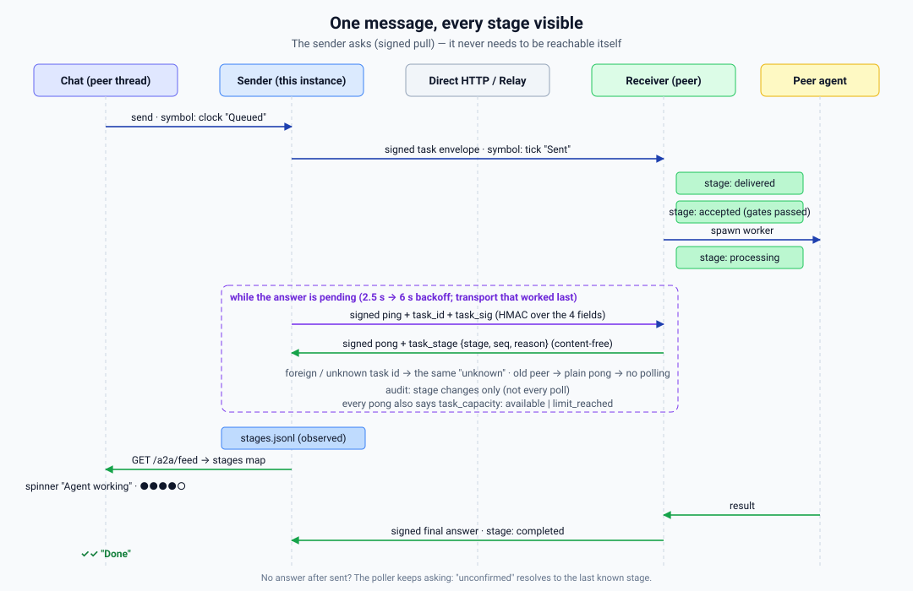

# Layer 38 — A2A Network Membership Attestation (ADR-0103)

This document covers the A2A network membership attestation system layered on top of
the core RemoteTriggerReceiver/Sender protocol (ADR-0048).  Read
[`docs/agent-communication.md` § Protocol Architecture](../agent-communication.md#protocol-architecture-layer-38--protocol-v4) for the base protocol reference.

---

## Overview

CorvinOS is Apache-2.0 open source. Without additional protection, a fork that
bypasses the local license check could build protocol-conformant A2A envelopes once
paired. ADR-0103 closes this gap by making the **pairing step** the enforcement
boundary: only instances holding a valid Corvin Labs Session Token (SesT) can join
the network.

### Trust anchor

A cryptographic trust anchor signs all A2A attestation envelopes. All four layers
below derive their security from this single root of trust.

---

## Layer 1 — Pairing Gate (M1)

**Trigger:** `corvin-a2a pair <peer> <peer-url>`

**Flow:**

```
Local instance                    features.corvinlabs.io
     │                                     │
     │── POST /v1/pair/authorize ──────────▶│
     │   { instance_id, sest_fp,           │
     │     peer_url }                      │
     │                                     │── verify SesT
     │                                     │── check revocation
     │◀── 200 { pairing_id, pairing_cert } │
     │         OR 403 { reason }           │
```

`sest_fp = SHA-256(header_b64url + "." + payload_b64url)` — the fingerprint of the
JWT header+payload, without its signature.

On success the **PairingCertificate** (30-day JWT) and `pairing_id` are written into
the origin JSON file alongside the HMAC keys.

**Fail-closed:** network errors or a 403 from the gate abort the pairing. Use
`--offline-pair` for isolated / air-gapped networks that do not connect to
Corvin Labs.

```bash
# Standard (requires network + valid SesT):
corvin-a2a pair mypeer https://remote.host:8000/v1/a2a/receive

# Isolated network:
corvin-a2a pair --offline-pair mypeer https://remote.host:8000/v1/a2a/receive
```

---

## Layer 2 — Per-Envelope Attestation (M2)

Every outbound `TaskEnvelope` (Protocol v6) carries a `network_attestation` block:

```json
{
  "task_id": "…",
  "origin_id": "…",
  "sender_instance_id": "…",
  "issued_at": 1749462000,
  "instruction": "…",
  "attachments": [],
  "network_attestation": {
    "sest_fp":     "<hex SHA-256 of JWT header.payload>",
    "sest_sig":    "<base64url signature from the JWT>",
    "pairing_id":  "<uuid from PairingCertificate>",
    "attested_at": 1749462000
  },
  "signature": "<HMAC-SHA256 over all fields including network_attestation>"
}
```

The `network_attestation` block is included in the HMAC payload, making it
tamper-evident. Replacing or stripping it invalidates the HMAC.

### Receiver validation (Step 6.8 in `_validate()`)

After HMAC verification succeeds:

| Check | Failure code |
|---|---|
| `attested_at` within ±300 s | `network_attestation_time_window` |
| Signature verify: `sest_sig` over `sest_fp` | `network_attestation_bad_sig` |
| `pairing_id` matches stored origin `pairing_id` | `network_attestation_pairing_mismatch` |
| `sest_fp` not on manifest revocation list | `network_attestation_revoked` |
| `pairing_id` not on manifest revocation list | `network_attestation_pairing_revoked` |

If `network_attestation` is absent: check `attestation_mandatory_after` from the
manifest. Before that timestamp (grace period), the envelope is accepted with a
WARNING. After it, the envelope is rejected with `network_attestation_required`.

**Disable for tests:**

```bash
CORVIN_A2A_ATTESTATION_DISABLED=1 pytest ...
```

---

## Layer 3 — Protocol Manifest (M3)

On every adapter restart, CorvinOS fetches a signed manifest:

```
GET https://corvinlabs.io/a2a/manifest.json
Mirror: https://github.com/CorvinLabs/CorvinOS/releases/latest/download/a2a-manifest.json
Cache: <corvin_home>/global/a2a_manifest.json  (mode 0600)
```

### Manifest schema

```json
{
  "schema_version": 1,
  "issued_at": 1749462000,
  "min_protocol_version": "3.0",
  "current_protocol_version": "6.0",
  "revoked_instance_ids": ["<uuid>"],
  "revoked_sest_fps":     ["<hex fp>"],
  "revoked_pairing_ids":  ["<uuid>"],
  "attestation_mandatory_after": 1752054000,
  "signature": "<signature over canonical JSON without this field>"
}
```

The manifest is cryptographically signed over the canonical JSON (all fields except
`"signature"`, sorted keys, no whitespace). The receiver verifies it against the
embedded trust anchor.

### Staleness policy

| Manifest age | Behaviour |
|---|---|
| < 3 days | Normal |
| 3–7 days | `a2a.manifest_stale` WARNING to audit chain |
| > 7 days | Treated as absent; revocation list cleared (fail-open) |

Operators can set `a2a_manifest_required: true` in `tenant.corvin.yaml` to make
a stale / absent manifest fail-closed (A2A reception disabled until refresh succeeds).

### Python API

```python
from a2a_manifest import load_manifest, clear_cached

manifest = load_manifest()
# manifest.revoked_sest_fps: set[str]
# manifest.revoked_instance_ids: set[str]
# manifest.attestation_mandatory_after: float  (unix timestamp)
# manifest.is_stale: bool
# manifest.sig_verified: bool

# Force re-fetch:
clear_cached()
manifest = load_manifest(force_refresh=True)
```

---

## Layer 4 — Self-Test (M4)

`corvin_operator/bridges/shared/self_test.py` runs `_check_a2a_network_membership()` as
part of `run_self_test()`.

| Check name | Severity | Condition |
|---|---|---|
| `a2a.network_pubkey` | CRITICAL | `a2a_network_pubkey.pem` missing or malformed |
| `a2a.network_pubkey` | WARNING | `cryptography` package not installed |
| `a2a.manifest_age` | WARNING | Cached manifest ≥ 3 days old |
| `a2a.sest_not_revoked` | CRITICAL | Local SesT fingerprint on revocation list |

---

## Audit events (ADR-0103)

Registered in `corvin_operator/forge/forge/security_events.py`:

| Event | Severity | When |
|---|---|---|
| `a2a.pairing_authorized` | INFO | M1 gate returns a valid PairingCertificate |
| `a2a.pairing_denied` | WARNING | M1 gate returns 403 or is unreachable |
| `a2a.manifest_fetched` | INFO | Fresh manifest successfully fetched + verified |
| `a2a.manifest_stale` | WARNING | Cached manifest ≥ 3 days old, or no manifest available |
| `a2a.attestation_failed` | WARNING | Any M2 validation failure |

**Audit allow-list** — never include in `details`:
- SesT bytes or full JWT
- Instruction or result payload
- Full `sest_fp` (use first 16 hex chars: `sest_fp_prefix`)
- Pairing cert body

**Allowed in `details`:** `instance_id`, `sest_fp_prefix`, `pairing_id`,
`origin_id`, `endpoint_id`, `reason`, `grace_days_remaining`, `manifest_age_days`.

---

## Key files

| File | Role |
|---|---|
| `corvin_operator/security/a2a_network_pubkey.pem` | Embedded trust anchor public key |
| `corvin_operator/bridges/shared/a2a_manifest.py` | M3 manifest fetch / cache / expose |
| `corvin_operator/voice/scripts/corvin_a2a.py` | M1 pairing gate (`_authorize_pairing_m1`) |
| `corvin_operator/bridges/shared/remote_trigger_sender.py` | M2 build `network_attestation` |
| `corvin_operator/bridges/shared/remote_trigger_receiver.py` | M2 validate `network_attestation` |
| `corvin_operator/bridges/shared/self_test.py` | M4 CRITICAL checks |
| `corvin_operator/forge/forge/security_events.py` | New A2A audit event types |

---

## Licence quota enforcement — pairing routes

All console pairing paths enforce `a2a_peers_max` (ADR-0094) before writing
any origin/endpoint config files. Exceeding the limit returns HTTP 402.

| Route | Quota check added |
|---|---|
| `POST /remote-trigger/pair/redeem` | Yes (original ADR-0094 implementation) |
| `POST /remote-trigger/pair/accept` | Yes — issuer side (review fix 2026-06-17) |
| `POST /remote-trigger/pair/cli-accept` | Yes (review fix 2026-06-17) |
| `POST /remote-trigger/pair/friendship/import` | Yes (review fix 2026-06-17) |

The shared helper `_check_a2a_peers_max()` (in `a2a_pair.py`) counts existing
`*.json` files in the origins directory and raises HTTP 402 when the count
meets or exceeds the licence limit.

---

## Per-connection rights + connection names (2026-07-20)

Pairing is bidirectional (each side stores an inbound *origin* and an outbound
*endpoint*), and **each side owns its own inbound policy**: what a peer may do
here is decided exclusively by the local origin file — the peer has no say in
it, and every field can be changed retroactively from the console (Chat →
sidebar **Peers** tab → gear icon → *Peers & Permissions*, i.e.
`PeerManagementDialog`) via `PATCH /v1/console/remote-trigger/origins/{id}`.

Editable per-connection fields (`OriginPatchRequest`, `a2a_pair.py`):

| Field | Meaning |
|---|---|
| `enabled` | connection on/off |
| `spawn_worker` | Observer (validate-only) vs Executor (M2 worker runs the instruction) |
| `allowed_personas` | persona allow-list; `[0]` is the active persona. Empty (the console's "Full Executor" preset) runs as `assistant` — it was rejected as `injection_attempt:no_allowed_personas` until 2026-10-06. The persona is a role label only; tools come from the `allow_*` flags |
| `max_ttl_s` | cap on envelope TTL (10–86400 s) |
| `label` | human-readable connection name (≤80 chars, control chars stripped) |
| `allow_bash` / `allow_network` / `allow_read_files` / `allow_write_files` / `allow_subagents` | M2 tool policy opt-ins — **deny-by-default** (ADR-0144); enforced in `remote_trigger_receiver._spawn_and_filter()` |

The tool policy is compiled into a `--disallowedTools` denylist (built-ins:
Bash · WebFetch/WebSearch · Read/Grep/Glob/LS/NotebookRead · Write/Edit/… ·
Task/Todo*). The A2A worker also spawns with `--strict-mcp-config` (no
`--mcp-config`), so it loads **zero** MCP servers — the operator's user-scoped
MCP tools (`~/.claude.json`) can't be used to sidestep `allow_network=false` /
`allow_read_files=false`. Persona-scope narrowing beyond the denylist is
advisory (prompt text), not a security boundary.

**Honest limits of the checkbox model (2026-07-20):**

- **`allow_bash` requires `allow_network` (2026-10-05).** A shell is network
  access (`curl`, `ssh`, a loopback call to this console). The receiver now
  refuses Bash (and every other shell tool) for an origin that grants bash but
  not network, audited as `A2A.bash_denied_without_network`.
- **`allow_read_files` / `allow_write_files` are NOT confined to the A2A
  workspace.** The worker runs `claude` with `--dangerously-skip-permissions`;
  `--add-dir <workspace>` adds a directory, it confines nothing. A read grant
  can read anything the OS user can (other origins' keys, `~/.config`), a write
  grant can write anything (shell rc files → code execution later). Real
  confinement needs path-scoped permission rules or OS isolation of the worker
  (ADR-0241/0238) — not built. Grant these only to peers you would give a shell.
- **The console's confirm gate holds against the MCP tool path, not against a
  shell.** A chat-staged `a2a_send` / token request becomes real only through a
  session+CSRF route — but the console's local login is credential-less on
  loopback, so a worker that can run Bash as the same OS user can obtain such a
  session itself. Same boundary as the session ledger and the audit chain:
  integrity against a same-user worker needs OS-level isolation.
- **Group erasure for a REMOVED member guesses "local uploader" (2026-10-05).**
  `ChatGroupHandler` deletes a departed sender's referenced attachment files
  only when at least one matching CURRENT participant record is not
  `kind=a2a_peer`. Once a member is removed from `meta.json` (left, or kicked)
  their `kind` is gone, and the handler falls back to treating them as a local
  uploader (not a peer) — correct for the common case (a web/console sender
  that was never added as a formal participant), but it means a REMOVED peer's
  historical message that happens to name a real attachment filename in its
  text can trigger a delete it would not have triggered while still a member.
  Fixing this needs persisting `kind` per message (or per removed-participant
  tombstone), not attempted here.

- `allow_subagents=true` unblocks the Task tool, and the engine does **not**
  contractually guarantee that the other per-connection denies bind inside
  subagent workers: claude-CLI subagents inherit the parent session's
  permission context, but the bare-name `--disallowedTools` form used here is
  a context-removal mechanism whose propagation into Task subagents is only
  inferred from documentation, and non-claude engines guarantee nothing.
  Because of that gap, `_spawn_and_filter()` **force-restricts** (A5, 2026-07-20):
  if `allow_subagents=true` is combined with **any** of `allow_bash` /
  `allow_network` / `allow_write_files` **denied**, the subagent grant is
  ignored — Task/Todo* stay on the denylist and the downgrade is audited as
  `A2A.subagents_force_restricted` (WARN). So a dangerous capability that is
  switched off can no longer be re-reached through a Task subagent. Only when
  every dangerous capability is granted does `allow_subagents=true` actually
  enable Task — where, by definition, there is no stricter deny left to leak.
- `allow_bash=true` factually includes network egress (`curl`/`wget` run in
  the shell). The Network checkbox only gates the built-in WebFetch/WebSearch
  tools — checkbox independence between Shell and Network is a fiction.

`GET /remote-trigger/origins` returns the same fields (never keys); stored
labels are re-sanitized read-side on **every** delivery surface (console
origin/endpoint listings, `GET /pair/friendship/connections`, the `PATCH`
origin/endpoint responses when the body omits `label`, MCP
`a2a_list_endpoints`, `peek_label()`) so pre-sanitizer records cannot carry
ANSI/bidi content (e.g. a U+202E override) to the UI or agent (A4
defense-in-depth). The
outbound side edits `label` / `url` / `enabled` / `default_ttl_s` via
`PATCH /remote-trigger/endpoints/{id}`; a patched `url` is schema-checked
(http/https only, non-empty host, no embedded credentials) but deliberately
NOT passed through an L35/danger-category egress gate — outbound A2A POSTs
never traverse L35 (documented egress honesty, see
`a2a_friendship.update_endpoint_url`). PATCH-route ids additionally reject
`:` (Windows drive-relative path escape).

**Concurrency (2026-07-20):** every read-modify-write on origin/endpoint
files — console PATCH routes, `friendship_set_url`/`activate_connection`,
the reconnect-driven `update_endpoint_url` in the bridge receiver, and the
`corvin-a2a` CLI writers `label-endpoint` and `migrate-attestation` (A2
residual) — runs under `a2a_friendship.config_file_lock` (per-directory
`.a2a_config.lock`, `fcntl.flock` on POSIX / `msvcrt.locking` on Windows) in
addition to the console's in-process `_pair_lock`. The POSIX acquire is
BOUNDED (`LOCK_TIMEOUT_SECONDS`, 2 s, `LOCK_EX | LOCK_NB` + retry): a wedged
holder raises `FriendshipLockBusy` and `friendship_set_url` answers 503
`lock_busy` instead of hanging forever. The module's advisory fail-soft still
covers a lock that cannot be *obtained*; a *contended* lock refuses, because
proceeding unlocked is the very lost update this section is about. This closes the
cross-process lost-update window where a peer could time reconnect
notifications — or a concurrent CLI edit could overwrite a lock-holding
console PATCH — to silently revert a fresh operator edit such as
`enabled: false`.

**Windows parity (ADR-0265, 2026-08-01):** `RemoteEndpointRegistry.load()` and
`OriginRegistry.load()` both reject a world-readable config file via a POSIX
`st_mode & (S_IRWXG|S_IRWXO)` check. NTFS has no separate owner/group/other bits, so
CPython's `nt` stat mirrors the owner bits onto group/other — this bitmask was
unconditionally true for every existing, readable file on Windows, so the check rejected
every endpoint/origin file unconditionally, making A2A send AND receive 100%
non-functional on any Windows-hosted instance (send/receive to ANY peer, including
another Windows instance). Fixed with a `sys.platform.startswith("win")` guard mirroring
`instance_identity.py::_validate_mode_strict`'s existing, correct precedent for the same
class of check — no-op on Windows rather than a half-implemented ACL check.

**Connection names for delegation:** `RemoteEndpointRegistry.resolve(name)`
(`remote_trigger_sender.py`) maps a reference to an endpoint_id — exact id →
unique case-insensitive label → unique id-prefix. An **exact endpoint_id
match wins deterministically** (ids are operator-assigned and unique; a
peer-controlled label equal to another peer's id must not make the victim
unaddressable — peer-triggerable DoS otherwise). Below that, an ambiguous
label raises `EndpointError("ambiguous_endpoint_ref")` instead of silently
picking a peer. The CLI (`corvin-a2a send <name>`) and the MCP tool
`mcp__forge__a2a_send` (`forge.mcp_server`, ADR-2099 Phase 2) accept a
connection name; the agent discovers names via `mcp__forge__a2a_list_endpoints`
(labels are returned for disabled peers too, via `peek_label()`, sanitized
read-side). In the console chat, `a2a_send` is gated by the
`a2a_send_from_chat` flag (dark by default) and enforces a two-step confirm:
the MCP tool stages a pending record only; a real browser session + CSRF token
confirms the send, preventing LLM-steered sends without operator action.

---

## Chat-native friendship tokens + group chat with foreign A2A agents (ADR-2216)

**Friendship tokens from chat (same two-step gate shape as `a2a_send`):**
`mcp__forge__a2a_friendship_token_create` (`forge.mcp_server`, gated by
`a2a_friendship_token_from_chat`, dark by default) stages a REQUEST only —
`label`/`ttl_hours`/`personas`, no key material. A real browser session +
CSRF token via `POST /remote-trigger/pair/friendship-token/confirm/{id}`
(`core/console/corvin_console/routes/a2a_pair.py`) is the only path that
actually calls `a2a_friendship.create_friendship_token()` and mints the
256-bit shared key, returned as a shareable card (the operator copies/sends
it outside chat — e.g. by email — to whoever they want to pair with). A
pasted-in token (`corvin-a2a:ft1:...`) is accepted via the pre-existing
`POST /remote-trigger/pair/friendship/import` route, unchanged. Preview:
`GET /remote-trigger/pair/friendship-token/pending/{id}`.

**Group chat (`core/console/corvin_console/chat_group_store.py` +
`routes/chat_groups.py`), the first group-conversation backend in
CorvinOS.** A group's `Participant.kind` is `human | agent | a2a_peer` from
the first commit. Two-layer authorization: the group's own participant
list gates who sees the conversation; `require_friendship_active(peer_id)`
(reuses `a2a_feed._peers()`) is re-checked LIVE on every `a2a_peer` admit
*and* every message send — never cached — so a friendship revoked (peer
endpoint disabled) after a peer joined immediately blocks the next message,
not just future joins.

Routes (`/v1/console/chat/groups...`): `GET/POST /chat/groups`,
`GET/DELETE /chat/groups/{id}`, `POST /chat/groups/{id}/participants`,
`DELETE /chat/groups/{id}/participants/{pid}`,
`GET/POST /chat/groups/{id}/messages`, `POST /chat/groups/{id}/send-to-peer`.

**Delivery across instances (ADR-2218).** A group lives on the instance that
created it (its *origin*); its `group_id` travels on the `TaskEnvelope`.

- **Outbound fan-out.** `POST /chat/groups/{id}/messages` stores the message
  (`delivery="fanout"` when the group has `a2a_peer` members, else `"local"`)
  and hands one `RemoteTriggerSender.send(..., group_id=...)` per peer to a
  background pool — the HTTP response never waits on a peer. Every outcome is
  audited (`chat.group.message_sent_to_peer` / `..._send_to_peer_failed`).
- **Inbound.** `RemoteTriggerReceiver` routes an envelope carrying `group_id`
  to `chat_groups.handle_inbound_group_message`, wired at both receiver
  construction sites (`corvin_console/standalone.py`, `corvin_gateway/app.py`).
  It re-checks the friendship live and appends under the sender's
  participant entry.
- **Mirror groups.** The first message of a group this instance does not know
  opens a *mirror* under the same `group_id` — only for an ACTIVE friend,
  title `Group with <peer>`, local `operator` first, sender as `a2a_peer`,
  `created_by = "a2a:<origin>"`, audited `chat.group.mirror_created`. A
  non-friend or an id failing `^[A-Za-z0-9_-]{1,64}$` is refused.
- **Hub relay, loop-free.** The ORIGIN instance forwards a peer's message to
  the group's other peers as `[<sender>] <text>`; a mirror never relays. So a
  three-instance group reads the same on all sides and nothing can circulate.
  Third parties see a relayed message as coming from the origin, with the
  author named in the text — the wire carries no per-message author.
- **Delete** removes the group on THIS instance only; mirrors elsewhere stay.

**Frontend — one chat page (2026-10-04).** Group chats and A2A conversations
live inside `/app/chat` (`web-next/src/pages/chat.tsx`). The main area shows
whatever the URL names: `/app/chat/<sid>` (operator ↔ CorvinOS session),
`/app/chat/group/<id>` (`components/chat/GroupConversation.tsx`),
`/app/chat/peer/<id>` (direct A2A thread from `GET /a2a/feed?peer_id=`,
`components/chat/PeerConversation.tsx`). The right sidebar
(`components/chat/ChatContextSidebar.tsx`) switches between **Chats**
(sessions), **Peers** (groups, connected agents, friendship tokens) and
**A2A** (pending confirmations a chat turn staged + recent agent traffic),
with `Alt+1/2/3` and a pending-count badge; the choice persists in
`localStorage` (`corvin.chat.sidebarMode`). Below `md` the sidebar is a
drawer. Confirmations are still POLLED (`GET /a2a/feed/send/pending`,
`GET /remote-trigger/pair/friendship-token/pending`) because
`chat_runtime.py` streams `tool_use` but never its result, so no inline
confirm card can be rendered from a chat bubble yet. The former
`/app/chat-groups` panel is gone; the route redirects to `/app/chat`.
E2E: `web-next/tests/e2e/chat-unified-panel.spec.ts` (live server, Chromium +
Firefox), `tests/e2e/a2a/test_chat_groups_e2e.py`,
`tests/e2e/test_a2a_group_routing_phase35_e2e.py`.

---

## Proactive Reconnect (ADR-0198, dynamic-IP peers)

**Problem:** an instance behind a dynamic-IP connection (e.g. an LTE router)
changes its public address at runtime. Every peer that already holds it as an
ACTIVE friendship endpoint (`corvin_operator/cowork/remote_endpoints/<kid>.json`)
keeps the stale URL until either an operator manually re-runs
`activate_connection`, or the next real task send fails with a
`TransportError` — a purely passive, timeout-driven recovery path.

**Mechanism:** the changed instance pushes a signed reconnect notification
to each known peer instead of waiting to be called. It travels as an
ordinary `TaskEnvelope` carrying a new optional
`reconnect: {"new_url": "<base url>"}` field (additive — the wire version
stays at the actual `PROTOCOL_VERSION = 8`; the constant is reserved for
capability-discovery milestones, not every additive field), HMAC-covered by
the *same* per-pairing key already established at pairing time — no new
credential, no new trust root. `RemoteTriggerReceiver.receive()`
short-circuits on this field, BEFORE attachment/classification/
worker-dispatch machinery, validates the URL, then rewrites the peer's own
`remote_endpoints/<kid>.json` `url` field via
`a2a_friendship.update_endpoint_url()`.

**Backward compatibility (honest statement, corrected 2026-07-19):**
pre-ADR-0198 receivers do NOT silently ignore the `reconnect` field — their
canonical payload omits the unknown key, so the sender's HMAC no longer
matches and the envelope is hard-rejected with `bad_signature`. That is
accepted fail-closed behaviour: an old peer never half-applies a reconnect,
it visibly rejects it; the fail-soft `send_reconnect()` logs
`A2A.reconnect_send_failed` and normal task traffic is unaffected.

**Fail-closed guarantees:**

| Guard | Effect |
|---|---|
| Signature/origin/time-window/replay checks run in `_validate()` first | An unauthenticated or replayed reconnect is rejected before it is even parsed as a reconnect |
| Endpoint must already be `state == "ACTIVE"` and `enabled` | A PENDING (never-yet-connected) or disabled peer cannot be reconnected into existence — reconnect can only *update* trust that already exists |
| Danger-category SSRF gate (2026-07-19 redesign; `a2a_friendship._reconnect_url_rejection_reason`) | Shape checks (`http(s)://`, ≤512 chars, printable, no whitespace) PLUS no https→http downgrade (`http` only if the previously stored URL was `http`). Then EVERY resolved address **and every embedded-IPv4** it carries (`.ipv4_mapped`, `.sixtofour`, NAT64 `64:ff9b::/96` + `64:ff9b:1::/48`) is classified: **forbidden** (loopback, link-local incl. `169.254.169.254` metadata + `fe80::/10`, unspecified, multicast, reserved) → `reconnect_url_forbidden_host` unconditionally; **private/LAN** (RFC1918, CGNAT `100.64/10`, ULA `fc00::/7`) → allowed ONLY if the previous stored host was ALSO private/LAN (LAN renumbering), else `reconnect_url_global_to_private`; **global** → allowed. Resolution failure rejects; `localhost`/`.onion` reject outright. This closes the NAT64/6to4/v4-mapped bypass (e.g. `[64:ff9b::7f00:1]` = 127.0.0.1) that the earlier `is_global`-only rule missed, while re-permitting the legitimate LAN/hotspot (`172.20.10.x`, `192.168.x`) reconnect it wrongly banned |
| No redirect-following on outbound POST/ping (2026-07-19; `remote_trigger_sender._NO_REDIRECT_OPENER`) | `_http_post` routes through a `HTTPRedirectHandler` that refuses to follow — a paired peer's `302` to `http://127.0.0.1`/`169.254.169.254` becomes a `http_3xx` `TransportError`, not a silent internal fetch |
| Write-first, audit-reflects-reality (`_handle_reconnect`, redesigned 2026-07-19 — the earlier build audited `reconnect_applied` BEFORE the write, so a subsequent write failure left the chain asserting an application that never happened) | Order is: read-only validation → on rejection audit `A2A.reconnect_rejected` (no write; audit-failure rolls back the nonce and rejects) → on pass, DURABLE endpoint write (temp+fsync+rename) FIRST, then audit the *real* outcome: `A2A.reconnect_applied` only when the write truly succeeded, else `A2A.reconnect_failed`. Nonce invariant: every path either audits a definitive outcome with the nonce consumed, or rolls the nonce back |
| Egress-control honesty (2026-07-19 — corrected) | Outbound A2A peer POSTs do **NOT** pass the L35 `check_engine_egress` gate (that gate is an engine-spawn control, never applied to A2A peer URLs — the earlier "still pass the L35 egress gates" claim was false). The real controls are the two rows above: no-redirect + the danger-category host gate. A **DNS-rebinding residual** remains (a compromised paired peer using short-TTL DNS that resolves global at check-time and private at send-time) — accepted for this release: the peer must already be a cryptographically-paired ACTIVE friend and redirects are blocked |
| No IP/URL in audit `details` | Mirrors the existing A2A audit allow-list (`endpoint_id`, `task_id`, `reason`, `status`, `duration_ms`) — the new URL itself is never logged. Numeric audit values are magnitude-bounded (≤ 10^13) so a Discord-UID-shaped int cannot leak past the backstop the way its string form is redacted (2026-07-19) |

**Trigger (sender side):** `RemoteTriggerSender.send_reconnect(endpoint_id, new_url)`
builds and POSTs the signed envelope, fail-soft (never raises). It is polled
from `a2a_friendship.check_and_broadcast_reconnect()`, which compares the
local outbound-interface IP (pure local UDP-connect trick, no external
egress call) against a cached last-known value at
`<corvin_home>/global/remote_trigger/last_known_ip`; on change, it
re-announces the operator-configured `get_my_url()` to every ACTIVE
friendship endpoint. This is polled from the existing 5-minute presence-
heartbeat thread (`aco/heartbeat.py::_heartbeat_loop`) rather than a new
dedicated thread — deliberately independent of `ping_enabled` (opting out of
the anonymous telemetry ping says nothing about wanting dead A2A peer links).
Since 2026-07-19 the heartbeat thread ALWAYS starts; `ping_enabled` gates
only the telemetry `send_heartbeat` inside the loop (re-checked per
iteration), so boot-time opt-outs still get the A2A reconnect poll.
Re-announce semantics (2026-07-19 fixes): the new IP is persisted once the
reconnect was **delivered** to ≥ 1 peer — i.e. that peer returned a
cryptographically SIGNED response, accept OR reject — or when there is nothing
to announce. Delivery, not acceptance, drives persistence: a peer that
signs-rejects will reject again on retry, so re-broadcasting to it every tick
is pointless and previously grew both audit chains unbounded (`send_reconnect`
now returns True on any signed response, False only for a genuinely
unreachable/unsigned peer). An all-peers-unreachable cycle still retries on
the next tick instead of silently losing the change. Broadcast cost is bounded
(10 s per peer, 180 s wall-clock budget per cycle).

**Scope note:** local-interface-IP-changed is a *proxy* trigger, not true
public-IP detection (which would require an external STUN/echo call and a
new L35 egress allowlist entry — out of scope here). Operators behind
NAT/CGNAT must still keep `my_a2a_url` (`CORVIN_A2A_URL` env var or
`<corvin_home>/global/remote_trigger/my_a2a_url`) current, e.g. via a DDNS
updater; this mechanism only makes the *push* proactive once that URL is
known to have changed, instead of leaving peers to time out.

### Audit events (ADR-0198)

| Event | Severity | When |
|---|---|---|
| `A2A.reconnect_sent` | INFO | Sender's `send_reconnect()` received a signed `"ok"` response (accepted). Note: a signed `"rejected"` also counts as *delivered* for persistence, but is logged under `reconnect_send_failed` for visibility |
| `A2A.reconnect_send_failed` | WARNING | Transport error, bad/absent signature, unsigned response, or the peer signed-rejected the reconnect |
| `A2A.reconnect_applied` | INFO | Receiver validated the reconnect AND the durable endpoint write succeeded; event lands AFTER the write (write-first, audit-reflects-reality) |
| `A2A.reconnect_rejected` | WARNING | Receiver validated the envelope but declined to apply (bad URL shape, danger-category SSRF gate, no matching ACTIVE endpoint) — no write attempted |
| `A2A.reconnect_failed` | WARNING | Validation passed but the durable endpoint write failed (transient: disk full / race); the nonce is rolled back so a later push retries (replaces the former `reconnect_rollback`, which the write-first ordering makes unnecessary) |

### Key files (ADR-0198 additions)

| File | Role |
|---|---|
| `corvin_operator/bridges/shared/remote_trigger_receiver.py` | `TaskEnvelope.reconnect` field, `_handle_reconnect()` |
| `corvin_operator/bridges/shared/remote_trigger_sender.py` | `RemoteTriggerSender.send_reconnect()` |
| `corvin_operator/bridges/shared/a2a_friendship.py` | `update_endpoint_url()`, `detect_local_ip()`, `check_and_broadcast_reconnect()` |
| `core/console/corvin_console/aco/heartbeat.py` | polls `check_and_broadcast_reconnect()` each 5-min tick |

---

## Typed error taxonomy (ADR-0197, sender-side)

`RemoteTriggerSender.send()` and `ping()` classify every failure into a
closed `error_category` enum (`remote_trigger_sender.ErrorCategory`),
surfaced on `SendResult` / `PingResult` alongside the legacy `ok`/`status`
fields:

| `error_category` | Meaning for the caller |
|---|---|
| `unreachable` | Nothing answered — DNS, refused, or TLS failure (`connection_failed`) |
| `timeout_transport` | Sender-side connect/read/total-transfer deadline |
| `timeout_remote` | Peer answered; its own worker/engine timed out — **`ok=False`** (fixes the pre-ADR bug where this read as success) |
| `rejected` | Peer explicitly refused (validation, TTL, revocation, rate limit) |
| `filtered` | House-rules (L44) blocked the instruction |
| `auth_failed` | Something answered but did not prove it was the paired peer (`bad_signature` / `missing_signature` / `task_id_mismatch`, unsigned ping response, instance-pin mismatch) |
| `http_error` | Peer's HTTP layer rejected before A2A logic (`http_status` carried alongside) |
| `protocol_error` | Unparseable/oversized response, invalid attachments |
| `internal_error` | Catch-all |

**Corrected `ok` semantics:** `SendResult.ok = (status not in ("rejected", "timeout"))`
— `ok=True` means the instruction actually ran and returned a receiver-signed result.

**Template-only `error_detail` (ADR-0197 §2, hardened 2026-07-19):**
`error_detail` is ALWAYS drawn from the fixed template set
(`_ERROR_DETAIL_TEMPLATES`) or the closed exception-type-name allowlist
(`_ALLOWED_EXC_TYPE_NAMES`) — never `str(exc)` verbatim, never interpolated
peer-controlled text (a malicious receiver's `status` string is mapped to
the fixed `"unexpected_receiver_status"` template). Reason strings are
closed at the raise sites (`transport_error:<TypeName>`,
`invalid_response_json`, `canonical_encode_failed`, `bad_recv_key` — no
embedded exception text).

**Audit fields + fail-closed backstop:** every audited `details` dict passes
through `_assert_audit_details_safe` (analogous to telemetry's
`_assert_safe`): only allowlisted keys (`endpoint_id`, `task_id`,
`instance_id_match`, `status`, `duration_ms`, `reason`, `ttl_s`,
`nonce_prefix`, `http_status`, `error_category`, `error_detail`,
`attachments_count`, `our_chain_tail`, `peer_chain_tail`, `match`,
`reachable`, `source`) with enum/typename-shaped values; free-form values
are dropped and replaced with `"redacted"` — never raised on, never sent.

---

## Lightweight peer liveness — `a2a_ping` (ADR-0199)

**Status: sender + receiver implemented in ALL THREE hosts (2026-07-29)** —
`POST /v1/a2a/ping` is served by `a2a_http_server.py`, the gateway
(`corvin_gateway/app.py`), AND `corvin_console.standalone` (added 2026-07-29,
ADR-0257 — see below; `corvinos-serve`, the default autostart target on every
OS, runs `corvin_console.standalone` and had NO A2A listener at all before
this). All three delegate to the shared core
`a2a_http_server.process_ping_request()` so the backends cannot drift
(ADR-0199's parity requirement holds by construction).

Receiver-side behavior (2026-07-22 adversarial-review hardening):
- **Anti-oracle ordering:** the HMAC signature is verified BEFORE the
  freshness check, and unknown-origin / bad-signature both return one opaque
  `403 ping_rejected` — an unauthenticated caller cannot enumerate paired
  origin_ids. `400 stale_ping` is only reachable with a valid signature.
- **Rate limit:** a ping-only, separately-bounded per-origin token-bucket map
  (60 rpm, `_PING_RATE_BUCKETS`) is checked BEFORE any disk work, so ping
  floods cannot burn CPU/disk via `OriginRegistry.load`. It is deliberately
  NOT the receiver's `/receive` bucket map: that map's invariant is
  "populated post-HMAC only", and sharing it would let unauthenticated fake
  origin_ids evict real `/receive` buckets — ping floods can at worst evict
  other ping buckets.
- **task_id echo:** the signed response carries `task_id = ping_id`
  (Decision 3); a valid ping also records a receiver-side endpoint heartbeat
  (`a2a_friendship.record_endpoint_heartbeat`).

`RemoteTriggerSender.ping(endpoint_id, timeout_s)` — timeout clamped to
`[2, 10]` s (default 5), far below `a2a_send`'s `[5, 120]` window.

- **Request:** `{ping_id: uuid4, issued_at, origin_id}` + HMAC-SHA256
  signature with the pairing's `hmac_key`. POSTed to `<base>/v1/a2a/ping`,
  where `<base>` is the endpoint URL with its `/v1/a2a/receive` suffix
  stripped.
- **Response (contract):** `{ok, instance_id, protocol_version, server_time,
  task_id}` signed with the pairing's `recv_key`; **`task_id` MUST echo the
  request's `ping_id`** (anti-replay binding — settled 2026-07-19, see
  ADR-0199). The sender verifies via
  `_verify_response(..., expected_task_id=ping_id)`.
- **Authenticated, non-negotiable:** only a *signed*, verified response
  yields `reachable=true`. The legacy unsigned-rejection tolerance
  (ADR-0077 C-5) never confers liveness — an unsigned `ok:true` is
  `auth_failed` (forgeable-liveness fix, 2026-07-19).
- **No nonce store** — pings are side-effect-free; ±30 s `issued_at`
  freshness suffices (enforced receiver-side).
- **Failures reuse the ADR-0197 enum** (one taxonomy, two producers).
- **Audit:** one `A2A.ping_result` event per call (INFO when reachable,
  WARNING otherwise) with closed-enum details only (`endpoint_id`,
  `reachable`, `source`, `error_category`, `duration_ms`).
- The ADR-0199 §2 heartbeat-cache fast path is deliberately NOT implemented
  sender-side yet — it needs receiver-side last-seen records that do not
  exist; `source` is always `"network_probe"` for now.

---

## Reciprocal friendship handshake (ADR-0257, 2026-07-29)

The friendship-token flow (`create_friendship_token` → `import`) previously
produced two INDEPENDENT one-way trust records, not one bidirectional
pairing — the issuer had no record of the redeemer until the WHOLE token
exchange was repeated a second time in reverse, and `state="ACTIVE"` was set
purely from url-presence, never a reachability check. Fixed via a new
signed callback, one round trip, no extra operator step:

- `create_friendship_token()` call sites now also call
  `a2a_friendship.save_pending_friendship()` — a short-lived, single-use
  record (`kid` + the shared key) under a NEW directory,
  `corvin_operator/cowork/remote_pending_friendships/` (env override
  `REMOTE_PENDING_FRIENDSHIPS_DIR`, same 0600/atomic-write convention as
  `remote_origins`/`remote_endpoints`).
- `friendship_import` (redeemer B), after writing its local files as before,
  calls `a2a_friendship.send_friendship_ack()` — a signed `POST
  {issuer_url}/v1/a2a/friendship-ack`, authenticated with the SAME
  `hmac_key` both sides derive independently from the token's shared key
  (`_derive_channel_keys` — no new credential).
- The issuer (A)'s `a2a_friendship.process_friendship_ack_request()` (shared
  core, all three hosts — same "ships together" invariant as ping above)
  verifies the ack against its pending record (anti-oracle 403, same pattern
  as ping's unknown-origin/bad-signature), writes ITS OWN origin+endpoint
  files for B under the SAME `kid` (reusing `to_origin_dict`/
  `to_endpoint_dict` via a reconstructed `FriendshipToken`), PINGS B back
  (ADR-0199 `sender.ping()`) before ever reporting `state="ACTIVE"`, and
  deletes the pending record (single-use).
- New route: `POST /remote-trigger/pair/friendship/{kid}/recheck` —
  re-verify an existing connection (ADR-0199 ping) without repeating the
  token exchange.
- `state` now has THREE values: `PENDING` (no url known yet — unchanged),
  `UNREACHABLE` (a url is known but this side's own probe failed — **new**,
  replaces the old "ACTIVE by url-presence"), `ACTIVE` (this side's own
  probe succeeded). The connection record also carries `_peer_knows_us` /
  `_peer_reports_reachable` — separate from `state` — so the UI can tell "I
  can reach them" apart from "they can also reach me back" (the latter needs
  Settings → A2A → "My URL" configured; without it, an ack can never be
  sent and the pairing stays one-way).
- **Host gate for the ack's declared URL** (`a2a_friendship._ack_url_rejection_reason`)
  is DELIBERATELY more permissive than the ADR-0198 reconnect gate above: a
  first-time pairing has no "previous" stored URL to compare against, so
  private/LAN addresses are allowed unconditionally (only the "forbidden"
  category — loopback, link-local incl. cloud metadata, unspecified,
  multicast, reserved, `.onion` — is rejected). Two LAN machines pairing for
  the first time is the common case this whole feature exists for.
- **`origin_id_for_send` fix (found while implementing the above):**
  `to_endpoint_dict()` previously never set this field, so every
  `send()`/`ping()`/`send_reconnect()` for a friendship-token pairing fell
  back to the sender's own random `instance_id` as the outbound `origin_id`
  — which could never match the receiver's origin file (named `<kid>.json`).
  Every authenticated call from a friendship-token-paired endpoint was
  rejected as "unknown origin" REGARDLESS of `state`. Now set to `token.kid`.
- Tests: `corvin_operator/bridges/shared/test_a2a_friendship_handshake.py` (real
  HTTP, two instances, same harness style as `test_a2a_bidirectional.py`).
- Existing pre-2026-07-29 friendship connections lack `origin_id_for_send`
  and were never reciprocal — delete and re-pair them.

### LAN pairing usability (2026-08-02)

Reported live: pairing a Windows and a Linux instance on the same home
network got stuck at `PENDING`/`UNREACHABLE` with no visible cause, and the
operator had no idea their own LAN IP was even relevant. Two fixes:

- **`POST /remote-trigger/pair/friendship/create` never issues a token with
  no URL when one is inferable.** Previously a blank "own URL" form field
  produced `url=None` in the token — permanent `PENDING` on the importer's
  side, with no recovery short of the issuer discovering their own LAN IP by
  hand and re-pairing. It now falls back to the already-configured
  `a2a_friendship.get_my_url()`, then to `suggest_my_url()` (the same
  mesh-VPN-then-local-interface auto-detection `GET /my-url` already offers)
  — so a same-LAN pairing, the case this whole feature exists for (see
  `_ack_url_rejection_reason` note above), works without the operator ever
  needing to know or type their own address. The auto-detected value is
  persisted via `set_my_url()` so it shows under Settings → A2A afterward.
- **`MyUrlBanner`'s "Use this URL" button was hidden for private/RFC1918
  addresses** — exactly the addresses correct for LAN pairing — forcing the
  operator to retype the same value manually via "Enter a different URL…".
  Fixed: the button now always shows; the warning copy for a private address
  was reworded from "not reachable by external peers" (which read as "this
  is wrong") to explain it works for same-network pairing and only needs a
  VPN/public domain for peers outside the network.
- **Windows Firewall / Linux `ufw`**: `install.ps1` now adds a best-effort
  inbound allow-rule for the console/A2A port (`Install-CorvinFirewallRule`,
  idempotent, never fatal, no elevation check — mirrors
  `Install-CorvinAutostart`'s try/catch idiom); `install.sh` does the Linux
  equivalent via `ufw allow 8765/tcp`, but ONLY if `ufw` is already active
  and NEVER via `sudo` (this installer only elevates on the explicit
  `--always-on` flag) — Windows' and (when active) ufw's default inbound-
  block policy otherwise silently drops the peer's reachability probe,
  which looks identical to a misconfigured URL from the UI.

---

## Threat model

| Threat | Mitigated by |
|---|---|
| Fork bypasses pairing attestation | M1 (pairing gate) + M2 (per-envelope signed attestation) |
| Stolen HMAC keys without SesT | M2 (fork has no signing key) |
| Compromised legitimate instance | M3 (manifest revocation effective on next restart) |
| MitM on manifest fetch | Manifest is cryptographically signed; MitM cannot forge |
| Stale manifest attack | 7-day TTL; `a2a_manifest_required` for strict mode |
| Free-tier quota bypass via alternative pairing paths | `_check_a2a_peers_max()` called by all 4 pairing routes |
| Unauthenticated reconnect hijack (redirect a peer's outbound calls to an attacker URL) | `_validate()`'s HMAC/origin/time-window/replay checks run before `reconnect` is even inspected — no distinct/weaker trust path (ADR-0198) |
| Reconnect-as-bootstrap (spoof a PENDING/never-connected peer into existence) | `update_endpoint_url()` refuses any file that is not already `state == "ACTIVE"` and `enabled` (ADR-0198) |

**Out of scope:** Operator with valid license who deliberately modifies source.
The network enforces *valid license*, not *unmodified binary*.

---

| Threat (2026-07-19 additions) | Mitigated by |
|---|---|
| Compromised peer repoints our outbound A2A traffic at internal infrastructure via reconnect (SSRF/stored redirect) | Danger-category host gate (forbidden hosts incl. NAT64/6to4/v4-mapped embedded IPv4 + global→private) and no-scheme-downgrade in `update_endpoint_url` / `validate_endpoint_url_change`, PLUS no-redirect-following on the outbound POST (ADR-0198 hardening, 2026-07-19 redesign). Residual: DNS-rebinding by an already-paired peer (accepted this release) |
| Compromised peer 302-redirects our signed POST to an internal address | `_http_post` uses a no-redirect opener — a 3xx is a `TransportError`, never followed (2026-07-19) |
| Forged liveness: anyone answering the port returns unsigned `ok:true` to a ping | `reachable=true` requires a recv_key-signed response echoing `task_id=ping_id` (ADR-0199) |
| Peer-controlled text injected into audit records (status strings, exception reprs) | Template-only `error_detail`, closed reason strings, `_assert_audit_details_safe` backstop (ADR-0197) |

---

## ADR

Full decision records:
- `Corvin-Knowledge: decisions/ADR-0103-a2a-network-membership-attestation.md`
- `Corvin-Knowledge: decisions/ADR-0197-a2a-send-typed-error-taxonomy.md` (error taxonomy)
- `Corvin-Knowledge: decisions/ADR-0198-a2a-reconnect-broadcast.md` (proactive reconnect)
- `Corvin-Knowledge: decisions/ADR-0199-a2a-ping-lightweight-peer-liveness.md` (a2a_ping)
- `Corvin-Knowledge: decisions/ADR-0257-a2a-reciprocal-friendship-handshake.md`
- `Corvin-Knowledge: decisions/ADR-0258-a2a-location-independent-connectivity.md` (relay fallback)
- `Corvin-Knowledge: decisions/ADR-0261-a2a-relay-hardening.md` (self-delivery guard, slot reaper, byte budget, off-loop ack)

---

## Relay fallback hardening (ADR-0261, 2026-07-30)

The relay fallback (`a2a_relay.py`, behind `a2a_relay_fallback` — **default-OFF**; the
relay *server* is mounted nowhere in the shipped hosts, only `python -m a2a_relay`) was
hardened after an adversarial review:

- **Self-delivery guard.** The pairing `kid` and derived relay keys are identical on both
  peers, so a relay could route an instance's own outbound task back to it. `RelayListener`
  refuses any envelope whose HMAC-covered `sender_instance_id` is this instance's own UUID.
  (The residual shared-`kid` routing ambiguity degrades to a send-side timeout+retry, not a
  wrong execution; an instance-scoped routing key is a tracked follow-up.)
- **Slot reaper + byte budget.** `RelayState._prune()` drops expired queue items and evicts
  offline, drained slots past an idle TTL (aggressively for ephemeral `*:reply:*` slots);
  a global `_MAX_TOTAL_QUEUE_BYTES` caps queued bytes across all slots. This closes the
  memory-exhaustion DoS and the self-wedge after `_MAX_TOTAL_SLOTS` legitimate sends.
- **Registration results are read.** The listener now logs `register_rejected`
  (capacity / >64 kids / auth mismatch) instead of silently listening to nothing.
- **Off-loop ack.** Both hosts' friendship-ack routes run the sync
  `process_friendship_ack_request` via `asyncio.to_thread` so one ack cannot freeze the
  event loop.

## Relay config surface + path visibility (ADR-0258, 2026-08-03)

Previously the `a2a_relay_fallback` flag's own description promised a Console UI
("Settings -> A2A -> Relay URL") that did not exist — the relay URL could only be set via
`CORVIN_A2A_RELAY_URL` or by hand-editing `~/.corvin/global/remote_trigger/my_a2a_relay_url`.
This closed that gap, plus two related ones (no visibility into which transport actually
answered, no single contextual action to enable relay for a struggling peer):

- `GET`/`POST /remote-trigger/pair/relay-url` (`a2a_pair.py`) — Console-facing relay URL
  config, validated for `ws://`/`wss://` scheme, non-empty host, no embedded credentials.
- `POST /remote-trigger/pair/friendship/{kid}/enable-relay` — one-click opt-in surfaced in
  the pairing/recheck UI exactly when a direct connection to that peer fails. Sets the relay
  URL if given, flips `a2a_relay_fallback` via the SAME tenant overlay `feature_flags.
  set_enabled` / the Settings toggle both use (audited as `a2a.relay.enabled_for_peer`,
  fully visible afterward with `source="console"` — nothing hidden), then re-verifies
  reachability. The flag stays instance-wide and OFF by default on every fresh install —
  this endpoint only collapses the number of manual steps once an operator has decided, for
  one peer, to allow it.
- `PingResult.via` (`"direct"` | `"relay"`) — `remote_trigger_sender.ping()` now reports
  which transport actually answered; `friendship_recheck`/`friendship_connections` persist it
  as a sticky `_last_via` field (survives a subsequent failed recheck) and expose it as
  `via`. The Console shows a "via relay" badge next to the state badge.
- A 60 s client-side poll re-runs recheck for any `UNREACHABLE` connection automatically
  (self-healing), deliberately slower than the read-only 15 s list refetch since each poll is
  a real network probe — and, when it falls back, real traffic through a third party.

**Explicitly NOT built here** (see ADR-0258's 2026-08-03 status entry): a CorvinOS-Labs-
operated public default relay. That would remove the "you must supply a relay host"
step entirely, but is a separate infrastructure/hosting/liability decision left undecided —
self-hosting a relay (`python -m a2a_relay`) remains the only supported path.

## Gateway RelayListener wiring + origin/endpoint path consolidation (2026-08-04)

Two structural bugs found live-debugging a real installed (uv-tool) deployment where a
freshly paired peer failed closed with `unknown_origin` on every single request, despite a
demonstrably successful friendship-ack handshake:

- **`corvin_gateway/app.py` never started the ADR-0258 Stage 3 RelayListener at all** —
  `corvin_console/standalone.py` had the wiring (added 2026-07-29), `corvin_gateway/app.py`
  did not, even though both hosts mount the identical `/v1/a2a/receive` /
  `/v1/a2a/ping` / `/v1/a2a/friendship-ack` routes and are meant to never drift. Fixed:
  identical lifespan block added to `corvin_gateway/app.py`, same inert-unless-flag-and-URL
  guard, same start/stop symmetry. Note: `corvin serve` (the CLI entry point most installs
  actually run) launches `corvin_console.standalone:create_app`, not `corvin_gateway.app` —
  this fix matters for deployments that run the gateway directly (`corvin-webui.service`,
  `ops/launcher/service_entry.py`), a different, less common path than `corvin serve`.
- **Four independently-computed "default origin/endpoint directory" functions** —
  `remote_trigger_receiver.py::_default_repo_relative()`,
  `remote_trigger_sender.py::_default_endpoints_dir()`, `a2a_http_server.py::
  _default_cowork_dir()`, and `a2a_google_sender.py`'s inline default — all walk up from
  their OWN `__file__` for a `.corvin_repo`/`plugins` marker (a 2026-08-01/02 fix for a prior
  `IndexError` crash), with a "directory next to this file" fallback when no marker is
  found. In an installed/vendored deployment (these files live under
  `corvin_console/_vendor/corvin_operator/bridges/shared/`) no marker exists anywhere up the tree,
  so all four silently fall back to a bogus location — DIFFERENT from
  `core/console/corvin_console/routes/a2a_pair.py`'s own default (a fixed
  `Path(__file__).resolve().parents[3]`, which happens to still land correctly in this
  layout by coincidental nesting depth). The friendship-ack handler (via `a2a_pair.py`)
  writes to one directory; the receiver's `OriginRegistry` (via the four functions above)
  reads from another. Fixed: all four now anchor off the INSTALLED `corvin_console`
  package's own location first (`Path(corvin_console.__file__).resolve().parents[3]` —
  fixed depth relative to site-packages/venv-root regardless of how deep the calling file
  itself is nested, so it agrees with `a2a_pair.py` by construction), falling back to the
  marker-walk only when `corvin_console` genuinely isn't importable (the original minimal-
  standalone-deployment scenario). Regression test:
  `corvin_operator/bridges/shared/test_a2a_installed_path_consistency.py` simulates an installed
  layout and asserts all four resolvers agree.

**LAN bind toggle (`a2a_lan_bind`, 2026-08-04).** Deliberately did NOT change the default
bind to `0.0.0.0` (would silently change the security posture of every install). Instead
added a single feature flag, off by default, that all three places a bind host gets decided
now read:

- `ops/launcher/corvin/cli.py::_default_bind_host()` — `corvin serve` with no explicit
  `--host` flag.
- `corvinOS/installer/core.py::_webui_bind_host()` — Stufe-1 login-autostart command,
  read when the autostart entry is (re-)registered.
- `ops/launcher/service_entry.py::_webui_bind_host()` — Stufe-2 opt-in always-on service,
  read at `corvin-service install` time.

An explicit `--host` on `corvin serve` always overrides the flag in either direction. The
flag shows up automatically in Settings -> Features (generic `GET`/`PUT
/settings/features` — no custom frontend needed) since every registered `FeatureFlag`
renders there by construction. Flipping the flag does NOT retroactively rebind an
already-running process or an already-registered autostart service — it only changes what
the NEXT `corvin serve` / next (re-)registration binds to; the operator still restarts (or
re-installs the autostart entry) once, same as any other bind-address change would require
in any server. Tests: `ops/launcher/corvin/tests/test_lan_bind_flag.py` (7, both flag
states + explicit-override + fail-closed-on-resolution-error).

## Link robustness — self-healing handshake, relay fan-out, LAN proxy (ADR-2057, 2026-09-24)

Measured live between two LAN instances (`shumway` ↔ `gpu-server`): the pairing
showed "peer can't reach you back" permanently. Six independent defects stacked;
each is fixed at its origin.

| Defect | Fix | Where |
|---|---|---|
| Recheck retried the reciprocal ack only after a successful ping — but the issuer answers our ping only once it has processed our ack. Deadlock. | Recheck retries the ack whenever `_peer_knows_us` is false; a signed ack response settles `reachable` itself (`via` reports direct/relay). | `a2a_pair._recheck_connection`, `a2a_friendship._ack_round_trip` |
| The issuer consumed its pending record on the first ack and answered every later ack with the opaque 403 — a lost first response stuck the redeemer forever. | Repeat ack accepted for an ESTABLISHED, ENABLED `_friendship` origin, verified against that origin's channel key (same key the first ack used — `_derive_channel_keys`). It refreshes the redeemer's endpoint URL (self-heals an IP change), rebuilds a missing endpoint record, pings back and re-records `state`. Opaque 403 before signature verification, ±30 s freshness, a disabled friendship is never resurrected. | `a2a_friendship._process_repeat_ack`, `_ack_ping_back_and_respond` |
| DHCP moved the host; the persisted `my_a2a_url` kept the dead address and the IP-change broadcast re-announced it. | `heal_my_url()` rewrites a persisted URL whose host is a literal RFC 1918 IPv4 that no local interface carries anymore (scheme/port/path kept; hostnames, public, mesh and still-assigned addresses untouched; `CORVIN_A2A_URL` wins). Runs every heartbeat tick before the `last_known_ip` early-return. | `a2a_friendship.heal_my_url`, `check_and_broadcast_reconnect` |
| A friendship kid (and its relay auth key) is identical on both peers, and a relay slot held ONE connection — whoever registered last received both directions (an ack sent over the relay came back to its own sender). | A slot holds up to `_MAX_CONNECTIONS_PER_KID` (4) live connections that proved the pinned credential; delivery fans out to all of them; each listener drops its own traffic via the existing `_relay_sender_instance_id` / `sender_instance_id` guard, so exactly the peer answers. A dead socket does not block the live one. **The public relay must be redeployed for this to take effect** — `ops/a2a-relay/deploy.sh` stages exactly `a2a_relay.py` + `requirements.txt` + `Procfile` and runs `railway up` for project `corvin-a2a-relay`, then waits for `/healthz` (deployed 2026-09-24; fan-out verified against production with two same-kid connections both receiving one delivery). | `a2a_relay.RelayState` |
| The relay listener ran the ack core (blocking 5 s ping-back whose relay fallback calls `asyncio.run()`) inside its event loop — the fallback raised, so a relay-only redeemer was never reported reachable, and the ping stalled every other delivery. | Ping and ack dispatch run via `asyncio.to_thread`, like task envelopes already did. | `a2a_relay.RelayListener._handle_deliver` |
| `corvin-webui.service` and `bridge.sh console` hard-coded `--host 127.0.0.1`, ignoring `a2a_lan_bind`, while `corvin serve`/`corvin-service`/the installer honoured it. | Both resolve the host through `python -m corvin_core.bind_host` (loopback on any failure, never 0.0.0.0). | `core/console/corvin_core/bind_host.py`, `core/gateway/systemd/corvin-webui.service`, `bridge.sh` |

**Recommended LAN topology (no `a2a_lan_bind`).** Keep the console on loopback and
expose only the three HMAC-signed routes through a user-space reverse proxy on a
separate port (e.g. nginx on `0.0.0.0:8775`, `location ~ ^/v1/a2a/(receive|ping|friendship-ack)$`,
POST only, every other path 404, `X-Forwarded-For`/`Forwarded`/`X-Real-IP` cleared —
uvicorn trusts forwarding headers from 127.0.0.1, and `local-login` treats a loopback
peer as the owner, so the proxy must never forward anything else). Set My URL to
`http://<lan-ip>:8775`. Binding the whole console to `0.0.0.0` exposes every
unauthenticated surface to the LAN.

**Pairing records are runtime state, never repo content.**
`corvin_operator/cowork/{remote_endpoints,remote_origins,remote_pending_friendships,pending_invites}/`
carry live channel keys; they are gitignored, and
`tests/security/test_no_tracked_a2a_runtime_secrets.py` fails if one is tracked
(commit cce86a13 had force-added a friendship's keys to this public repo — that
pairing must be treated as compromised and re-paired).

Tests: `test_a2a_friendship_handshake.py::TestRepeatAck` (real HTTP, two instances),
`test_a2a_relay.py::TestSharedKidFanOut` + `TestSharedKidAckOverRealRelay` (real relay
server on a socket, two real listeners, redeemer registering last — red on the old
relay), `core/console/tests/test_a2a_relay_config.py::TestRecheckAckDeadlock`.

## Peer presence — measured, aged, one rule (2026-10-05)

"Online" in the console is **measured reachability**, never a permission.
Before 2026-10-05 the chat sidebar painted a peer green whenever
`can_send`/`can_receive` was true; live, a peer last reachable 7.5 days
earlier showed as "two-way" online.

| Piece | Rule | Where |
|---|---|---|
| Probe record | Every probe of a peer writes `_last_check_at`, and on success `_last_ok_at` with the same timestamp, through **one** writer. A failed check drops an `_last_ok_at` that lies in the future (clock stepped back). | `a2a_friendship.stamp_probe` — called by the connectivity manager, `_probe_plain_endpoint`, the manual `/recheck`, the console + CLI import, and the inbound-hello ping-back |
| Presence | `online` = newest check fresh (≤ `PRESENCE_FRESH_S`, 150 s) **and** it succeeded; `offline` = fresh and failed; `unknown` = no fresh check; `pending` / `disabled` overlay; `removed` = only in the history. `state` is not trusted on its own (more paths write it, nothing ages it). Timestamps that are bool, NaN/inf or > 60 s in the future are ignored. | `a2a_connectivity.presence()` — the only reader rule, used by `GET /a2a/feed` and `GET …/friendship/connections` |
| Cadence | The manager pings every connection every `PRESENCE_INTERVAL_S` (60 s, no hello); hellos keep their healthy (600 s) / backoff schedule. Due connections are probed concurrently (`PROBE_WORKERS`), so a few dead peers cannot push a live one past the freshness window. Invite-code (non-friendship) endpoints get a plain ping that records only the timestamps. | `ConnectivityManager._maintain_friendships` / `_upkeep_one` |
| Audit | Routine presence pings are not audited one by one (`RemoteTriggerSender.ping(audit=False)`); every **change** of reachability is (`A2A.connection_state`). Manual rechecks and hello passes still audit each ping. | `a2a_connectivity._audit_transition`, `_probe_plain_endpoint` |
| UI | Dot + words from `presenceView()` (green online, red offline with "seen N d ago", grey unknown, amber pending). A missing field reads as `unknown`, never online. | `web-next/src/lib/a2a-presence.ts` |

The client no longer re-pings from the browser: the old Agent Hub loop sent
hellos from every open tab, also to connections the operator had disabled.
`_recheck_connection` now refuses operator-disabled connections without any
network call or write, and it and the import write under the cross-process
`_pair_write_lock`. Tests: `test_a2a_presence.py`, the HTTP test in
`core/console/tests/test_agent_hub_feed_real_data.py`, the sidebar render test
`web-next/tests/unit/a2a-presence.test.tsx`, and step 8 of
`test_a2a_hub_ten_peers_e2e.py` (real browser: no live agent may read
`unknown`, the revoked one reads `removed`).

**Hardening from the 2026-10-05 review (round 2).**
- *Group messages:* the receiver answers a group message it did not store
  (sender not a participant, revoked friendship, handler error, host without
  group support) with a signed `rejected` (`group_message_refused`, audited
  with the reason) — it used to fall through to the M1 path and answer `ok`.
  An outbound group message is stored `pending` and ends `delivered` or
  `failed:<n>` per peer outcome (`chat_group_store.set_delivery`); the UI
  shows exactly that. Mirror groups an inbound message may create are capped
  (`MAX_MIRROR_GROUPS_PER_PEER` 20, `MAX_GROUPS_TOTAL` 500), each group's log
  is trimmed to its newest 2 000 messages past 2 MiB, all under the
  cross-process `config_file_lock`.
- *Nonce store:* `a2a_nonce_store.default_nonce_store` raises when the SQLite
  store cannot be opened (after two retries) instead of silently degrading to
  memory, so the receiver's fail-closed gate (`CORVIN_A2A_ALLOW_EPHEMERAL_NONCE`)
  and its audit actually fire.
- *Attachment names:* Windows device stems (`CON`, `NUL`, `COM1`…, any
  extension) and a trailing dot are refused; duplicate names are compared
  case-insensitively. The console's encoder applies the same rules before
  sending (prefix `_`, strip the dot, `_2` suffix).
- *Audit registry:* `a2a.group_message_received`, `A2A.reconnect_applied|
  rejected|failed`, `A2A.subagents_force_restricted`,
  `A2A.attestation_disabled_bypass` and `a2a.manifest_required_unavailable`
  now have severity + allowlist entries (their fields were being floored).

**Failure truth (2026-10-05 review, round 3).** What the operator sees on a
failure must be what happened:
- A send the console accepted is recorded **`queued`** in the feed before the
  job waits for a send-pool worker (`POST /a2a/feed/send` returns its
  `task_id`; `RemoteTriggerSender.send(task_id=…, feed_task_recorded=True)`),
  so a message behind a hung peer is visible and, after a restart, visibly
  unanswered.
- A failure where the request may have reached the peer (read timeout after
  send, 5xx, relay "delivered, no answer") is `SendResult.maybe_delivered` and
  recorded **`unconfirmed`** with a "do not resend blindly" note — not `error`.
- A **signed** rejection carries a closed public reason
  (`remote_trigger_receiver.public_rejection_reason`: `identity_required`,
  `rate_limited`, `replay`, `clock_skew`, `purpose_not_allowed`, `disabled`,
  `peer_limit`, `integrity_required`, plus `busy`, `group_message_refused`);
  the sender turns only those tokens into fixed text
  (`_PUBLIC_REJECTION_TEXT`, all in `_ERROR_DETAIL_TEMPLATES`). The peer pane
  shows the reason and flags "last message refused" next to the presence.
- The ping freshness window is the task window (`_PING_WINDOW_S` ==
  `_TIME_WINDOW_S` = 300 s; `_ping_seen` TTL > 2 windows), so presence and
  deliverability agree under clock skew.
- Group messages are stored only in the group store — never in the 1:1 feed,
  inbound only once the group handler accepted them.
- GDPR Art. 17 covers the feed (`L-a2a-feed`: `a2a_feed.erase_peer`, records by
  `peer_id`/exact `peer_label` + orphaned blobs) and group chats
  (`L-chat-groups`: the subject's messages, the files they attached, the
  membership), each plus the generic attribution rule.
- The standalone Discovery page/section is gone: its backend
  (`routes/a2a_discovery.py`) lists only already-paired origins — there is no
  LAN/mDNS discovery — and those are the Peers tab already.

Every pairing writer stores `require_ibc: false` (operator decision
2026-10-06, ADR-2099). From 2026-10-04 (2e4bc8566) to 2026-10-06 they stored
`true`: two unlicensed instances (no IBC on either side) then read as online —
the ping is not IBC-gated — while every task was `rejected` in both directions
with `instance_attestation_required_but_absent`, which reaches the sender as
the public reason `identity_required`. Nothing could write `false` back, so the
only way out was editing the origin file by hand. A pairing made in that
window keeps `true` until its origin file is edited on BOTH hosts.
Enforcement for new pairings returns with ADR-2099 P1, together with the
audited exception path. The transport E2E suites (zero-config, ten-peer hub)
now assert that the real pairing flow writes `false` and exchange tasks
between IBC-less hosts without any rewrite.

## Zero-config connectivity — the token is the only input (ADR-2059, 2026-09-24)

Builds on ADR-2057. Operator requirement: a user enters the friendship token and
nothing else. Concept + root-cause analysis: `Corvin-Knowledge/concepts/a2a-robust-connectivity-concept.md`.

| Piece | What it does | Where |
|---|---|---|
| Connectivity manager | One task per host process (all work off the loop). Keeps the ingress listener in line with its config; keeps an auto-managed `my_a2a_url` on the current mesh/LAN address + ingress port (hostnames, https, public IPs, foreign ports and `CORVIN_A2A_URL` are never touched); starts / stops / re-points the relay listener at runtime (was boot-only); runs hello (= the idempotent ack) + ping per connection with backoff 10 s → 5 min while unhealthy and a 10 min keepalive while healthy. Transitions audited (`A2A.connection_state`, `A2A.ingress_state`, `A2A.relay_listener_state`, `A2A.my_url_updated`). | `a2a_connectivity.py` |
| Dedicated A2A ingress | Default on, port 8775, its own socket. Exactly `POST /v1/a2a/{receive,ping,friendship-ack}`; every other path/method 404. Served only to loopback / RFC 1918 / RFC 4193 / RFC 6598 (Tailscale) peers unless `allow_public`; per-address token bucket; shares the host's receiver (one nonce store). Config `<CORVIN_HOME>/global/remote_trigger/ingress.json` (`enabled`, `port`, `allow_public`), env `CORVIN_A2A_INGRESS=off|on`, `CORVIN_A2A_INGRESS_PORT`. Replaces the hand-written LAN proxy above; the console stays loopback. | `a2a_ingress.py` |
| Relay in the token | `create` embeds the issuer's relay URL (`rly`, signed, ignored by older parsers). `import` adopts it unless the operator chose a relay (or `off`) explicitly. No explicit choice → `DEFAULT_RELAY_URL` (project relay). `a2a_relay_fallback` stays default-off; create/import turn it on through the audited tenant overlay (`a2a.relay.enabled_for_pairing`). Relay URL `off` opts out completely. | `a2a_friendship.create_friendship_token/parse_and_verify/get_my_relay_url`, `a2a_pair.friendship_create/friendship_import` |
| Handshake completion | A verified ack (first or repeat) sets `_peer_knows_us` / `_peer_reports_reachable` on the RECEIVING side too (bug #5: the issuer showed "peer can't reach you back" forever). An ack with no direct URL goes straight to the relay; 404/5xx on the direct path fall back to the relay (400/402/403 stay authoritative). | `a2a_friendship._ack_round_trip`, `_ack_ping_back_and_respond` |
| Relay listener refresh | Re-reads registrations every 15 s and on a console nudge (`nudge_listeners()` after create/import/relay change); registers PENDING connections; `status` snapshot for diagnostics. | `a2a_relay.RelayListener` |
| Diagnostics | `GET /v1/console/remote-trigger/a2a/diagnostics`: ingress (running, port, counters), relay (connected, registered, source), advertised URL, per-connection handshake state. Metadata only. `enable-relay` also accepts a pending issued token. | `a2a_pair.a2a_diagnostics`, `friendship_enable_relay` |

Tests: `test_a2a_ingress.py` (peer gate, config, rate limit),
`core/console/tests/test_a2a_relay_config.py::TestZeroConfigPairingSurface`,
`test_a2a_zero_config_e2e.py` — a real relay process and two instance processes
(`a2a_e2e_host.py`, separate CORVIN_HOMEs, own audit chains, NO inbound route):
token-only pairing in both directions, issuer offline during import, address
change, revocation.

## A2A feed — messages with media, read in the chat (ADR-2063, 2026-09-25; moved 2026-10-05)

The audit chain stays metadata-only for A2A (instruction text, worker output
and attachment bytes never enter it). The readable view of the same
exchanges is the console **chat**: the sidebar's **Peers** tab lists every
peer (with measured presence, see below), and a peer opens its conversation
(`/console/app/chat/peer/<id>`) with the tasks this instance sent or
received, the peer's replies and the attachments, rendered inline (images,
audio, video; other files as links). The standalone Agent Hub page was
removed 2026-10-05; `/app/agent-hub` redirects to `/app/chat`. Its pieces
moved: permissions, invite codes, friendship connections and the licence
limit → `PeerManagementDialog` (gear icon in the Peers tab), the
instance's own A2A URL → Settings, the A2A audit trail → Compliance, the
"clear all A2A messages" action → the dialog's danger zone. A peer whose
pairing was removed stays listed as *connection removed*, its history
read-only (`GET /a2a/feed?include_former=true`).

| Piece | What it does | Where |
|---|---|---|
| Content store | Tenant-local, append-only `messages.jsonl` + content-addressed `blobs/<sha256>` (the digest is recomputed, never the declared one). Dir 0o700, files 0o600. 30-day retention + 32 MiB cap, compacted with orphan-blob GC. Best-effort: a store failure never changes an A2A result. Override `CORVIN_A2A_FEED_DIR` (tests). | `corvin_operator/bridges/shared/a2a_feed.py` → `<tenant>/global/a2a_feed/` |
| Outbound hook | `RemoteTriggerSender.send()` is a thin wrapper over `_send_impl()`: it assigns the `task_id`, records the task BEFORE sending (so the feed shows it while the peer works), then records the response or failure on every return path. | `remote_trigger_sender.py::send`, `_record_feed_task`, `_record_feed_response` |
| Inbound hook | Records the task only AFTER HMAC, nonce, TTL, consent and the CLAG chain gate passed — an unauthenticated sender can never write into the store — then the signed response (including the injection-rejection path). | `remote_trigger_receiver.py::receive`, `_feed_record` |
| Console API | `GET /v1/console/a2a/feed?after=<seq>` or `?before=<seq>&limit=` (append-ordered page + `has_more` + `last_seq` + peer directory; `since=` kept as a legacy ts filter), `GET /a2a/feed/blob/{sha256}`, `POST /a2a/feed/send` (202; runs on a bounded send pool, result lands in the feed; > 16 KiB after NFKC → 422), `DELETE /a2a/feed` (audit-FIRST `A2A.feed_cleared`, counts only; no chain record → 503, nothing deleted). Router-level session + CSRF guard. | `core/console/corvin_console/routes/a2a_feed.py` |
| Blob serving | Only passive media types are served inline; SVG/HTML and every unknown type go out as `application/octet-stream` attachments. Always `nosniff` + `Content-Security-Policy: sandbox`. | `routes/a2a_feed.py::_INLINE_MIME` |
| UI | Peers tab with presence dots, per-peer conversation (this instance right, peers left), composer with attach / folder / drag-drop (1 MiB, 16 files per message — the protocol caps, checked across picks), voice input, 4 s polling. Messages render with the chat's Markdown renderer: a reply's prose comes from its `output`/`summary`/… field (`messageMarkdown`), leftover fields follow as a JSON block, attachments render as image/audio/video, and an image the text names by attachment filename (``) is shown inline from the console's own blob store. Peer-authored text never loads a URL it chose (`blockRemoteImages`). | `web-next/src/components/chat/{ChatContextSidebar,PeerConversation}.tsx`, logic in `src/lib/a2a-feed.ts`, `src/lib/a2a-presence.ts` |

A rejection's reason stays on the answering side by protocol design (the
signed `rejected` response carries no reason); the feed says so instead of
guessing.

**Layout invariant of the feed grid** (fixed 2026-10-01, Agent Hub too): both
axes must be `minmax(0,1fr)` — `grid-rows-[minmax(0,1fr)]` and
`md:grid-cols-[16rem_minmax(0,1fr)]`. With an `auto` row the agent rail's
content height (18 peers on this install) sets the row height; with a plain
`1fr` column one unbreakable string in a message widened the column to
131 202 px. Either pushes the composer, own replies, the Live toggle and the
clear button out of the clipped box. It is invisible on an install with few
peers and short messages, which is why no test saw it.
E2E: `web-next/tests/e2e/chat-relay-panel.spec.ts` (real console, no API
mocks) asserts the feed's composer is in the 1280x720 viewport; it fails with
either `minmax` reverted (positive control run 2026-10-01).

**Agent-initiated relay depends on the persona MCP wiring.** For the chat or
bridge *agent* to send A2A itself it needs `mcp__corvin_orchestration__a2a_send`,
which the cowork resolver attaches only for a persona file with
`orchestration_enabled: true`. Measured 2026-10-01: commit `c93ef9915`
(2026-09-06) deleted every persona JSON, so the resolver attaches no
forge / skill_forge / corvin_orchestration server on any surface — every
live worker carried only `imagegen-zero-config`, and
`core/console/tests/test_chat_mcp_wiring.py` fails 4/4. Operator-initiated
relay (the panel composer, `POST /a2a/feed/send`) is unaffected.

Tests: `corvin_operator/bridges/shared/test_a2a_feed.py` (real sender → real
receiver over HTTP: four records per exchange, forged envelope stores nothing,
broken store never breaks a send, retention, clear),
`web-next/tests/unit/a2a-feed.test.ts`,
`tests/e2e/test_agent_hub_live_feed_e2e.py` against the running console
(`CORVIN_E2E_A2A_LIVE=1` additionally sends a real envelope with a PNG to the
paired peer and verifies feed, blob serving and the `task_id` link to the chain).

## Message lifecycle — every stage visible to the sender (ADR-2242, 2026-10-09)



**Problem.** After `sent` the sender used to be blind until the peer's single, final answer
(~30 s for a "pong" over the relay), and an `unconfirmed` send was a dead end.

**Stages (one ordered state machine per `task_id`, receiver-recorded):**
`delivered → accepted → processing → completed | failed | rejected | timeout`. Only forward moves
are accepted; a terminal stage is immutable, so a replayed or reordered event can never regress a
task. `queued`/`sent` stay the sender's own feed statuses.

| Where | What |
|---|---|
| `a2a_task_state.py` (receiver) | the stage store: in memory + `a2a_feed/task_state.jsonl` (0600). Origin-bound `lookup`, `create=False` for pre-auth reject paths so an unauthenticated sender can never grow it, closed reason vocabulary, restart closes orphans as `failed(restart)`. |
| `remote_trigger_receiver.py` | `_stage()` at: envelope audit committed → `delivered`; gates passed → `accepted`; worker start → `processing`; response built → `completed`/`failed`/`rejected`/`timeout`. `_rejected_response` closes a *known* task as `rejected`; an escaped internal error is `failed(worker_error)`. A worker-path refusal carries `reason=gate`. |
| `a2a_http_server.process_ping_request` | answers a **task-status query that rides on the ping**: optional `task_id` + `task_sig` (HMAC over `ping_id, issued_at, origin_id, task_id`). The ping's own signature stays over the original three fields, so an older peer ignores the extra keys and answers a plain pong — that is how a sender detects "no stage support". The answer carries `task_stage` and is signed over it. Foreign and unknown ids answer the same `{"stage":"unknown"}`. Works on all three hosts and through the relay listener because they share this core. |
| `remote_trigger_sender.py` | `task_status()`; `_StagePoller` (daemon thread per in-flight 1:1 task, max 8): first query after 1.5 s, then 2.5 s → 6 s backoff, starting on the transport that worked last. Stops at a terminal stage, when the peer lacks support (remembered 10 min), when the send provably never reached the peer, or — after an `unconfirmed` send — when the peer has never heard of the task / is unreachable. **Outlives `send()` only for an unconfirmed send**, so it resolves to the real stage. |
| `a2a_feed.py` | the sender's observations in a **separate** `stages.jsonl` (not rows in `messages.jsonl`: context bridge, groups, erasure and task sources all key on kind `task`/`response`). `observe_stage` / `latest_stages` (furthest by rank) / `stage_timeline`. Covered by `erase_peer`, `clear`, the 2 MiB cap and 30-day retention. |
| `routes/a2a_feed.py` | `GET /a2a/feed` now carries `stages` (task_id → furthest stage, not tied to the `after` cursor, capped at 400) and `GET /a2a/feed/task/{task_id}` returns the chain without message text. |
| `web-next` | `lib/a2a-message-status.ts` maps (message, reply, stage) → symbol/label/chain; `PeerConversation` draws it on **every** message and polls every 2 s while one of ours is in flight (4 s otherwise). |

**Symbols** (never claim more than was observed): clock *Queued* · tick *Sent* · double tick
*Delivered* / *Accepted* · spinner *Agent working* · green double tick *Done* · cross *Refused /
Failed / Timed out / Not sent* · question mark *Delivery unconfirmed* (only while no stage was ever
observed). Outbound messages also show the six-dot chain and the age of the last observation
("seen 6 s ago") — the stage is a pull, so its freshness is bounded by the transport (direct ≈ sub-second,
relay ≈ 6–9 s) and the UI says so instead of implying real time.

**Why was it refused? — closed reason codes (2026-10-09).** A refusal on the worker path
(`a2a_worker.spawn_a2a_worker`) used to die at the peer: `_spawn_and_filter` returned `{}`, so the sender saw a
bare `rejected` after ~20-30 s — indistinguishable from "the peer is down", and the operator had to dig the
peer's chain. `WorkerResult` now carries `reason_code` (set at every refusal site; the free-text `error`
with exception names / gate wording stays on the peer), the receiver puts it into the SIGNED response
`data.reason`, the stage record and the audit record, and the sender maps it to fixed text
(`_WORKER_REFUSAL_TEXT`, part of the audit template allowlist — a peer-supplied string is never shown):

| Code | Meaning / who acts |
|---|---|
| `engine_unavailable` | the engine could not start — Claude Code missing or not signed in on the peer |
| `engine_failed` | the engine failed to run (usage limit, sign-in) — transient, try again later |
| `engine_error` | the engine ran and reported an error |
| `house_rules` / `house_rules_unavailable` | L44 acceptable-use refusal / gate missing (fail-closed) |
| `data_flow`, `egress`, `gate_error` | L34 / L35 refusals, or a gate that errored (fail-closed) |
| `quota`, `license`, `attachments` | compute quota, licence check, attachment store |
| `refused` | a code this build does not know |

A rejection with **no** reason (an older peer build, or a pairing the peer no longer recognises) now reads
"refused without naming a reason (an older build, or it no longer recognises this connection) — check the peer's
audit log for `house_rules.*` / `A2A.engine_spawned`, its engine sign-in and usage limit" instead of nothing.

**The commonest refusal: the peer's daily compute pool (measured 2026-10-09, PF65XQC9).** The free tier allows
`compute_units_per_day = 10` agent runs per UTC day — ONE pool shared by every engine on that instance (ACS, TDE,
forge compute, A2A inbound, its own chat agents). PF65XQC9 completed 9 runs for us and timed out a 10th between
14:49 and 14:55 UTC; from the 11th task on **every** task was refused, for the rest of the UTC day. It looked like
an outage because (a) the cause was discarded (above) and (b) the quota gate sits **behind** L44 — a refusal cost
the sender ~22-28 s (relay round trip + the L44 model call) and the peer a model call per refused task. Reproduced
end to end in `test_a2a_quota_exhaustion_e2e.py` (tasks 1-10 ok, 11-12 `quota`). Two structural fixes:

- **Fast-fail.** `compute_quota.peek_exhausted()` (read-only, never consumes, any doubt → False) runs right after
  the sanitiser, before L34/L35/L44. The authoritative `increment_and_check` stays AFTER L44 on purpose — a request
  refused by acceptable-use must burn no unit. A refused task now costs one relay round trip and no model call, and
  `reason=quota` travels with it.
- **Capacity in the pong.** Every authenticated pong carries `task_capacity` (`available` | `limit_reached`, closed
  enum, signed with the pong; read-only, unaudited — pings run every minute). `PingResult.task_capacity` →
  `a2a_connectivity._CAPACITY_SEEN` (beside the unchanged `_ping_peer` contract) → `_peer_task_capacity` on the
  connection files → `presence()["task_capacity"]` (only while the peer is **online**; an old reading of a peer we
  can no longer see is not a fact about now; an older build answers without the field and clears a stale value) →
  `GET /a2a/feed` peers → the peer header shows *daily limit reached* BEFORE anything is sent.

**Is the RUNNING host on the new code?** A service keeps serving the code it was started with — the console bundle
can be new while the A2A receiver behind it is not. `tests/e2e/a2a/test_live_host_a2a_contract_e2e.py` proves it over
the host's real HTTP boundary (`CORVIN_LIVE_URL=http://127.0.0.1:8765 pytest …`): it drops a throwaway origin
(random id/keys, mode 0600, removed again), checks a signed pong carries `task_capacity`, a signed task-status query
for an unknown task answers `unknown`, a re-aimed signature is ignored, a forged ping gets the opaque 403, an ordinary
old-style ping still works, and `GET /a2a/feed` carries `stages` and `task_capacity` per peer.
`web-next/tests/e2e/peer-live-status-symbols.spec.ts` does the same for the page, with no stubs. Run both after every
restart; red against a host started before the change, green after (2026-10-09: 2 red → 6 green).

### Continuous watch — `a2a_live_watch.py` (2026-10-09)

**Goal:** A2A works on every freshly installed instance. **Success = a pass says `healthy`.** One pass
(`corvin_operator/bridges/shared/a2a_live_watch.py`, run by `ops/systemd/corvin-a2a-watch.timer` every 10 min)
measures, over the host's REAL HTTP boundary and without sending a task or spending a peer's quota:

| Level | Check | Meaning |
|---|---|---|
| CRITICAL (host wrong) | `service_fresh` | the serving process started AFTER the newest A2A source file on disk — a service keeps the code it started with (this class left the quota fast-fail undeployed for hours) |
| CRITICAL | `ordinary_ping`, `pong_capacity`, `task_status_unknown`, `reaimed_ignored`, `forged_refused`, `feed_shape` | the contract in `a2a_live_probe` (the same probe `tests/e2e/a2a/test_live_host_a2a_contract_e2e.py` asserts on) |
| WARN | `peer_offline`, `peer_probe_stale` (>5 min), `peer_limit_reached` | a paired peer is down / the host stopped probing it / it reports its daily pool as spent |
| WARN | `peer_pool_pressure` | we alone used ≥ 8 of a free-tier peer's 10 daily units today (UTC) |
| WARN | `peer_refusing` | the peer's last ≥ 3 answers to us were refusals — with the reason it gave |

Exit 0 = healthy/degraded, **1 = broken (shows in `systemctl --user --failed`)**, 2 = the watch could not run. Output:
`<CORVIN_HOME>/logs/a2a_watch.jsonl` (capped) and `a2a_watch.status.json` (atomic). Boundaries: it only pings and reads;
a throwaway origin (random id/keys, 0600, never a symlink target) is created and ALWAYS removed; keys never appear in
output; concurrent runs are serialised (the second exits 0); it leaves one synthetic `A2A.task_status_queried` audit
record per pass.

Install (units live outside the repo, absolute paths — like the other Corvin user units):

```bash
sed -e "s#@REPO@/#$PWD/#g" -e "s#@HOME@#$PWD/.corvin#" ops/systemd/corvin-a2a-watch.service > ~/.config/systemd/user/corvin-a2a-watch.service
cp ops/systemd/corvin-a2a-watch.timer ~/.config/systemd/user/
systemctl --user daemon-reload && systemctl --user enable --now corvin-a2a-watch.timer
```

Adversarial coverage (`test_a2a_live_watch.py`): a fake host that lies (forged ping accepted, re-aimed signature
honoured, wrong-key pong), hangs, answers HTML/500/oversized bodies or is down; hostile feeds (string/NaN/bool
timestamps, junk rows); unwritable origin and log directories; a symlink planted where the throwaway origin goes;
concurrent runs; the real CLI as a subprocess; the unit's ExecStart pointing at a script that exists.
Found by running it on 2026-10-09: peer rows of removed connections lacked `task_capacity`; the watch itself crashed
on a non-numeric timestamp and exited 2 when its log directory was unusable.

Operator note: testing against a **live** peer spends THAT peer's pool. 10 tasks a day is also what a fresh free-tier
installation can accept from its peers — a product/licensing question (a separate, larger inbound-A2A allowance) that
this layer deliberately does not decide.

**Resend.** A refused or never-sent message of ours shows a *Resend* action. It is withheld for `unconfirmed`
(the message may already have run — a resend would run it twice), for messages with attachments (the feed keeps no
bytes), for refusals about the content itself (`injection`, `house_rules`, `data_flow`) and for lines a
conversation generated. It is an explicit user action on purpose: an automatic retry must use a new `task_id`
(the receiver's stage record of the old one is terminal), which would split one message into two feed rows.

**Audit** (`EVENT_SEVERITY` + `_EVENT_ALLOWLIST`, closed enums only): `A2A.task_stage_changed`
(receiver; `stage`, `prev_stage`, `reason`) and `A2A.task_status_queried` (once per stage *change*
on either side, not per poll).

**GDPR.** The store is content-free (ids, an enum, numbers). `a2a_feed.erase_peer` removes the
sender-side observations, `A2AFeedHandler` also calls `a2a_task_state.erase_origin`.

**Compatibility.** Peer without the feature → plain pong → `supported:false` → sender behaves exactly as
before (symbols fall back to Queued / Sent / Done / Failed from the feed). MCP-sent tasks get the poller
too, because it lives in `RemoteTriggerSender.send()`.

**Tests.** `test_a2a_task_lifecycle.py` (state machine, real `receive()` with a blocking worker while the
real ping core answers `processing`, forged/re-aimed/foreign/oversized queries, tampered answer, poller
decisions), `test_a2a_zero_config_e2e.py::test_5…` (two fresh instance processes + a real relay),
`core/console/tests/test_a2a_task_lifecycle_routes.py`, `web-next/tests/unit/a2a-message-status.test.ts`
and `peer-conversation-status-symbols.test.tsx`.

## Adversarial review + hardening (ADR-2064, 2026-09-25)

Five parallel adversarial reviews of the whole A2A stack found 44 defects
(≈37 distinct), all fixed with regression tests, then a second review round
on the diff. The product goal they were measured against: *the user creates
a friendship token, any agent imports it, and the two talk — text and media —
while the user watches everything in the Agent Hub live feed, for many
connections at once.* `test_a2a_hub_ten_peers_e2e.py` proves exactly that
with ten agents (below).

**Root causes that blocked the goal outright**

| Defect | Effect | Fix |
|---|---|---|
| Empty `result_schema` → receiver releases `{}` (by design) and no sender declared one | every chat reply arrived empty (`filtered`) | `send()` defaults to `CHAT_RESULT_SCHEMA` (`{"output": string}`) when the caller passes none; the receiver invariant is unchanged |
| `_load_sest()` used the `CORVIN-` **EdDSA** licence as the RS256 network-attestation SesT | every licensed (Member) instance's tasks were rejected by every peer: `network_attestation_bad_sig` | the block is built only from a token whose header says `alg: RS256`; otherwise omitted (manifest grace period) |
| The connectivity manager (`start_manager`) had no production caller; the relay listener started once at boot, only if the flag was already on | a fresh install that paired by token was unreachable over the relay until a restart; no ACTIVE/UNREACHABLE transitions | both hosts (`corvin_gateway.app`, `corvin_console.standalone`) start/stop the manager in their lifespan |
| `/v1/a2a/receive` + `/ping` ran the sync receiver on the event loop; relay listener handled deliveries serially | one worker run froze the whole console and every other peer | `asyncio.to_thread` in both hosts; relay deliveries run concurrently (16 heavy slots, pings bypass) |
| Revocation could not reach the peer (keys + relay slot gone first) | the other side showed "peer knows us" forever | signed **revoke notice** on the friendship-ack channel, sent before the keys are deleted (`send_revoke_notice` / `_process_revoke_notice`); older receivers reject it as `missing_fields` |

**Security + integrity** — token `kid`/invite `oid` validated as filenames
(path traversal); repeat acks bound to the peer instance (`signature_v2`,
`_peer_instance_id`) and gated by the reconnect URL rule; ack reflection
rejected; redeemer-side SSRF gate on the token URL; unredeemed tokens
revocable; `a2a_peers_max` checked under the config lock after the
signature; invite registry claim is atomic (console + CLI); pairing is
audited first (`A2A.friendship_paired`, `A2A.friendship_url_updated`,
`A2A.friendship_peer_revoked`); the sender rejects responses signed by its
own instance and TOFU-pins the peer instance id (`A2A.instance_pinned`;
recover from a peer that lost its home by re-pairing); `receive()` never
raises on malformed input (no origin-existence oracle); nonce store keyed
`(origin_id, nonce)` with a per-origin cap and refuse-when-full (no
eviction of live nonces); a replay no longer spends a rate token; ingress
gates peers and rate at accept time with a whole-request read deadline and
thread caps; ping pre-auth bucket per source address; worker deny list
covers `Monitor`, `PowerShell`, `RemoteTrigger`, `CronCreate`, `Workflow`,
`TaskStop`/`KillShell`/`KillBash` and `Agent` when `allow_bash`/subagents
are off; silent workers are killed at `ttl_s` (watchdog) and reported as
`timeout`; relay fallback only when the direct request provably was not
delivered (no duplicate execution); relay frames up to a 4 MiB plaintext
with `task_id` on error frames (the public relay needs a redeploy for >512 KB).

**Audit completeness** — every `A2A.*` event now has an allowlist listing
all fields its emitter sends (`corvin_operator/forge/forge/security_events.py`);
attachment file names are no longer emitted (peer-chosen, may carry personal
data). The six compliance modules whose `_audit_path()` fell back to the
legacy `<home>/global/forge/audit.jsonl` without a tenant now resolve the
process tenant's canonical chain — the boot tripwire's own consent probe was
the writer behind `audit_chain_split` on fresh installs.

**Live feed** — the store takes one sidecar lock (`store.lock`) across
processes for blob write + append, compaction and clear; `seq` (allocated
under that lock) replaces wall-clock `ts` as the cursor; `GET /a2a/feed`
takes `after` (oldest page past a cursor + `has_more`) and `before`
(history); the UI drains `has_more`, loads a peer's history on selection,
offers "Load older", renders peer Markdown without auto-loading remote images,
keeps the conversation of a removed connection under its last name, and the
route is bound to the host A2A tenant.

**Proof** — `corvin_operator/bridges/shared/test_a2a_hub_ten_peers_e2e.py`:
a real relay, the user's instance as the real gateway + console (own
CORVIN_HOME, Member licence copy) driven only over HTTP with session + CSRF,
and ten agent processes running the real worker path with a scripted model.
Half the agents are direct over the LAN ingress, half relay-only; the hub is
relay-only. Steps: 10 tokens → 20 linked connection ends → user sends text +
image to every agent, each reply carries the marker, the input hash and a
rendered image → every agent writes to the user → feed integrity + gap-free
seq cursor → 30 concurrent round trips → one revocation cuts exactly that
agent off and it sees the revocation → the UI shows all agents with images →
no A2A audit field dropped in any of the 11 chains. Run:
`python3 test_a2a_hub_ten_peers_e2e.py` (`E2E_PEERS=N` to scale).

### Pairing binding keys (ADR-2064, review rounds 4–5)

A friendship token is a bearer secret and instance ids are public (every
signed ping response carries one), so neither can authenticate "the bound
peer". Each instance therefore has a long-term **X25519 binding key**
(`<CORVIN_HOME>/global/remote_trigger/a2a_bind_key`, 0600, fsync'd on
creation, a corrupt file is replaced; `a2a_binding.py`).

- **The issuer's public key travels in the signed token** (`bpk`, ignored by
  older parsers). The redeemer stores it at import as `_peer_bind_pub`.
- **The redeemer's public key arrives with the first ack** (`bind_pub`,
  covered by `signature_v3`). The issuer stores it with the pairing, and its
  ack response carries its own `bind_pub`.
- **A key is never adopted from any later response.** After pairing, every
  response path can be spoofed by someone holding the token: relay fan-out,
  or a URL moved on a legacy pairing. Keys come only from the token and the
  first ack.
- **Legacy pairings** keep the instance-id rule until they are re-paired.
- **Once the peer's key is stored, every change needs a MAC** under
  HKDF(X25519, kid):
  - a repeat ack that moves the URL or rebuilds the endpoint (`bind_mac`);
  - a revoke notice (`bind_mac`);
  - an ADR-0198 reconnect push (`reconnect.bind_mac` over kid, new URL and
    nonce). A reconnect also requires a bound peer and a matching
    `sender_instance_id`.
- **Keep-alives from the bound sender need no MAC.**
- **Inbound acks never bind anything.** A binding comes only from our own
  verified outbound round trip or from the token.
- **Recovery after a peer reinstalls** (new instance id and binding key):
  re-pair with a new token, because keys are never re-learned. Endpoint PATCH
  `reset_instance_pin` (clears the instance pin, `_peer_instance_id` and
  `_peer_bind_pub`) only unblocks a legacy pairing's instance-id pin.

### Executors (review rounds 2–4)

A2A task work runs on a dedicated executor (`run_a2a_work`, 24 threads). It is
used by both hosts' `/receive` and by relay task deliveries. Pairing acks and
revoke notices over the relay use their own control executor
(`run_a2a_control`) and skip the heavy-slot semaphore.

Pings stay on the default pool, so worker runs never starve liveness checks.
ContextVars are carried like `to_thread`. At most 4 worker runs per origin at
a time; beyond that the task gets a signed `rejected` whose data carries
`reason: "busy"` (the UI says "busy — try again"), and it is never queued.
The receiver's own feed record of that refusal carries the same
`data.reason`, not an `error` string, so its UI shows "your instance was busy"
(round 8).

### Messages with files and no text (round 8)

A message with attachments and an empty text is legitimate. The sender puts
the stand-in instruction `ATTACHMENTS_ONLY_INSTRUCTION` ("Please look at the
attached file(s).") on the wire and keeps the empty text in its feed. The
worker applies the same substitution for older senders. Without it, the
receiver refused the message as an `injection_attempt:empty_instruction` and
left a false security signal in its audit chain. Text-less AND file-less stays
refused.

### Legacy invite routes (round 8)

`POST /remote-trigger/pair/redeem` host-gates the invite's `accept_url` and
`issuer_url` (`_ack_url_rejection_reason`) before any request or write, and
refuses with 409 when the invite's `origin_id` already names a connection. An
invite can therefore neither take over nor, through the failure rollback,
delete another peer's pairing. `POST /remote-trigger/pair/accept` restores the
invite on its correctable refusals (400 URL, 409 id), so the redeemer can
retry, and deletes it on a licence refusal (402). No `.used` file holding the
pairing keys is left behind. `corvin-a2a import` rolls back on the issuer's
402 exactly like the console import, and prints the connection's stored name
(the issuer's `nam`).

### Round 9

- **Reconnect MAC names its direction.** Both ends of a pairing derive the
  same binding secret, so a push A sent to B also verified at A. A token
  holder could reflect it and re-point A's endpoint for B at A itself.
  `reconnect_bind_canonical(kid, new_url, nonce, bind_ts, sender_pub)` now
  covers the sender's binding public key. The sender uses its own key, the
  receiver the stored `_peer_bind_pub`. Repeat acks and revoke notices
  already covered the sender's instance id.
- **ADR-0063 invite accept is host-gated.** `parse_invite` requires `rp` to
  be a plain path (no `@`, `?`, `#` or `..`), so `url + rp` cannot move the
  real host. Accepting a FOREIGN invite runs `_ack_url_rejection_reason`
  (`a2a_invite.endpoint_url_rejection_reason`) before any claim or write, in
  the console route (400) and the CLI (exit 1). `generate_invite` refuses a
  non-plain `receive_path`.
- **Relay queue budget per kid.** Besides the global 64 MiB ceiling, one
  recipient kid may hold at most one full-size frame
  (`_MAX_QUEUE_BYTES_PER_KID = _MAX_MESSAGE_BYTES`). Residual: first-use
  registration is credential-free, so an attacker with many fake kids can
  still fill the global budget for the queue TTL. That limit is availability
  only and applies to the standalone relay process.

### Round 10

- **Task direction.** A friendship's HMAC keys are identical on both ends, so
  a task we signed for the peer also verified against our own origin file.
  Anyone who saw it on the wire (plain `http` on a LAN) could POST it back
  and have us run our own instruction as the peer's, with no key at all.
  `_validate()` now refuses, right after the HMAC check and before the nonce
  is consumed, a task whose HMAC-covered `sender_instance_id` is our own id
  (`sender_is_self`) or differs from the bound `_peer_instance_id`
  (`sender_not_bound_peer`). This runs inside `receive()`, so every
  transport is covered. An empty sender id (legacy sender) passes. The
  Google A2A adapter builds its in-process envelopes with an empty
  `sender_instance_id`: it speaks for no Corvin peer and must not claim the
  host's own identity (round 11).
- **Attachment names** use `fullmatch`; `$` admitted a trailing newline.

### Live feed store — seq allocation (review rounds 4–5)

`seq` is allocated under `store.lock` and never lowered, not even by `clear()`.
Records without a `seq` get one from the same counter through the sidecar
`seq_overrides.json`, under the lock. Such records come from the first store
version, or from a process still running it during a rolling restart.
`messages.jsonl` is never rewritten on a read. A reader whose file parse
overlaps a compaction re-reads the file and the sidecar together under the
lock. `compact()` folds the sidecar into the records.

Residual: during a rolling restart, a compaction can still race an old-version
writer, which locks only the data file. Restart all feed writers together
(gateway, adapter, MCP server).

## IBC maintenance — CRL cache refresh + auto-renew (ADR-2099 P0 facts 4+5, 2026-10-01)

The receive path's `require_ibc` gate (M2) checks a peer's `jti` against the
revocation list, but it only ever reads `instance_identity`'s on-disk CRL
cache — it never fetches. Until 2026-10-01 nothing refreshed that cache, so
past its 7-day grace it silently stopped rejecting any revoked peer, and the
IBC itself (one-year TTL) was never renewed automatically.

`corvin-id maintain` (`corvin_operator/bridges/shared/corvin_id_cli.py`) now
does both in one run, as `corvin-ibc-maintain.timer` — daily at 04:15,
30 min jitter, `OnBootSec=10min` — installed by `bridge.sh` and registered in
the installer's unit list (`corvinOS/installer/core.py`) so uninstall stops
it:

1. `instance_identity.refresh_revocation_list()` — fetches the CRL and
   rewrites the cache atomically. Failure leaves the existing cache in place
   and is audited (`instance.crl_refresh_failed`, WARNING).
2. `instance_identity.ensure_ibc_fresh()` — renews the IBC
   (`bind_instance()`) when it expires within 30 days, including an IBC that
   has already expired (expiry is not revocation). An unbound instance only
   refreshes the list — that is not a failure. A failed renewal is audited
   (`instance.ibc_renew_failed`, WARNING).

Either failure exits the job 1, so the systemd unit shows red. Both outcomes
land in the hash-chained audit trail — `_audit_ibc()` had imported a
`SecurityEventsPlugin` that never existed since this code was written, so no
IBC event (issued, expired, revoked, and now crl_refreshed/renew_failed) ever
reached the chain before this fix; it now writes through
`forge.security_events.write_event` into the same `audit.audit_path()` the
A2A receiver uses, deferred to a helper thread when called while
`get_instance_pubkey_b64()` holds the signing lock (self-deadlock otherwise).

The console dashboard's Instance Identity card reads
`crl_fetched_at`/`renewal_due` from `GET /v1/console/instance/identity` and
shows staleness (> 7 days) and an upcoming renewal inline
(`core/console/corvin_console/routes/instance.py`,
`core/console/corvin_console/web-next/src/pages/dashboard.tsx`).

An IBC without a numeric `exp` claim used to pass (`exp is not None` guard,
`None` only) — fixed to reject: an IBC without `exp` would otherwise verify
forever (`instance_identity._verify_ibc_signature`).

Proof: `corvin_operator/bridges/shared/test_ibc_maintain_e2e.py` runs the real
CLI as a subprocess against a local HTTP stub standing in for
Corvin-Features, and verifies the resulting chain with
`security_events.verify_chain`. `test_ibc_trust_ring_parity.py` pins that the
IBC issuer's trust ring and the license validator's session key ring never
drift apart (a key in only one of them is a fleet-wide outage once
`require_ibc` is required — fact 10, still open).

**ADR-2099 P0 facts 1, 3, 4 shipped (2026-10-04):** the sender attaches an
IBC (fact 1, ab54f2183), and the CRL receive path was cache-only even before
this session (fact 4, pre-existing). The receiver's M2 gate enforces
`require_ibc=true`: a peer without attestation is rejected. Fact 3
(2e4bc8566, all new pairings write `true`) was **withdrawn on 2026-10-06**:
it shipped without the P1 exception path and locked unlicensed pairs out
in both directions; writers store `false` again until P1. Still open from P0:
fact 9 (email field removal), fact 10 (second trust-ring key), and auto-renew.

## Agent federation — catalog + task over the `federation` field (ADR-2231/2232, 2026-10-06)

Diagram: `docs/diagrams/30-a2a-agent-federation.svg`.

**What it is.** A paired installation can list a peer's agents and run one
task on one of them. Not a new protocol: one optional, HMAC-covered
TaskEnvelope field, `federation`, added exactly like `reconnect`/`group_id`
(omitted from the canonical payload when `None`, so every other envelope is
byte-identical). Size-capped (4 KiB) and type-checked pre-HMAC; semantics are
validated only after the HMAC (`a2a_federation.parse_request`).

| `op` | Receiver behaviour |
|---|---|
| `catalog` | Control plane: short-circuits after `_validate()` like `reconnect`, strict-audits `federation.catalog_served`, answers with its federable agents in the signed response `data`. No worker, no 1:1 feed record. |
| `task` | Selects one local agent (`target_agent_id`, else the cheapest offering `capability`), reserves one of its `max_concurrent` slots, strict-audits `federation.task_received`, then runs `_receive_task` — the former task-path body, unchanged — with that agent's model; `finish()` releases the slot and audits `federation.task_completed` on every return path. |

**Who is offered.** An agent is federable only if the operator opted it in
(`LocalAgent.federable`, `POST /v1/console/federation/agents` with
`"federable": true`; default false) AND it runs on `claude_code`. Only an
origin that may run workers (`spawn_worker`, not `CORVIN_A2A_M1_ONLY`) gets a
catalog or a run — the no-worker path would answer a signed `ok` for a task
that never ran. `federation` together with `group_id` is refused.

**Identity (ADR-2231).** `agent://<instance_id>/<agent_id>`. The instance
comes from the signed, pinned response; `agent_id` is a name, not a
credential. A peer's catalog is attributed, never verified, and re-validated
on receipt (`core.federation.peer_catalog.sanitize_catalog`).

**Refusals** carry a closed signed reason (`a2a_federation.PUBLIC_REASONS`):
`federation_unsupported_version`, `_bad_request`, `_disabled` (origin config
`allow_federation: false`), `_no_worker`, `_unknown_agent`,
`_agent_not_federable`, `_capability_mismatch`, `_no_agent`, `_agent_busy`,
`_duplicate_task`, `_hop_limit` (`hop` > 3), `_audit_unavailable`. No worker
spawns on any of them. The vocabulary lives in `core/federation/protocol.py`;
the origin records a peer's status/reason only if it is in that closed set.

**At-most-once.** `(tenant, origin_id, task_id)` is claimed in memory (1 h)
the moment a task is ACCEPTED. Any repeat — still running or finished, same
or different payload — is refused `federation_duplicate_task` and never runs
again; the answer is NOT re-sent from a cache (a re-send would skip the
audit-first write, the consent re-check and the chain gate — review
2026-10-06). `_agent_busy` releases the claim (the task never started) but
consumes the nonce, so a captured envelope cannot be replayed later.

**Compatibility.** A pre-ADR-2232 receiver omits the unknown key from its
canonical payload → HMAC mismatch → `bad_signature`. It never half-applies.

**Model.** `spawn_a2a_worker(model=...)` — claude_code engine only, normalised
by `model_selector.normalise_pin`. A non-federated task passes no model.

**Origin side.** `core/federation/peer_catalog.py` (`PeerCatalog.refresh`,
`peer_agents.jsonl`, 300 s freshness), `core/federation/delegation.py`
(`rank_candidates`, audit-first `delegate` → `federation.task_delegated`
before the envelope leaves, `delegations.jsonl` with `our_chain_tail` +
`peer_chain_tail` per hop, `trace`). `SendResult` exposes both ADR-0116
anchors. Console: `GET /v1/console/federation/peers`,
`POST …/peers/{endpoint_id}/refresh`, `GET …/peer-agents`, `POST …/select`,
`POST …/delegate`, `GET …/tasks/{task_id}/trace`; read-only
`/federation [capability]` slash command (disk only).

**Audit events** (metadata only, registered in `EVENT_SEVERITY` +
`_EVENT_ALLOWLIST`): receiver — `federation.catalog_served`,
`.catalog_refused`, `.task_received`, `.task_rejected`, `.task_completed`;
origin — `federation.catalog_fetched`, `.task_delegated`,
`.task_result_received`.

**Limits.** Only opted-in claude_code agents federate; slots and the
at-most-once claims are per process (a restart forgets claims — the nonce
store still blocks exact replays); hops between two other peers are invisible here (no remote
chain is ever queried); agent-initiated multi-hop is carried on the wire
(`hop`, `parent_task_id`) but not wired from inside a worker.

Tests: `tests/federation/test_federation_cross_peer_e2e.py` (two instances,
real HTTP + signatures), `tests/federation/test_federation_routes_e2e.py`
(real console login/CSRF, REST + slash over the chat WebSocket).

### Agent-to-agent conversations (ADR-2234, 2026-10-06)

One local agent (`LocalAgentRegistry`, `claude_code` only, need not be `federable`)
and one peer agent from a fresh catalog take turns on a topic the operator opens.
**This installation moderates** (`core/federation/conversation.py`): one daemon
thread per conversation owns the turn order, the transcript and the stop flag;
`max_turns` ≤ 12, ≤ 3 running per process, stop takes effect between turns.

- **Peer turn** = an ordinary federated task (`delegation.delegate`,
  `parent_task_id` = conversation id, `origin_agent_id` = the local agent), so
  `GET /federation/tasks/<conversation_id>/trace` is the hop tree of the whole
  exchange with both chain anchors per hop. Nothing new on the wire.
- **Local turn** runs through `a2a_worker.spawn_a2a_worker` (sanitizer, L34, L35,
  L44, A2A framing) with the agent's model — its prompt carries the peer agent's
  words, which are untrusted input here exactly as on the receiving side. A peer
  reply that tries to close the framing block ends the conversation
  (`local_turn_refused`) before the local agent is spawned.
- **Transcript** `<tenant>/global/federation/conversations/<id>.jsonl` — append-only,
  single writer, strictly increasing `seq`, `0600`; only `start()` creates it
  (`O_EXCL`), so an erased transcript is never re-created mid-run. 50 per tenant,
  oldest finished ones dropped. Each prompt carries the newest turns that fit 9 000
  characters (16 KB A2A cap).
- **Audit** (metadata only, never text): `federation.conversation_started`
  (audit-first: no record → 503, nothing sent), `.conversation_turn` (seq, speaker,
  agent, task_id, status, length), `.conversation_ended` (closed reason:
  `max_turns`, `operator_stop`, `local_turn_failed`, `local_turn_refused`,
  `peer_turn_failed`, `empty_reply`, `audit_failed`, `internal_error`).
- **Console**: `POST/GET /v1/console/federation/conversations`,
  `GET …/{id}?after_seq=N` (poll; `status` `running` while the thread is alive,
  `interrupted` if the console restarted mid-run), `POST …/{id}/stop`,
  `DELETE …/{id}`. Page `/app/agent-conversations` (sidebar: Assistant →
  Agent conversations) polls the transcript every second while it runs.
- **Art. 17**: erasure layer `L-federation-conversations` removes every transcript
  held with the subject's pairing id (`peer.endpoint_id`, same subject id as
  `L-a2a-feed`) and stops a running one.

Peer turns also appear in the 1:1 A2A feed of that peer (a federated task does,
by ADR-2232), including the full prompt each turn sends.

Tests: `tests/federation/test_agent_conversation_e2e.py` (console login/CSRF →
real gated local worker + real signed A2A to a second instance; ordering,
exchange, live read, stop, refusal, framing escape, audit-first, erasure).

### Peer-thread command dispatcher — `/ask`, `/talk`, `/stop`, `/agents` (ADR-2235 Phase 2, 2026-10-07)

Before this dispatcher existed, a `/` line typed into the peer-chat composer
(`PeerConversation.tsx`) had no interception and was sent to the peer as
plain A2A task text — so `/ask @mine <text>` reached the PEER's own worker,
which answered it, because it has no reason to treat `/ask` as anything but
an ordinary instruction (the exact bug an operator reported). Every peer-chat
composer now POSTs a `/` line to the dispatcher first; it is executed or
refused, never sent as text.

- **Module**: `core/federation/peer_thread.py` — one command table
  (`COMMANDS`), one parser (`dispatch()`), no state of its own. Addressing
  grammar: `/ask @mine[/<agent_id>]  <task>`, `/ask @peer[/<agent_id>] <task>`,
  `/talk [@mine/<id>] [@peer/<id>] [--turns N] <topic>`, `/stop`, `/agents`.
  `@mine`/`@peer` resolve to the installation's only local agent / the
  thread's only federable peer agent when there is exactly one; more than one
  with no `/<agent_id>` suffix is refused, never guessed.
  Fail-closed: any `/` line outside this table — including a console-session
  command like `/stop`, `/new`, `/delegate` (ADR-2235 point 3: that grammar is
  not peer-chat grammar) — returns `{"executed": false, "reason": "unknown
  command — not sent"}`, a plain 200, never forwarded.
- **`/ask @mine`** (`conversation.ask_mine()`) is a one-shot local turn
  through the same `a2a_worker.spawn_a2a_worker` gates a conversation turn
  gets, never sent to the peer. Stored as a one-turn record (`ask: true` in
  the start meta, closed end-reason `"ask"`) in the SAME
  `global/federation/conversations/<id>.jsonl` store ADR-2234 uses — so
  `GET /federation/conversations`, the erasure layer and `_prune()`'s 50-per-
  tenant cap cover it without a second store. Audited once, after completion
  (`federation.local_ask`: `conversation_id`, `agent_id`, `endpoint_id`,
  `status`, `duration_ms`, `task_id` — never the answer text), before the
  turn/end records are appended (same order `_moderate()` uses: a chain-write
  failure leaves only the start record, which reads as `interrupted` and is
  pruned, the answer never shown unaudited).
- **`/ask @peer`** and **`/talk`** call the existing `delegation.delegate()` /
  `conversation.start()` directly — no new wire behaviour, same audit trail
  those already have.
- **`/stop`** stops whichever conversation in `list_conversations()` is
  `status == "running"` with this thread's `endpoint_id` (there is at most
  one, `MAX_RUNNING` is process-wide but a thread only ever starts its own).
- **Console**: `GET /v1/console/peer-thread/commands` (the table the
  composer's palette renders — `SlashCommandPalette.tsx`'s
  `useSlashCommandPalette(value, extraCommands)` merges it in; NOT a
  client-side constant, by ADR-2235 Alternatives (e): a command not parsed
  server-side can't be audited or refused fail-closed), `POST
  /v1/console/peer-thread/{endpoint_id}/command` `{line}` (CSRF-protected,
  `peer_thread_router`, its own prefix — deliberately not nested under
  `/federation`). `PeerConversation.tsx::handleSend` routes every line
  starting with `/` through `sendPeerThreadCommand`; everything else keeps
  using `sendA2AFeedMessage` unchanged.
- **Group chat** (same grammar, same parser): `core/federation/group_thread.py`
  resolves WHICH peer of the group a line acts through and then calls
  `peer_thread.dispatch` — the group's only `a2a_peer` participant, or the
  one named by `--in <participant_id>` (`/ask --in bob @peer q`); several
  peers without a selector are refused, never guessed. `/stop` and `/agents`
  cover every peer. The live friendship gate (`require_friendship_active`)
  runs for each peer a command touches. `GET /v1/console/chat/group-commands`
  (table) and `POST /v1/console/chat/groups/{id}/command` `{line,
  sender_participant_id}` (CSRF, sender must be a participant); a `/` line is
  never stored or fanned out as a group message. `GroupConversation.tsx`
  routes `/` lines through `sendGroupCommand`. Tests:
  `tests/federation/test_group_thread_commands_e2e.py`,
  `web-next/tests/e2e/chat-slash-palette.spec.ts`.
Tests: `tests/federation/test_peer_thread_commands_e2e.py` (console
login/CSRF; `/ask @mine` spawns locally and never touches the wire; `/ask
@peer` crosses a real signed A2A call and produces a trace hop; `/talk`
starts and `/stop` ends a conversation in the thread; `/frobnicate` and a
console-only command (`/delegate`) are refused and spawn nothing anywhere;
CSRF missing is a 403).

### Four-actor rendering — `thread_ref` + role derivation (ADR-2235 Phases 1+3, 2026-10-07)

Fixes the misattribution ADR-2235 point 2 names: a conversation's outbound
turn-prompt (the moderator/framing text sent to the peer during
`conversation._run_peer_turn`) used to render in the peer chat as **"You"**
— as if the operator had personally typed it — because the only distinction
the UI ever made was `direction === "out"` ("mine") vs `"in"` ("theirs").

- **`a2a_feed.record(..., thread_ref=None)`** — one optional field,
  `{kind, id, author_role, agent_id}`, closed vocabularies (`kind ∈
  {conversation, ask}`, `author_role ∈ {operator, peer_operator, local_agent,
  peer_agent}`, ids regex-checked); anything else is silently dropped
  (`_sanitize_thread_ref`), never raised — recording stays best-effort. A
  record without it renders exactly as before this field existed.
  Threaded through `RemoteTriggerSender.send(..., thread_ref=)` →
  `_record_feed_task` and `delegation.delegate(..., thread_ref=)`.
  **Only `conversation._run_peer_turn` sets it** (`kind="conversation",
  author_role="local_agent"`, the agent moderating the exchange) — a plain
  composer send and a direct `/ask @peer` stay `None`, because their default
  rendering (below) is already correct: a human DID type that text.
- **Default role, no new field needed for the other three actors** — derived
  from `(direction, kind)` alone in `lib/a2a-feed.ts::peerMessageRole`:
  `out+task→operator` (composer sent it) · `in+response→peer_agent` (every
  1:1 message wakes the peer's worker) · `in+task→peer_operator` (their
  composer sent it to us) · `out+response→local_agent` (our worker answered
  their instruction). `thread_ref.author_role` overrides this when present —
  the ONLY case that fires today is the conversation turn-prompt above.
- **Console**: `PeerMessageRow` labels every bubble with its role ("You" /
  "Your agent" / "`<peer>`" / "`<peer>`'s agent", a small Bot icon on the two
  agent-authored roles) instead of a bare "You"/`<peer>` toggle; alignment
  (`isMinePeerRole`) still groups `operator`+`local_agent` on our side.
- **Observer-mode label** (`isObserverModeEmptyReply`, closes the PLAN-0937
  "Resolved" note): a plain `direction=in, kind=response, status=ok` record
  with no text, no structured data and no attachments is the peer's
  `spawn_worker=false` fallback — rendered as "no agent — `<peer>` has not
  granted Executor permission" instead of a blank bubble.
- **Inline conversation banner** (`ActiveConversationBanner`): polls
  `GET /federation/conversations` (1 s while a conversation for this
  `endpoint_id` is `running`, else 5 s), shows topic + turn count + Stop,
  and collapses to nothing once the conversation is no longer `running` —
  the full transcript stays reachable from `/app/agent-conversations`.

**Not yet built** (deferred, named so the gap stays explicit): the
`GET /peer-thread/{endpoint_id}` read-side join of feed + conversation
transcripts ADR-2235's Structural section describes. It is not needed for
the fixes above (role derivation needs no join; the banner reads the
conversation list directly) — it would let the LOCAL agent's own spoken
turns (today transcript-only, never touching the feed) appear inline in the
SAME thread rather than only on `/app/agent-conversations`. Receiver-side
`thread_ref` derivation (so the PEER sees OUR conversation's turns grouped
in THEIR view of it) is also not built — this slice only fixes the
origin-side rendering.

Tests: `corvin_operator/bridges/shared/test_a2a_feed.py::TestThreadRef`
(closed-vocabulary validation, round-trip, malformed input dropped not
raised) · `tests/federation/test_peer_thread_commands_e2e.py` (the real
`/talk` conversation's peer-turn feed record carries the right `thread_ref`;
a plain `/ask @peer` carries none) · `tests/unit/a2a-feed.test.ts`
(`peerMessageRole`/`isMinePeerRole`/`peerRoleLabel`/`isObserverModeEmptyReply`)
· `tests/unit/peer-conversation-four-actor-roles.test.tsx` (the real
component renders all four role labels from a mixed feed, labels an
Observer-mode reply, and the banner's Stop button ends a running
conversation and collapses).
