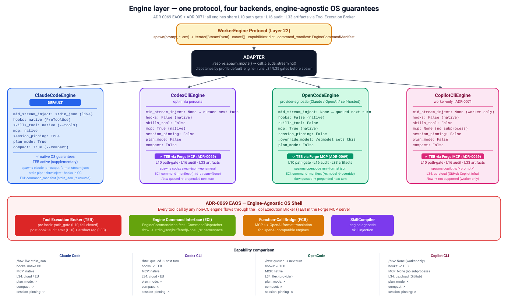
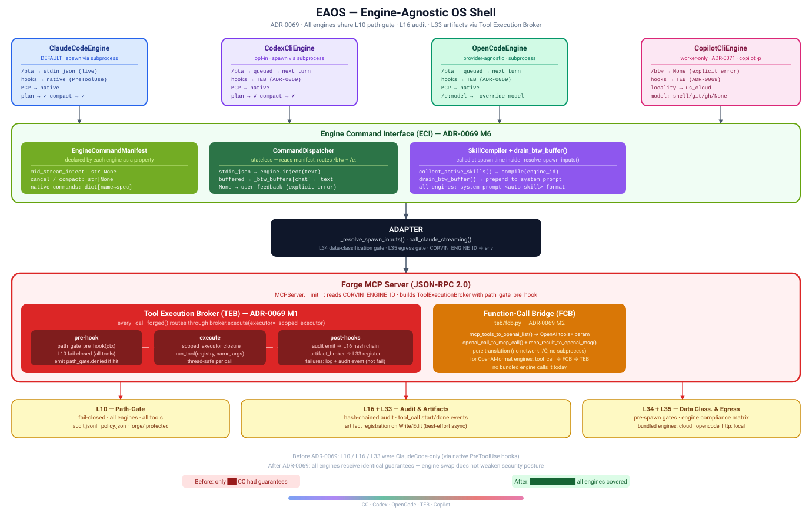

# Engine layer

> The LLM-execution boundary. Backend-agnostic by design — Claude Code,
> Codex CLI, OpenCode, GitHub Copilot CLI, or any future engine plugged
> into the same `WorkerEngine` Protocol.
>
> **ADR-2087:** the local `HermesEngine` and every path that ran inference on
> a local Ollama server were removed. A stored engine id `hermes`, `hermes-*`,
> `local`, `ollama`, `opencode_ollama` or `claude_code_local` is mapped to
> `claude_code` on read (`engine_registry.normalize_legacy_engine_id`, one
> `engine.legacy_mapped` WARNING log line per value), never rejected.



## The mental model

The agent's "brain" — the thing that turns a prompt into a response — is
**not** part of Corvin. It's a **dependency**, the same way the Linux
kernel is a dependency of `bash`. Corvin sits one layer up: it owns
the per-chat persona, the runtime-generation substrate, the audit
chain, the memory loadout — but it lets you swap the engine itself
based on what the chat needs.

This means:
- Different chats can run different engines **in the same process**
- A persona that needs Claude's specific capabilities (hooks,
  mid-stream-inject, system-prompt slot) gets Claude
- A persona that wants a different provider or cost profile gets
  OpenCode (hosted providers, or a self-hosted OpenCode server)
- A persona that needs Codex's behavior gets Codex
- The engine swap is a one-line change in a JSON file

The cost of this design is one abstraction: `WorkerEngine` Protocol.
Four concrete engines ship today; the abstraction is intentionally
small enough that adding a fifth is ~300 LOC plus capability
declarations.

## The problem this solves

A single-engine framework forces every workflow into the engine's
shape. That's fine until:

- You want to test a feature with a different LLM and discover the
  framework hard-codes Claude-specific assumptions
- A subset of users want local-first inference and you have to
  fork the framework
- A regulator says "must use a model hosted in EU only" and the
  framework's engine assumption blocks the deployment
- A specific persona should run on a cheaper or different model
  while the rest of the system runs on Claude — and you want to
  do this **per chat**, not per deployment

Corvin's answer: engine selection is a **per-call decision**. The
adapter consults `profile.default_engine` for each chat turn and
dispatches accordingly. Two chats sitting in the same Discord guild
can run completely different engines in the same bridge process.

## The `WorkerEngine` Protocol (Layer 22)

```python
class WorkerEngine(Protocol):
    capabilities: dict[str, bool]   # see table below

    def spawn(
        self, prompt: str, *, env: dict
    ) -> Iterator[StreamEvent]: ...

    def cancel(self) -> None: ...
```

That's the whole interface. Every engine implementation:
1. Implements `spawn`, returning an iterator of normalised
   `StreamEvent` objects
2. Implements `cancel` for SIGTERM-on-budget-exceeded
3. Declares its `capabilities` dict so the adapter can gate features

The capability keys are **identical across engines** — a CI test
asserts this so no engine can silently omit a key. Today's keys:

| Key | Meaning |
|---|---|
| `mid_stream_inject` | Does the engine support `/btw` mid-stream user-message injection? |
| `hooks` | Does the engine honor PreToolUse hooks (path-gate, etc.)? |
| `skills_tool` | Does the engine load skill files via plugin discovery? |
| `add_system_prompt` | Does the engine accept `--append-system-prompt`? |
| `mcp` | Does the engine load MCP server config? |
| `stream_json` | Does the engine emit stream-json output? |
| `permission_modes` | Curated list of supported permission modes |
| `command_manifest` | Does the engine declare an `EngineCommandManifest` (ECI)? Exposes `/btw` transport type and engine-native `/e:<cmd>` commands. |
| `teb_hooks` | Does the engine route tool calls through TEB (L10 path-gate + L16 audit + L33 artifacts via Forge MCP server)? True for all engines. |

## The four shipped engines

### `ClaudeCodeEngine` — the default

Spawns `claude -p --output-format stream-json --verbose` with full
feature flags. Ships with every capability enabled. This is what
most chats run on; it has the broadest feature set in production
and is what every persona that uses `forge_enabled` /
`skill_forge_enabled` / mid-stream-inject defaults to.

**File:** `bridges/shared/agents/claude_code.py`

### `CodexCliEngine` — opt-in

Spawns `codex exec --json --skip-git-repo-check --ephemeral`.
Capabilities: `mcp + stream_json + teb_hooks + command_manifest` — no
skills_tool, no *live* mid-stream-inject (no live ECI transport; the adapter
queues `/btw` notes to the next turn instead). L10
path-gate, L16 audit, L33 artifacts delivered via TEB (M1).
Useful when a persona genuinely needs Codex's
behavior (e.g. specific code-completion patterns, ChatGPT account
billing). Adapter opt-in via `engine_factory` injection at adapter
construction time.

**File:** `bridges/shared/agents/codex_cli.py`

### `OpenCodeEngine` — the provider-agnostic option

Spawns `opencode run --format json [--model <provider/model>]`.
OpenCode (anomalyco/opencode) is itself provider-agnostic: a single
CLI talks to Claude / OpenAI / Google / hosted OpenAI-compatible
providers (e.g. Ollama Cloud) via opencode's provider config.
Capabilities match Codex's subset.

Opt-in per chat via `chat_profiles[<chat>].default_engine = "opencode"`
or the `/engine opencode` command.

**File:** `bridges/shared/agents/opencode_cli.py`

Driving a **local** Ollama server through OpenCode (`opencode_ollama`) was
removed in ADR-2087 along with every other local-inference path; the L34
registry no longer knows that engine id.

#### Cloud Ollama (hosted provider)

Hosted Ollama exposes an OpenAI-compatible endpoint at
`https://ollama.com/v1` with bearer auth. Add a provider
entry; opencode's `{env:VAR}` substitution keeps the key out of the
config file:

```jsonc
"ollama-cloud": {
  "npm": "@ai-sdk/openai-compatible",
  "options": {
    "baseURL": "https://ollama.com/v1",
    "apiKey": "{env:OLLAMA_API_KEY}"
  },
  "models": { "qwen3-coder:480b": {}, "minimax-m2.7": {} }
}
```

The `OLLAMA_API_KEY` is sourced from
`~/.config/corvin-voice/service.env` (same place every other
operator-managed secret lives — no inline secrets in the opencode
config).

Wall-clock (rough): cloud `minimax-m2.7` ≈ 5 s warm / 20 s cold.

### Removed: `HermesEngine` (ADR-2087)

`HermesEngine` (Ollama HTTP API on `localhost:11434`), its model aliases,
`delegate_hermes`, the `_check_hermes_ollama()` self-test, the Hermes console
bootstrap and the `corvin-hermes-health` timer are gone. Consequences:

- **No automatic fallback engine.** When the `claude` CLI is missing or not
  logged in, the turn stays on `claude_code` and returns a clear refusal
  pointing at setup instead of switching engines.
- **No bundled zero-egress engine.** Under the default L34 matrix,
  CONFIDENTIAL data is admissible only on `opencode_http` (a self-hosted
  OpenCode server, `locality=local`) or on an engine the tenant declares in
  `spec.data_classification.engine_compliance`; SECRET data has no bundled
  admissible engine and is blocked.
- `spec.hermes_model` and `spec.engine_models.hermes` are ignored; the
  `hermes.*` audit event types stay registered only so existing chain
  records keep their severity. Nothing emits them.

**Engine dispatch resolution order:**
```
1. per-chat profile.default_engine (persona JSON or /engine command)
2. tenant.corvin.yaml::spec.default_engine  (console setting)
3. CORVIN_OS_ENGINE env var
4. ClaudeCodeEngine  (hardcoded fallback)
```
A legacy id at any step is mapped to `claude_code`.

**Console selector:** `GET/PUT /v1/console/settings/engine`; `PUT` accepts
only `claude_code` as `default_engine`.

### `CopilotCliEngine` — GitHub Copilot CLI worker (worker-only)

Wraps `copilot -p "<prompt>"` (github/copilot-cli v1.0.56+, standalone binary).
**Worker-only:** cannot serve as the OS engine — it lacks `/btw` live injection,
hooks, and skills_tool. Use via delegation: `/engine copilot` or
`mcp__corvin_delegate__delegate_copilot`.

**Task-type steering** via the `model` field: `shell`, `git`, `gh` inject a
context prefix; omit for general chat. Zero incremental cost for Copilot
Business/Enterprise subscribers.

**Auth:** `~/.copilot/config.json` or `GH_TOKEN` env var.

**L34 matrix:** `locality=us_cloud` — eligible for PUBLIC/INTERNAL/CONFIDENTIAL
under the permissive default (residency restriction is opt-in), but excluded
once an operator tightens the matrix or applies the EU_PRODUCTION preset.

**Self-test:** `_check_copilot_cli()` at INFO severity (binary is optional).

**Delegation persona:** `corvin_operator/cowork/personas/copilot-worker.json` — sets
`default_engine: "copilot"` with a shell/git task-type preset.

**File:** `bridges/shared/agents/copilot_cli.py`

---

## How a chat picks an engine

Three layers, evaluated in order:

```
1. profile.default_engine (from persona JSON or chat_profile)
2. CORVIN_USE_ENGINE_LAYER env (operator emergency rollback)
3. ClaudeCodeEngine (default)
```

The persona JSON is where most engine pinning happens:

```jsonc
// Example: an inline chat_profile that pins to OpenCode + Ollama Cloud
// (No dedicated bundle persona ships — wire inline or via /engine opencode)
{
  "default_engine": "opencode",
  "model": "ollama-cloud/qwen3-coder",
  "inject_skills":      false,   // OpenCode has no system slot
  "forge_enabled":      false,   // forge MCP needs Claude's mcp wiring
  "skill_forge_enabled": false,
  "append_system": "You are a local-first coding helper. …"
}
```

Activation per chat:
- bridge-side: set `chat_profiles.<chat>.default_engine = "opencode"` in `bridges/<channel>/settings.json`
- in-chat: send `/engine opencode`

## Capability-gated features (graceful degradation, not crashes)

The adapter consults `engine.capabilities[k]` per feature site. The
load-bearing pattern:

```python
if engine.capabilities.get("mid_stream_inject", False):
    engine.inject(text)          # live delivery (ClaudeCode stdin_json)
else:
    return False                 # inject_btw: no LIVE delivery on this engine
```

The `/btw` handler in `process_one` treats a `False` from `inject_btw` as
"no live delivery", **not** "no task running". It then checks the
engine-agnostic active-turn marker (`_turn_active(chat_key)`, set for every
engine in `call_claude_streaming`):

- **live delivered** → `📝 Note delivered to the running task.`
- **turn active but no live inject** (OpenCode / Codex / Copilot) → the note is
  **queued** into the `/btw` buffer and drained into the *next* spawn by
  `drain_btw_buffer()`; ack: `📝 Got your note … queued … added on the next turn.`
- **no turn active** → `No task is running right now …` (the true idle case).

This closed a long-standing false-negative where a non-Claude engine reported
the misleading "No task is running" and **dropped** the note, even mid-turn.
The buffer drain runs in the OpenCode/Codex spawn paths too — previously it
lived only on the Claude path.

Effects of running a non-Claude engine in an existing chat:

| Feature | Claude | Codex | OpenCode |
|---|---|---|---|
| `/btw` mid-stream injection | ✓ live (stdin_json) | ○ queued → next turn | ○ queued → next turn |
| PreToolUse path-gate | ✓ native hooks | ✓ via TEB | ✓ via TEB |
| L16 audit + L33 artifacts | ✓ native | ✓ via TEB | ✓ via TEB |
| skill_inject (system prompt) | ✓ via `--append-system-prompt` | `<SYSTEM>` block (SkillCompiler) | `<SYSTEM>` block (SkillCompiler) |
| Forge / Skill-Forge MCP | ✓ via `--mcp-config` | ✓ via `--mcp-config` | config-based (`opencode mcp`) |
| TodoWrite / ExitPlanMode status events | ✓ | partial | ✗ |
| permission modes | default · acceptEdits · bypassPermissions · plan | (limited) | default · bypassPermissions only |

The **load-bearing rule**: missing a capability → degrade gracefully,
never crash. The regression tests in
`bridges/shared/test_adapter_engine_switch.py` enforce this for the
`mid_stream_inject` and `add_system_prompt` axes.

## Stream-event normalisation

Every engine emits the same five `StreamEvent` types regardless of the
underlying CLI's wire format:

| Event | Claude Code | Codex CLI | OpenCode |
|---|---|---|---|
| `session_started` | `system.init` | `thread.started` | first `step_start` |
| `text_delta` | `assistant.message.content[].text` | `item.completed` (agent_message) | `text` with `part.text` |
| `tool_call` | `assistant.message.content[].tool_use` | _(not yet)_ | `tool_use` (terminal only) |
| `turn_completed` | `result` (subtype=success) | `turn.completed` | synthesised on stdout EOF |
| `error` | `result` (is_error=true) | `turn.failed` or stderr | `error` (drills nested envelope) |

Adapter consumers (`/btw`, status callbacks, retry-on-corrupted-session,
budget accounting) work against this normalised vocabulary, so
adding another engine is "implement spawn() that yields these five
event types" — no consumer-side changes.

## How the engine layer integrates with the rest of Corvin

| Adjacent layer | What it gets / gives |
|---|---|
| **Personas** | `default_engine` + `model` fields on the persona JSON; resolver passes them through to the adapter unchanged |
| **Adapter** | `_resolve_spawn_inputs` returns engine-agnostic kwargs; `call_claude_streaming` dispatches to `_call_claude_streaming_via_engine` (Claude/Codex), or `_call_opencode_streaming_via_engine` (OpenCode). Resolution order: per-chat `profile.default_engine` → `tenant.corvin.yaml::spec.default_engine` → `CORVIN_OS_ENGINE` → Claude fallback; removed legacy ids map to `claude_code`. |
| **Skill-Forge** | Skills land via `--append-system-prompt` (Claude) or `<SYSTEM>` prefix (OpenCode). The skill workspace is engine-agnostic |
| **Forge MCP** | Tools advertise via the engine's MCP wiring; the actual tool execution (bwrap + audit) is engine-independent |
| **Audit chain** | Every spawn emits the same envelope; engine identity lands in `details.engine` for forensic correlation |
| **Voice (L23)** | STT runs *before* engine spawn; engines never see audio |

## Why Codex / OpenCode / Copilot aren't the default

The default stays Claude Code because:
- Most personas in production rely on at least one capability that
  only Claude has (mid-stream inject, hooks, skill_inject system slot)
- Codex is a billing / behavior alternative, not a feature superset
- OpenCode is opt-in by user intent — making it default would
  silently break every chat that depends on capability X
- Copilot is worker-only (no `/btw` live inject, no hooks, no skills_tool)

The opt-in-per-persona pattern lets each chat choose the right
trade-off. Use `default_engine: "opencode"` in a persona for OpenCode.

## EAOS — Engine-Agnostic OS Shell



Non-ClaudeCode engines (Codex, OpenCode, Copilot) previously ran without
L10 path-gate, L16 audit coverage, or L33 artifact registration. EAOS
closes this gap with four subsystems wired into the Forge MCP server:

### Tool Execution Broker (TEB)

Every tool call from any engine flows through `teb/broker.py` inside the Forge
MCP server. TEB enforces L10 path-gate (fail-closed, same `path_gate.py` rules),
L16 audit chain, and L33 artifact auto-registration for every engine. The
compliance guarantees that were previously ClaudeCode-only are now universal.

### Engine Command Interface (ECI)

Each engine declares an `EngineCommandManifest` (`eci/manifest.py`) with two
fields:
- **`btw_transport`**: how `/btw` is delivered — `stdin_json` (ClaudeCode, live),
  `buffered` (injected at next prompt boundary), or `None` (Codex /
  OpenCode — no live ECI transport). For any non-`stdin_json` engine the adapter
  never drops the note: while a turn is active it queues the text into the `/btw`
  buffer and `drain_btw_buffer()` prepends it to the next spawn's system prompt
  (wired into the OpenCode/Codex spawn paths, not just ClaudeCode).
- **`native_commands`**: engine-specific commands exposed under the `/e:` namespace
  Routed by the adapter dispatcher to
  `engine.handle_command(cmd, args)`.

### Function-Call Bridge (FCB)

`teb/fcb.py` translates between MCP tool-call format and OpenAI function-calling
format: an engine emits `tool_calls` in OpenAI format → FCB translates to
MCP → TEB executes with L10/L16/L33 enforcement → FCB translates results
back. `teb/fcb_copilot.py` applies it to Copilot. (Its first user,
`HermesEngine`, was removed in ADR-2087.)

### SkillCompiler

`eci/skill_compiler.py` compiles active `SKILL.md` files into the correct
injection format per engine: `--append-system-prompt` flag for ClaudeCode,
structured `<SYSTEM>` block for OpenCode / Codex. All engines now
receive skill context regardless of whether they have a native system-prompt slot.

### Console

New page at `/app/engine-control` shows the live capability matrix (one row
per engine, one column per capability key) and the registered `/e:<cmd>`
commands per engine. Read-only API: `GET /v1/console/settings/engine/capabilities`.

---

## What you, as operator, must NOT do

- **Don't promote Codex / OpenCode / Copilot to default.** Default stays
  Claude Code. The capability-degradation rule applies *per chat*; making
  a partial-capability engine the default silently breaks every
  chat that used a depending feature.
- **Don't add `default_engine: "opencode"` to existing
  feature-rich personas.** Personas like `coder`, `forge`, `research`,
  `orchestrator` depend on Claude-specific features (skills_tool, hooks,
  forge MCP). Engine-pinned chats must explicitly disable every feature
  that the target engine cannot honor (forge_enabled, skill_forge_enabled, etc.).
- **Don't widen `permission_modes` beyond what each engine actually
  honors.** Pretending OpenCode supports `acceptEdits` (just because
  the value parses) lets bridge callers request a mode the engine
  silently ignores.
- **Don't ship the engine binaries inside the repo.** The `claude` /
  `codex` / `opencode` CLIs are operator-installed. The engine
  resolver respects env-var overrides (`CLAUDE_CLI`, `OPENCODE_BIN`),
  then `~/.opencode/bin/opencode`, then PATH.
- **Don't write `OLLAMA_API_KEY` directly into `opencode.json`.** Use
  the `{env:OLLAMA_API_KEY}` substitution. The key lives in
  `~/.config/corvin-voice/service.env` (same place as
  `OPENAI_API_KEY` for STT). Inline secrets in opencode config
  defeats the central key-management discipline.
- **Don't add `import anthropic` to engines.** They authenticate via
  the operator's CLI subscription (Max-Abo for Claude, ChatGPT for
  Codex, Ollama Cloud for OpenCode). The CI lint rejects the import.
- **Don't bypass the WorkerEngine Protocol.** Direct engine API
  access from non-adapter code couples the consumer to one
  engine's wire format and breaks the swap promise.

## Concrete commands + files

| Action | Where |
|---|---|
| List active engine in chat | `/whoami` shows `engine=…` |
| Pin engine for a chat | `chat_profiles.<chat>.persona = "<persona-with-default_engine>"` |
| Emergency rollback to legacy spawn | `CORVIN_USE_ENGINE_LAYER=0 bash bridge.sh restart` |
| Add a new engine | implement `WorkerEngine` Protocol + capability dict + register in `engine_factory` |
| Test engines | `bridges/shared/agents/test_engines_e2e.py` (36 cases incl. live opt-in) |
| Test OpenCode | `bridges/shared/agents/test_opencode_cli.py` (30 cases incl. opt-in cloud test) |

## Where to look in the code

- `corvin_operator/bridges/shared/agents/__init__.py` — `WorkerEngine`
  Protocol + `StreamEvent` dataclass + tolerant JSONL parser
- `corvin_operator/bridges/shared/agents/claude_code.py` — Claude
  implementation (full feature set)
- `corvin_operator/bridges/shared/agents/codex_cli.py` — Codex
  implementation (mcp + stream_json subset)
- `corvin_operator/bridges/shared/agents/opencode_cli.py` — OpenCode
  implementation (provider-agnostic)
- `corvin_operator/bridges/shared/adapter.py::call_claude_streaming` —
  the dispatch site
- `corvin_operator/cowork/personas/copilot-worker.json` — delegation persona for CopilotCliEngine
- `bridges/shared/agents/copilot_cli.py` — CopilotCliEngine implementation

## Adjacent docs

- [Architecture](architecture.md) — engine as one of the five
  orthogonal axes
- [Runtime generation](runtime-generation.md) — how forge / skill-
  forge degrade across engines
- [Audit and compliance](audit-and-compliance.md) — engine identity
  in the chain
- Architecture: AWP as orchestration standard
- Phase 2 adapter-engine migration
- AWP standards-only (engine layer owns execution)
