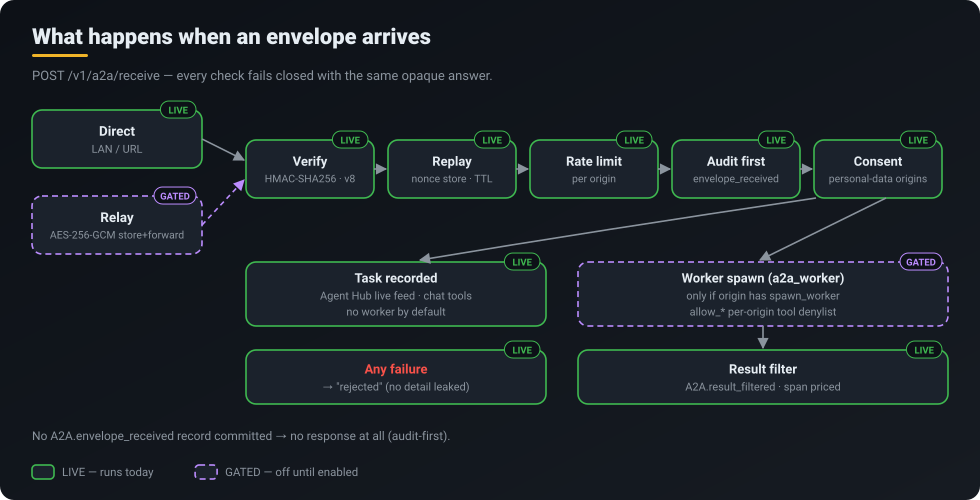

<p align="center">
  <a href="../../README.md"></a>
</p>
<p align="center">
  <a href="../../README.md">Home</a> &middot;
  <a href="token-savings.md">Token savings</a> &middot;
  <a href="self-learning.md">Self-learning</a> &middot;
  <a href="skills-acp.md">Skills 2.0 &amp; ACP</a> &middot;
  <a href="operating-system.md">CorvinOS as an OS</a> &middot;
  <a href="organizations.md">Organizations</a> &middot;
  <strong>A2A</strong> &middot;
  <a href="video.md">Video</a> &middot;
  <a href="marketplace.md">Marketplace &amp; plugins</a> &middot;
  <a href="extensibility.md">Extensibility</a>
</p>

# A2A — agents across instances

> **Two CorvinOS instances — yours and a partner's, or your laptop and your GPU box — pair once and then hand each other signed tasks, with every step on both audit chains and nothing executed unless the receiver allowed it.**

<p align="center"></p>

## What you get

- **Pairing without a central service.** A one-time friendship token (`corvin-a2a:ft1:…`) carries the pairing secret; you send it through any channel you trust. No account, no broker.
- **Signed, replay-proof tasks.** Every TaskEnvelope is HMAC-SHA256 signed, carries a nonce and a TTL, and is checked against the receiver's protocol (version 8).
- **The receiver stays in charge.** A peer's task is recorded, not executed — unless the receiver set `spawn_worker` for that peer, and even then a per-peer `allow_*` denylist limits which tools the worker may touch.
- **Proof on both sides.** Pairing, invites, every envelope and every filtered result land in each instance's own hash-chained audit chain; the receiver writes its record before it answers.
- **Works across networks.** Direct over LAN or a public URL; an AES-256-GCM store-and-forward relay is available when neither side is reachable.

## How it works

**Pairing.** Instance A creates a friendship token in the console's **Agent Hub → Connect** tab or with `corvin-a2a create-token`. The token goes to B out of band (chat, mail, QR). B imports it; during the handshake both instances exchange the public halves of their long-term X25519 keys and derive a per-pairing binding secret. That matters because the token is a bearer secret: someone who finds it later can derive the HMAC keys but not the binding secret, so they cannot re-point the pairing, forge a revoke or push a reconnect. A connection becomes ACTIVE once a peer URL is set (`corvin-a2a set-url`) — or the relay is enabled.

**Sending.** `corvin-a2a send <endpoint_id> "<instruction>"` (or the Agent Hub) builds a TaskEnvelope with a nonce, a TTL and optional attachments (sha256-pinned, at most 16 files and 1 MiB in total) and signs it.

<p align="center"></p>

**Receiving** (`POST /v1/a2a/receive`, on the gateway and the standalone console):

1. Signature and protocol version are verified, the nonce is checked against the replay store, the origin's rate limit applies.
2. **Audit first:** an `A2A.envelope_received` record must commit to the audit chain. If it does not, there is no response at all.
3. Origins flagged as carrying personal data need the consent the receiver granted for them.
4. The task is recorded and appears in the Agent Hub live feed. Only if the origin has `spawn_worker` does `a2a_worker` run it: the instruction is framed as untrusted, capped at 16 KB, normalised, and the worker is started with a `--disallowedTools` denylist compiled from the origin's `allow_*` policy plus `--strict-mcp-config`, so no tool outside the grant is reachable.
5. The result passes a filter (`A2A.result_filtered`); the worker's span carries its model and tokens, so the run is priced like any other.

Every failure — bad signature, replay, unknown origin, missing consent — answers with the same opaque `rejected`. A probing sender learns nothing about which check failed.

### Typical setups

| Setup | What pairs with what | Typical settings |
|---|---|---|
| Laptop + GPU box | Your two instances on one LAN | `spawn_worker` on the GPU box for the laptop's origin, `allow_*` narrowed to the tools the job needs |
| Partner organisation | Your instance and theirs over public URLs | No `spawn_worker` — tasks land in the Agent Hub feed and a human decides |
| Instances behind NAT | Neither side reachable | Relay enabled (`a2a_relay_fallback`); the relay only stores AES-256-GCM ciphertext |
| Personal-data exchange | An origin flagged `personal_data` | Required consent purposes set; without consent the envelope is rejected |

## What runs today

| Capability | Status | Where |
|---|---|---|
| Signed envelope receiver, nonce store, rate limit, audit-first | **LIVE** | `corvin_operator/bridges/shared/remote_trigger_receiver.py` |
| Friendship tokens, invites, X25519 binding keys | **LIVE** | `a2a_friendship.py`, `a2a_invite.py`, `a2a_binding.py` |
| `corvin-a2a` CLI | **LIVE** | `corvin_operator/voice/scripts/corvin_a2a.py` |
| Console Agent Hub (Live Feed, Peers, Connect, Audit trail) | **LIVE** | `core/console/corvin_console/web-next/src/pages/agent-hub.tsx` |
| Attachments (sha256, ≤ 1 MiB total) | **LIVE** | `a2a_attachments.py` |
| Peer limit by license (`a2a_peers_max`, free tier 1; over it → 402) | **LIVE** | pairing path |
| Inbound worker spawn | **GATED** — `spawn_worker` off per origin by default | `a2a_worker.py` |
| Relay fallback (AES-256-GCM store-and-forward) | **GATED** — flag `a2a_relay_fallback` | `a2a_relay.py` |
| LAN bind | **GATED** — flag `a2a_lan_bind` | gateway |
| `a2a_send` from chat (two-step, browser + CSRF confirm) | **GATED** | Forge MCP tool |
| Instance-bound attestation (IBC) | **PARTIAL** — new pairings require it; auto-renew open (ADR-2099) | `instance_identity.py` |
| Group chat with foreign agents (inside the console chat; fan-out, mirror groups, hub relay) | **LIVE** | `chat_group_store.py`, `routes/chat_groups.py`, `pages/chat.tsx` |

All `a2a_*` files above live in `corvin_operator/bridges/shared/` unless a path is given.

## Try it

**In the console:** open **Agent Hub → Connect**, create a friendship token, send it to your peer; they import it in their own Agent Hub. Watch both sides in **Live Feed** and **Audit trail**.

**On the command line:**

```bash
# instance A
corvin-a2a my-url https://a.example.org          # this instance's own A2A base URL
corvin-a2a create-token --label "partner-b" --ttl 7d
# send the printed corvin-a2a:ft1:… token to B through a channel you trust

# instance B
corvin-a2a import-token 'corvin-a2a:ft1:…'
corvin-a2a set-url <kid> https://a.example.org   # only if the token carried no URL
corvin-a2a agents                                # list local and remote agents

# send a task with an attachment
corvin-a2a send <endpoint_id> "Summarise the attached report" --attach report.pdf

# end the pairing
corvin-a2a revoke-token <kid>
```

Grant execution only when you want the peer to run work on your instance: `corvin-a2a pair --spawn-worker` (or `invite --spawn-worker`) sets it for that one origin, and the origin's `allow_*` settings decide which tools its worker may use. `corvin-a2a pair --offline-pair` records the pairing audit-first and refuses if the record cannot commit.

## Honest limits

- **Execution is off by default.** A freshly paired peer can deliver tasks; it cannot make your instance run them until you set `spawn_worker` for it.
- **Relay and LAN bind are gated.** Two instances that cannot reach each other directly need the relay flag turned on.
- **IBC auto-renewal is open** (ADR-2099).
- **The completeness ADR is still PROPOSED.** A2A audit coverage is documented in ADR-2042, which has not been accepted.
- **Free tier: one peer.** More peers need a license; the pairing path answers 402 over the limit.

## Under the hood

- Receiver and sender: `corvin_operator/bridges/shared/remote_trigger_receiver.py`, `remote_trigger_sender.py`; worker `a2a_worker.py`; relay `a2a_relay.py`; nonces `a2a_nonce_store.py`.
- Reference: `docs/claude-ref/layer-38-a2a-network.md`.
- ADRs (Corvin-Knowledge): ADR-0063 (invites), ADR-0070 (friendship tokens), ADR-2042 (A2A audit events), ADR-2064 (binding keys), ADR-2099 (IBC), ADR-2216 (chat-native tokens, group chat), ADR-2218 (group routing over A2A).
- GDPR erasure reaches paired peers: `erasure_a2a.py` — see [Organizations](organizations.md).
- Related: [CorvinOS as an OS](operating-system.md) · [Organizations](organizations.md) · [Marketplace &amp; plugins](marketplace.md)
