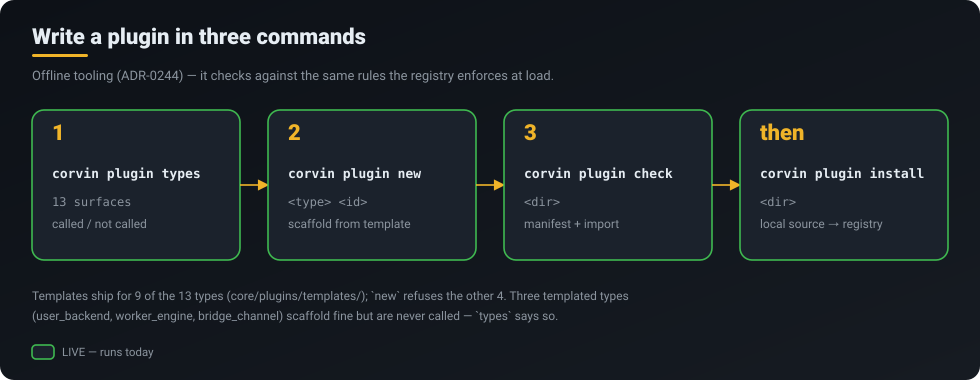
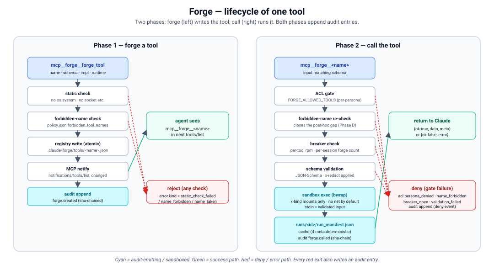

<p align="center">
  <a href="../../README.md"></a>
</p>
<p align="center">
  <a href="../../README.md">Home</a> &middot;
  <a href="token-savings.md">Token savings</a> &middot;
  <a href="self-learning.md">Self-learning</a> &middot;
  <a href="skills-acp.md">Skills 2.0 &amp; ACP</a> &middot;
  <a href="operating-system.md">CorvinOS as an OS</a> &middot;
  <a href="organizations.md">Organizations</a> &middot;
  <a href="a2a.md">A2A</a> &middot;
  <a href="video.md">Video</a> &middot;
  <a href="marketplace.md">Marketplace &amp; plugins</a> &middot;
  <strong>Extensibility</strong>
</p>

# Extensibility — build your own

> **Seven live ways to extend CorvinOS: code plugins, sandboxed runtime tools, self-graded skills, a chat-driven plugin builder, MCP servers, custom prompt layers and Claude Code plugins. Each one is labelled below with whether it runs today.**

<p align="center"></p>

## What you get

- **Code plugins with a contract.** 13 plugin types, each with a named invariant. `corvin plugin types`
  tells you honestly which ones the runtime calls.
- **Tools the agent writes for itself.** The agent writes a Forge tool through MCP. The tool is checked
  statically, runs in a **bwrap/docker sandbox**, and is audited. It is callable in the same turn.
- **Knowledge that earns its place.** A SkillForge skill is linted fail-closed and gets injected into
  later turns only after it has a grade.
- **Plugins from a conversation.** `/plugin-builder` interviews you and writes a full scaffold: idea,
  architecture, ADR, plan, code, tests.
- **The whole MCP ecosystem.** Add MCP servers from the console and manage them per tenant.

## How it works

### Every extension point, with its status

| Extension point | Status | How, in one line |
|---|---|---|
| Plugin types — 8 called: `router_backend`, `summary_provider`, `notification_backend`, `recall_backend`, `audit_backend` (gets a copy after the core write), `context_retriever`, `compute_engine`, `web_surface` | **LIVE** | `corvin plugin new <type> <id>` → `corvin plugin check <dir>` → `corvin plugin install <dir>` |
| Plugin types — 5 not wired: `user_backend`, `stt_provider`, `data_connector`, `worker_engine`, `bridge_channel` | **NOT BUILT** (no call site) | They load and register, but nothing calls them yet |
| Forge runtime tools | **LIVE** | MCP tools `forge_tool`, `forge_promote`, `forge_list`, `forge_exec` |
| SkillForge skills | **LIVE** | `skill_create`, then one seed `skill_grade` so the injection gate admits it |
| Plugin-Builder | **LIVE** | Type `/plugin-builder` in any chat |
| MCP servers | **LIVE** | Console → Marketplace → MCP tools (install / activate / deactivate) |
| Custom layers (ADR-0156) | **PARTIAL** | `corvin-layer custom install <dir>`; only Tier A prompts/skills are consumed |
| Claude Code plugins | **LIVE** | `/plugin marketplace add <path-to-CorvinOS>` → `/plugin install corvin` |
| Worker engines (pluggable) | **NOT BUILT** — hard-coded | `claude_code`, `codex_cli`, `opencode`, `copilot` in `corvin_operator/bridges/shared/engine_registry.py`; no plug-in point |
| Chat bridges (pluggable) | **NOT BUILT** — hard-coded | Discord, Email, Signal, Slack, Teams, Telegram, WhatsApp are built in; no plug-in point |

### Write a plugin in three commands

<p align="center"></p>

The offline tooling (ADR-0244) checks your plugin against the same rules the registry enforces at load.
Templates ship for 9 of the 13 types, in `core/plugins/templates/`. For `web_surface`,
`context_retriever`, `stt_provider` and `data_connector`, `new` refuses with a clear message.
`user_backend`, `worker_engine` and `bridge_channel` do have templates, and they scaffold, load and
register, but the runtime never calls them. `corvin plugin types` prints this next to each type, so you
find out before you build.

A code plugin runs **in-process**. The registry attributes its actions to it but does not contain it
(see [Marketplace &amp; plugins](marketplace.md#in-process-means-attribution-not-a-sandbox)). When code
must be contained, use a Forge tool.

### Forge: tools the agent writes, run in a sandbox

<p align="center"></p>

Here the agent itself is the author. A `forge_tool` call goes through the static check and
forbidden-name policy and is written atomically to the registry. The MCP server then announces it with
`tools/list_changed`, so the tool is callable as `mcp__forge__<name>` in the same turn. Each call passes
the ACL, breaker and schema gates and runs in a **bwrap or docker sandbox**: no network by default,
fresh `/tmp`, read-only system paths. Each forge and each call is written to the audit chain. A tool
starts with `task` scope, and `forge_promote` moves it up the ladder
`task → session → project → user`.

### SkillForge: knowledge that has to earn its place

`skill_create` writes a `SKILL.md`. The linter checks it fail-closed for prompt-injection patterns,
embedded secrets and persona-boundary phrases. A skill is injected into later turns only once it has a
grade, so a new skill needs **one seed `skill_grade`**, capped at 0.3 and labelled as a manual seed.
After that it gets real grades from use. `skill_list`, `skill_diff`, `skill_promote` and `skill_purge`
cover the rest of the lifecycle.

### Plugin-Builder: a plugin from a conversation

`/plugin-builder` runs an interview, classifies the plugin type and writes Idea, Architecture, a plugin-scoped
ADR, a Plan, and a scaffold with tests. It **produces files and never loads them**. Installing them is
your decision, through the normal manifest-gated path.

## What runs today

| Capability | Status | Where |
|---|---|---|
| 13 plugin types, 8 called | **LIVE** | `core/plugins/corvin_plugins/` (`surface_map`) |
| 5 plugin types without a call site | **NOT BUILT** | listed by `corvin plugin types` |
| Plugin authoring CLI (`types`/`new`/`check`) | **LIVE** | `ops/launcher/corvin/plugin_cmd.py` |
| Forge runtime tools (bwrap/docker sandbox) | **LIVE** | `corvin_operator/forge/forge/mcp_server.py` |
| SkillForge | **LIVE** | `corvin_operator/skill-forge/skill_forge/mcp_server.py` |
| Plugin-Builder | **LIVE** | `core/plugins/plugin_builder/`, `/plugin-builder` in `adapter.py` |
| MCP server management | **LIVE** | `corvin_operator/mcp_manager/`, `core/console/corvin_console/routes/mcp_plugins.py` |
| Custom layers — Tier A prompts/skills | **LIVE** | `adapter.py` (Tier-A prompt injection) |
| Custom layers — Tier B/C | **PARTIAL** | install, but nothing consumes them |
| Claude Code plugins `corvin`, `voice`, `cowork`, `forge`, `skill-forge` | **LIVE** | `.claude-plugin/marketplace.json` |
| Pluggable worker engines / bridges | **NOT BUILT** | hard-coded today |

## Try it

```bash
# A code plugin
corvin plugin types                                   # 13 surfaces, called or not
corvin plugin new router_backend com.example.my-router
corvin plugin check ./com.example.my-router
corvin plugin install ./com.example.my-router

# A custom prompt layer (Tier A is the part that is consumed)
corvin-layer custom install ./my-layer
corvin-layer custom list
```

**In chat** (any bridge or the console):

- Ask the agent for a tool ("write a tool that computes CSV statistics"). It calls `forge_tool`, and
  the tool is available as `mcp__forge__<name>`.
- Ask it to remember a procedure as a skill. It calls `skill_create`, followed by one seed `skill_grade`.
- `/plugin-builder` starts the plugin interview.

**In the console:** Marketplace → MCP tools. The catalogue lives at
`<tenant>/global/mcp-tools/catalog.json`, and 6 manifests ship built in: `brave-search`, `fetch`,
`filesystem`, `github`, `sqlite`, `corvin-batch`.

**In Claude Code:**

```text
/plugin marketplace add /path/to/CorvinOS
/plugin install corvin
/corvin:install          # runs the installer for you
/corvin:update --check   # report how far behind origin/main — changes nothing
/corvin:update           # pull, reinstall, rebuild, restart, verify
```

## Honest limits

- **5 of 13 plugin types are not wired.** `user_backend`, `stt_provider`, `data_connector`,
  `worker_engine` and `bridge_channel` load and register, but nothing calls them. A plugin of one of
  these types runs no code.
- **Engines and bridges cannot be plugged in yet.** The four worker engines and seven bridges are
  hard-coded. The `worker_engine` and `bridge_channel` types are the intended route, and they have no
  call site.
- **Code plugins are not sandboxed.** In-process means attribution. Only Forge tools run in a sandbox.
- **Custom layers are half-consumed.** Tier B/C layers install and pass the licence gate, but nothing
  reads them.
- **Plugin-Builder stops at files.** It does not install or load what it generates.
- **No plugin updates.** See [Marketplace &amp; plugins](marketplace.md#honest-limits).

## Under the hood

- Plugin types and call sites: `core/plugins/corvin_plugins/surface_map.py`, templates in `core/plugins/templates/`
- Authoring CLI: `ops/launcher/corvin/plugin_cmd.py` (ADR-0244)
- Forge: `corvin_operator/forge/forge/mcp_server.py` — scopes `task → session → project → user`
- SkillForge: `corvin_operator/skill-forge/skill_forge/mcp_server.py`
- Plugin-Builder: `core/plugins/plugin_builder/` (ADR-0253); flow diagram `docs/diagrams/plugin-builder-v2-flow.svg`
- MCP: `corvin_operator/mcp_manager/`, `core/console/corvin_console/routes/mcp_plugins.py`
- Custom layers: `corvin_operator/bridges/shared/layer_cli.py`, `corvin_operator/bridges/shared/custom_layer_gate.py` (ADR-0156)
- Engines: `corvin_operator/bridges/shared/engine_registry.py`
- Runtime generation overview: `docs/diagrams/17-runtime-generation.svg`

Related: [Marketplace &amp; plugins](marketplace.md) · [Self-learning](self-learning.md) ·
[Skills 2.0 &amp; ACP](skills-acp.md) · [CorvinOS as an OS](operating-system.md)
