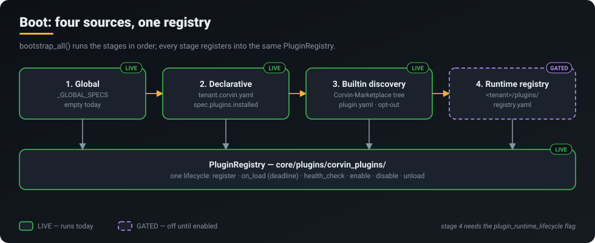
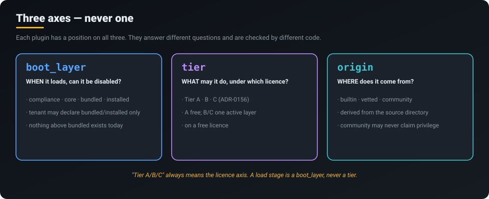

<p align="center">
  <a href="../../README.md"></a>
</p>
<p align="center">
  <a href="../../README.md">Home</a> &middot;
  <a href="token-savings.md">Token savings</a> &middot;
  <a href="self-learning.md">Self-learning</a> &middot;
  <a href="skills-acp.md">Skills 2.0 &amp; ACP</a> &middot;
  <a href="operating-system.md">CorvinOS as an OS</a> &middot;
  <a href="organizations.md">Organizations</a> &middot;
  <a href="a2a.md">A2A</a> &middot;
  <a href="video.md">Video</a> &middot;
  <strong>Marketplace &amp; plugins</strong> &middot;
  <a href="extensibility.md">Extensibility</a>
</p>

# Marketplace &amp; plugin system

> **One registry and one lifecycle for every plugin — browse, install, enable, load, and every step lands in your tenant's audit chain.**

<p align="center"></p>

## What you get

- **One registry, not five.** Every plugin — memory, observability, security/compliance, integrations,
  data processing — goes through the same `PluginRegistry` in `core/plugins/corvin_plugins/`. There is no
  second lifecycle, no second taxonomy, no side-loader.
- **A small core.** Plugin source lives in its own repository, Corvin-Marketplace. CorvinOS loads plugins
  from there instead of carrying copies of them, so the core stays small.
- **A real install path.** A plugin is checked against its manifest before it enters the tenant's
  `registry.yaml`. Enable and disable are separate, reversible steps.
- **A record of what happened.** Install actions, load failures and load/health-check deadline overruns
  are written to the tenant's hash-chained audit chain.
- **Clear names.** A plugin is described on three independent axes — `boot_layer`, `tier`, `origin` —
  and each one answers a different question.

## How it works

### Boot: four sources, one registry

`bootstrap_all()` (`core/plugins/corvin_plugins/bootstrap.py`) fills the registry in a fixed order:

1. **Global specs.** Plugins that load before any tenant. Empty today.
2. **Declarative.** Whatever the tenant lists under `spec.plugins.installed` in `tenant.corvin.yaml`.
3. **Builtin discovery.** Walks the Corvin-Marketplace tree (`CORVIN_MARKETPLACE_ROOT`, or
   `../Corvin-Marketplace/plugins/buildin` next to the checkout) for `plugin.yaml` plus
   `provider.py`/`plugin.py`. Opt-out: anything found loads unless the tenant disables it.
4. **Runtime registry.** `<tenant>/plugins/registry.yaml`, which the marketplace install writes to.
   This stage runs when the `plugin_runtime_lifecycle` flag is on.

<p align="center"></p>

### The lifecycle

| Step | What happens | Status |
|---|---|---|
| Discover | The console Marketplace panel reads `Corvin-Marketplace/index/plugins.json` | **LIVE** |
| Install | `POST /v1/console/api/v1/marketplace/plugins/{id}/install` → manifest gate (ADR-0247) → entry in `registry.yaml`. Local sources only | **LIVE** |
| Enable / disable | Console or `corvin plugin enable|disable` | **LIVE** |
| Load | `on_load` with a deadline; the plugin's `origin` is derived from where its files sit, not from what it claims | **LIVE** |
| Audit | `console.action_performed`, `plugin.load_failed`, `plugin.execution_timeout` | **LIVE** |
| Update | No update path; manifests carry `update_policy: none` | **NOT BUILT** |
| Remote / community install | No download from a remote source; a `community` origin is refused | **NOT BUILT** |

There is also an upload queue (`POST /plugin-uploads`, `routes/plugin_upload.py`): a ZIP is validated and
staged, and an operator approves it before anything else happens.

### Three axes, never one

<p align="center"></p>

- **`boot_layer`**: load order and whether the plugin can be disabled (`compliance · core · bundled ·
  installed`). A tenant may declare only `bundled` or `installed`; a higher claim is downgraded and
  audited. No plugin sits above `bundled` today.
- **`tier`**: capability boundary and licence (ADR-0156, Tier A/B/C). Tier A is free; on a free licence,
  B/C allow one active layer (`corvin_operator/bridges/shared/custom_layer_gate.py`).
- **`origin`**: provenance (`builtin · vetted · community`), taken from the source directory.

"Tier" always means the licence axis. A load stage is a `boot_layer`.

### In-process means attribution, not a sandbox

A plugin runs in the CorvinOS process and is part of it. The registry records **which plugin did what**,
but it cannot stop a hostile plugin: in CPython a caller can set every property that could identify it.
Code that has to be contained belongs in a subprocess. Forge tools are the example: they run in a real
bwrap/docker sandbox (see [Extensibility](extensibility.md)). The one in-process guard that holds is the
boot tripwire. It runs first, it has no override, and it verifies the audit chain before any plugin loads.

## What runs today

Numbers measured on the maintainer's install, 2026-10-04.

| Capability | Status | Where |
|---|---|---|
| One plugin registry + lifecycle | **LIVE** | `core/plugins/corvin_plugins/` |
| Builtin discovery from Corvin-Marketplace | **LIVE** | `bootstrap.py::_marketplace_root` |
| Runtime tenant registry (`registry.yaml`) | **GATED** | flag `plugin_runtime_lifecycle` |
| Console Marketplace (browse + install + manage) | **LIVE** | `/console/app/marketplace`, `routes/marketplace_install.py` (ADR-0892) |
| CLI lifecycle | **LIVE** | `ops/launcher/corvin/plugin_runtime_cmd.py` |
| Manifest gate on install | **LIVE** | ADR-0247 |
| Audit of install / load failure / timeout | **LIVE** | tenant audit chain |
| Update path | **NOT BUILT** | `update_policy: none` |
| Remote download, community install | **NOT BUILT** | refused |

**Catalogue size:** 51 `plugin.json` manifests in Corvin-Marketplace, 43 builtin (by category:
security_compliance 12, observability 11, data_processing 7, integration 6, memory 6, orchestration 1)
and 8 contributor. 43 of the 51 ship a `src/` tree, 35 can be loaded by builtin discovery, and the index
lists 37. On that install the tenant runtime registry holds one installed plugin (`corvin_knowledge`).

## Try it

**Console:** open **Marketplace** in the sidebar (`http://127.0.0.1:8765/console/app/marketplace`).
From there you can browse the index, install a plugin, and manage installed plugins, skill packages and
MCP tools.

**CLI:**

```bash
corvin plugin list                      # installed plugins in this tenant (--json available)
corvin plugin install <plugin-id>       # marketplace id, resolved to its LOCAL source
corvin plugin install /path/to/plugin   # or a local directory → manifest gate → registry.yaml
corvin plugin enable  <plugin-id>
corvin plugin disable <plugin-id>
corvin plugin uninstall <plugin-id>
```

Every command accepts `--tenant <id>` (default `_default`).

## Honest limits

- **No updates.** Installing a newer version means uninstall plus install. `update_policy: none` is the
  only policy there is.
- **Local sources only.** The install path does not download from the internet, and a `community`
  origin is refused. A public community marketplace is roadmap.
- **Discovery does not cover everything.** The contributor tree (8 manifests) is not scanned by builtin
  discovery, and 5 leftover directories without `plugin.yaml` remain under CorvinOS
  `core/plugins/buildin/`.
- **Nothing above `bundled`.** The `compliance`/`core` boot-layer rules are implemented and tested, but
  no plugin uses them yet.
- **Not a sandbox.** In-process plugins are attributed, not contained (see above).
- **ADR status.** ADR-0030/0033/0156/0233/0243 are still PROPOSED. ADR-0244, ADR-0510, ADR-0511 and
  ADR-0892 are accepted.

## Under the hood

- Registry, lifecycle, boot: `core/plugins/corvin_plugins/` (`bootstrap.py::bootstrap_all`)
- Marketplace install route: `core/console/corvin_console/routes/marketplace_install.py`, upload queue `routes/plugin_upload.py`
- CLI: `ops/launcher/corvin/plugin_cmd.py`, `ops/launcher/corvin/plugin_runtime_cmd.py`
- Licence gate: `corvin_operator/bridges/shared/custom_layer_gate.py` (ADR-0156)
- Plugin source: the Corvin-Marketplace repository (`plugins/buildin/<category>/<name>/`, `index/plugins.json`)
- ADRs (Corvin-Knowledge): ADR-0030, ADR-0033, ADR-0156, ADR-0233, ADR-0243, ADR-0244, ADR-0247,
  ADR-0510, ADR-0511, ADR-0892

Related: [Extensibility — build your own](extensibility.md) · [CorvinOS as an OS](operating-system.md) ·
[Skills 2.0 &amp; ACP](skills-acp.md)
