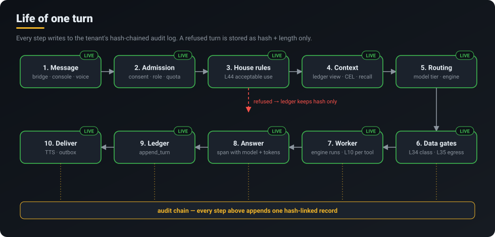
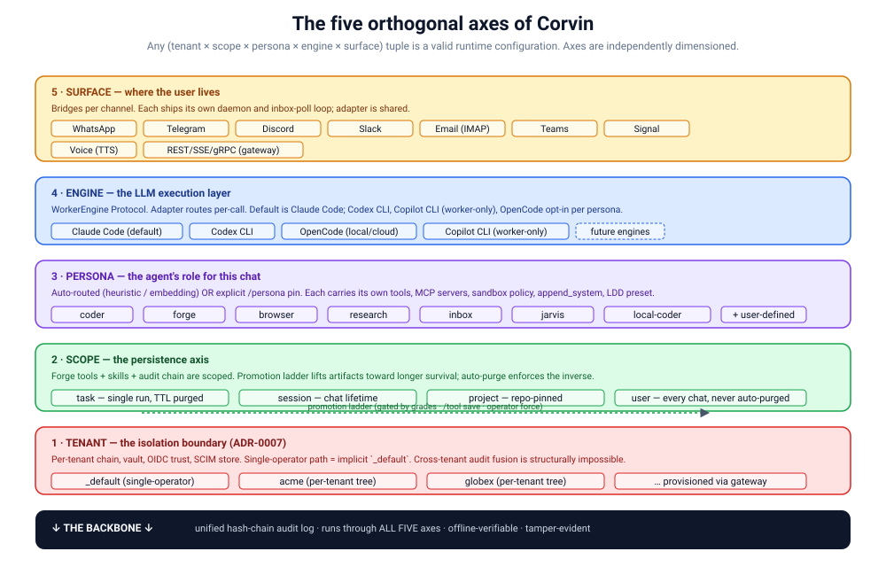

  

  <a href="../../README.md">Home</a> &middot;
  <a href="token-savings.md">Token savings</a> &middot;
  <a href="self-learning.md">Self-learning</a> &middot;
  <a href="skills-acp.md">Skills 2.0 &amp; ACP</a> &middot;
  <strong>CorvinOS as an OS</strong> &middot;
  <a href="organizations.md">Organizations</a> &middot;
  <a href="a2a.md">A2A</a> &middot;
  <a href="video.md">Video</a> &middot;
  <a href="marketplace.md">Marketplace &amp; plugins</a> &middot;
  <a href="extensibility.md">Extensibility</a>

# CorvinOS as an operating system

> **You bring the agent — Claude Code, Codex, OpenCode or Copilot CLI. CorvinOS is the system around it: it boots it behind a compliance check, schedules every turn onto a model, gates what it may touch, remembers the conversation and writes every step into a tamper-evident log.**

## What you get

- **Your agent, unchanged.** CorvinOS does not replace the agent loop; it runs one worker process per turn with the engine you choose and keeps that engine swappable.
- **Protection that fails closed.** House rules (acceptable use), data classification per engine, network egress lists and a file-write guard sit in front of every turn. An error in a gate refuses; it never waves a turn through.
- **Memory that survives resets.** Every chat turn is appended to a ledger outside the worker's reach; a reset or an auto-compaction of the CLI transcript can no longer make the system forget what was said.
- **One log of everything.** Each tenant has exactly one hash-chained audit chain. Boot refuses to start if it does not verify.
- **Many front doors.** Seven chat apps, voice in and out, a web console, Claude Code and other CorvinOS instances — all go through the same gates.

## The OS analogy, mapped to real code

| OS concept | In CorvinOS | Where | Status |
|---|---|---|---|
| Kernel (the loop that does the work) | External agent engines: Claude Code, Codex CLI, OpenCode, Copilot CLI | `corvin_operator/bridges/shared/agents/`, `engine_registry.py` | **LIVE** |
| Boot / init | Boot tripwire: the audit chain must verify before anything starts — no override, no flag | `core/compliance/corvin_compliance_reports/tripwire.py`, `bootstrap.boot_platform()` | **LIVE** |
| Processes | One worker process per message, started and collected by the adapter | `corvin_operator/bridges/shared/adapter.py` | **LIVE** |
| Scheduler | Model router (Haiku · Sonnet · Opus per turn) | `model_selector.resolve_os_model` → [Token savings](token-savings.md) | **LIVE** |
| Scheduler | Delegation router (which engine/agent) | `os.delegation_router` | **SHADOW** |
| Job control | Tasks and the work board (fed from the knowledge base) | `core/orchestration/subsystems/task_manager.py`, `kb_projection.py` | **LIVE** |
| Working memory | Session ledger, context engine | `session_ledger.py`, `corvin_operator/context_engineering/` | **LIVE** |
| Long-term memory | Conversation recall, session artifacts | `conversation_recall.py`, `forge/forge/artifacts.py` | **LIVE** |
| Permissions | L44 house rules · L34 data classification · L35 egress · L10 path gate | `house_rules.py`, `data_classification.py`, `egress_gate.py`, `voice/hooks/path_gate.py` | **LIVE** |
| Users & groups | Tenants, roles, quota, consent, disclosure, proposals | `core/paths/tenant.py`, `roles.py`, `quota.py`, `consent.py` | **LIVE** |
| System log | One hash-chained audit chain per tenant | `forge/forge/security_events.py` (`tenant_audit_chain()`) | **LIVE** |
| System calls | Tools: built-in, MCP servers, runtime-generated (Forge) | `forge/forge/mcp_server.py` | **LIVE** |
| Drivers / I/O | Chat bridges, voice STT/TTS, A2A | `corvin_operator/bridges/<channel>/`, `remote_trigger_receiver.py` | **LIVE** |
| Package manager | Plugin registry with boot layers, sources in the Corvin-Marketplace | `core/plugins/corvin_plugins/` → [Marketplace](marketplace.md) | **LIVE** |
| Shell | Web console, CLIs, Claude Code plugin | `:8765/console`, `corvin`, `corvin-serve`, `/corvin:install` | **LIVE** |
| Login | Credential login / SSO for the console | — | **NOT BUILT** (console is local, owner-only) |

## Life of one turn

A message from any surface is admitted (consent, role, quota), checked against the house rules, given its context (the ledger view, retrieved memory), routed to a model and engine, checked again for data class and egress, and only then run. The worker's file writes go through the path gate on every tool call. The answer is recorded with the model that actually answered and its token counts, appended to the ledger, then delivered — spoken, if it was a voice chat. A refused turn is kept in the ledger as a hash and a length only, never its text.

## Five independent axes

Every run is a combination of five axes that can be chosen independently — tenant, scope, persona, engine and surface — with the audit chain running through all of them:

## Try it

- Install from your clone (`./install.sh` / `.\install.ps1`, or `/corvin:install` in Claude Code) and open `http://127.0.0.1:8765/console/`.
- Console sidebar: **Chat**, **Tasks**, **Models**, **Memory**, **Voice**, **Messaging**, **Marketplace**, **Audit & Compliance**.
- Connect a chat app: `bash corvin_operator/bridges/bridge.sh up` (or `/discord-on`, `/telegram-on`, … from the `voice` Claude Code plugin).
- Switch the engine for a chat: Console → Settings → AI Engines.

## Honest limits

- CorvinOS is **not** a kernel and not a sandbox: the path gate is a syntactic guard against accidental and naive writes. A worker running as your OS user can still write what that user can; hard isolation needs OS-level isolation of the worker.
- The **console has no multi-user login**; it trusts the local machine. Teams work through the chat bridges — see [Organizations](organizations.md).
- **Audit coverage is not 100 %.** The chain is complete and verified for what is recorded; some registered events still have no emitter.
- The **delegation router runs in shadow** and decides nothing yet — see [Self-learning](self-learning.md).

## Under the hood

- Multi-tenant axis and one audit chain per tenant: ADR-0007, ADR-0650 · boot tripwire: ADR-0232/0233
- Worker engines and model routing: ADR-0759, ADR-0952 · session ledger: ADR-2102
- Layer reference: [`docs/claude-ref/layer-summary.md`](../claude-ref/layer-summary.md) · compliance baseline: [`docs/claude-ref/compliance-baseline.md`](../claude-ref/compliance-baseline.md)
- Related: [Token savings](token-savings.md) · [Organizations](organizations.md) · [Marketplace & plugins](marketplace.md)
