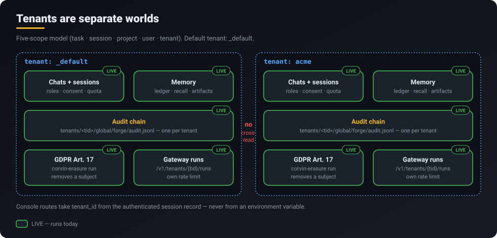

<p align="center">
  <a href="../../README.md"></a>
</p>
<p align="center">
  <a href="../../README.md">Home</a> &middot;
  <a href="token-savings.md">Token savings</a> &middot;
  <a href="self-learning.md">Self-learning</a> &middot;
  <a href="skills-acp.md">Skills 2.0 &amp; ACP</a> &middot;
  <a href="operating-system.md">CorvinOS as an OS</a> &middot;
  <strong>Organizations</strong> &middot;
  <a href="a2a.md">A2A</a> &middot;
  <a href="video.md">Video</a> &middot;
  <a href="marketplace.md">Marketplace &amp; plugins</a> &middot;
  <a href="extensibility.md">Extensibility</a>
</p>

# CorvinOS in organizations

> **One operator runs the instance; the whole team works with it in the chat channels it already uses — with roles, quotas, consent and a tamper-evident record of who did what.**

<p align="center"></p>

## What you get

- **A team assistant in your existing chats.** Discord, Slack, Teams, Telegram, WhatsApp, Signal and email bridges put one CorvinOS instance into shared channels — no new app for your colleagues.
- **Per-chat roles with an expiry.** The owner grants `admin`, `member` or `observer` per chat, with a TTL (default 7 days). Every grant, revoke and denial is a record in the audit chain.
- **Consent before anyone's words reach the model.** Observers are silent by default; their messages are only admitted after they opt in, and the consent expires.
- **Budgets per person.** Messages and tokens are counted per user per rolling 24 hours, with per-user overrides.
- **Separation and erasure.** Every run is tenant-scoped, each tenant has its own hash-chained audit chain, and a GDPR Art. 17 request is executed by one CLI command.

## How it works

The instance belongs to an **operator** (the owner). Colleagues never log in anywhere: they write in a shared chat, and the bridge decides per message whether that message may reach the model.

1. **Disclosure.** The first time a person appears, they get a one-time card saying they are talking to an AI (EU AI Act Art. 50). They answer `/join` (become an observer) or `/pass` (stay out); either way the card is not shown again.
2. **Role.** The owner is whoever is whitelisted in the bridge's `settings.json`. Everyone else has the role the owner (or an admin) granted. Roles do not inherit — each bundle lists its capabilities explicitly.
3. **Consent.** A read-only sender's messages are dropped unless they have given consent (`/consent on`, or time-bounded `/consent 1h`, max 30 days) or admit one message with `/share <text>`. Deny is the default.
4. **Quota.** Messages and tokens per user are counted over a rolling 24 hours; an exhausted quota refuses the turn.
5. **Proposals.** Anyone may `/propose` an idea; the stack is curated by the owner or an admin and consumed in one turn with `/go`. That is how a group contributes to one decision without triggering the model for every message.

Only then does the turn reach the same gates every CorvinOS turn passes — L44 house rules, L34 data classification, L35 egress, the L10 path gate on every tool call — and a worker engine runs it. The answer goes back to the chat; the turn is appended to the session ledger.

<p align="center"></p>

**Tenants.** Every run carries a tenant id (ADR-0007, five scopes: task, session, project, user, tenant). A tenant's data lives under `<corvin_home>/tenants/<tid>/`, and its audit chain is exactly one file, `tenants/<tid>/global/forge/audit.jsonl`. Console routes take the tenant from the authenticated session record, never from an environment variable. The gateway exposes runs per tenant (`/v1/tenants/{tid}/runs`) with its own rate limit; a non-loopback caller needs an OIDC JWT.

**What does not bend.** The house-rules gate (L44) has no off switch, consent is deny-by-default with a TTL, the disclosure card is shown once per uid, and the boot tripwire refuses to start the instance when the audit chain does not verify. A plugin cannot weaken any of these.

### A typical team setup

| Who | How they get there | What they can do |
|---|---|---|
| Operator (owner) | Whitelisted uid in the bridge `settings.json`; runs the console on the host | Everything, including `/grant`, `/revoke`, `/quota set`, the console |
| Team lead (admin) | `/grant <uid> admin 30d` by the owner | Grant `member` / `observer`, curate proposals, `/go`, view chat-wide audit |
| Colleague (member) | `/grant <uid> member 7d` | Trigger turns within their quota, read their own audit |
| Guest (observer) | `/join` after the disclosure card | Nothing reaches the model until `/consent`; may `/propose` |

## What runs today

| Capability | Status | Where |
|---|---|---|
| Roles `owner/admin/member/observer`, TTL grants (`/grant /revoke /role /roles /leave`) | **LIVE** | `corvin_operator/bridges/shared/roles.py`, `shared/js/in_chat_commands.js` |
| Disclosure card + `/join` / `/pass` | **LIVE** | `corvin_operator/bridges/shared/disclosure.py` |
| Consent gate (`/consent`, `/share`), deny-by-default, TTL | **LIVE** | `corvin_operator/bridges/shared/consent.py` |
| Per-user quota (`/quota`), rolling 24 h | **LIVE** | `corvin_operator/bridges/shared/quota.py` |
| Proposal stack (`/propose /proposals /go`) | **LIVE** | `corvin_operator/bridges/shared/proposal.py` |
| One hash-chained audit chain per tenant; `grant.*` records | **LIVE** | `corvin_operator/forge/forge/paths.py::tenant_audit_chain()` |
| Audit &amp; Compliance panel | **LIVE** | console `/app/compliance` |
| Members view (read-only) | **LIVE** | `core/console/corvin_console/routes/members.py` |
| GDPR Art. 17 erasure (`corvin-erasure`), incl. A2A peers | **LIVE** | `corvin_operator/bridges/shared/erasure_orchestrator.py`, `erasure_a2a.py`; CLI `corvin_operator/voice/scripts/corvin_erasure.py` |
| Gateway runs per tenant, rate-limited | **LIVE** | `core/gateway/corvin_gateway/app.py` |
| Web console login | **LIVE** — single operator, loopback, credential-less, tenant `_default`, tier owner | `core/console/corvin_console/auth.py` |
| OIDC (static JWKS) for gateway API callers | **PARTIAL** | `core/gateway/corvin_gateway/oidc.py` |
| SCIM user provisioning | **PARTIAL** — stub, no PATCH | `core/gateway/corvin_gateway/scim.py` |
| L42 organisations panel | **PARTIAL** — routes exist, hidden from the sidebar | `core/console/corvin_console/routes/orgs.py`, `web-next/src/pages/orgs.tsx` |
| Multi-user console login / SSO | **NOT BUILT** | — |

## Try it

Make yourself the owner: add your uid to the bridge's `settings.json` whitelist, then invite the bot into a team channel.

```text
/roles                                  # who is in this chat, with which role
/grant 123456789 member 7d onboarding   # owner: give a colleague a member role for a week
/grant 987654321 admin 30d              # owner: an admin may grant member/observer
/revoke 123456789                       # drop a granted role
/quota all                              # owner/admin: everyone's usage today
/quota set 123456789 200 keep           # per-user message override, tokens unchanged
/consent list                           # owner: active consents in this chat
/propose summarise the open tickets     # anyone: add to the proposal stack
/proposals                              # owner/admin: review the stack
/go keep it to five bullets             # owner/admin: consume the stack in one turn
```

A newcomer sees the disclosure card and answers:

```text
/join            # become an observer (visible in /roles)
/consent 1h      # let my messages reach the next turn for one hour
/pass            # or: stay out, the card is not shown again
```

Erase a person on request (dry run first):

```bash
corvin-erasure run <subject_id> --requester dpo@example.org --dry-run
corvin-erasure run <subject_id> --requester dpo@example.org
corvin-erasure list
```

Then open the console's **Audit &amp; Compliance** panel to see the `grant.*`, consent and erasure records.

## Honest limits

- **The web console is single-operator.** It accepts only loopback connections, has no credentials, and treats the person at the keyboard as the owner of tenant `_default`. There is no team login, no per-user console account and no SSO — multi-user console login is **NOT BUILT**.
- **Identity providers are partial.** OIDC verifies JWTs against a static JWKS for gateway API callers only; SCIM is a stub without PATCH.
- **`user_backend` has no subject yet.** The plugin hook that would deny an unknown credential exists and is tested, but no credential login calls it — there is none.
- **Roles are per chat, not per organisation.** A person granted `member` in one channel has no role in another; the L42 organisation model is hidden and unfinished.
- **One operator instance per team.** Tenants separate data and audit, but they share one host and one operator.

## Under the hood

- Roles, consent, disclosure, quota, proposals: `corvin_operator/bridges/shared/{roles,consent,disclosure,quota,proposal}.py`; chat dispatch in `corvin_operator/bridges/shared/js/in_chat_commands.js`.
- Console auth: `core/console/corvin_console/auth.py`, `routes/auth_routes.py`.
- Erasure: `corvin_operator/bridges/shared/{erasure_orchestrator,erasure_a2a}.py`, CLI `corvin_operator/voice/scripts/corvin_erasure.py`.
- Gateway identity: `core/gateway/corvin_gateway/{oidc,scim}.py`.
- ADRs (Corvin-Knowledge): ADR-0007 (multi-tenant axis), ADR-0232 / ADR-0233 (boot tripwire, additive plugin extension), ADR-0650 (one audit chain per tenant).
- Related: [CorvinOS as an OS](operating-system.md) · [A2A](a2a.md) · [Marketplace &amp; plugins](marketplace.md)
