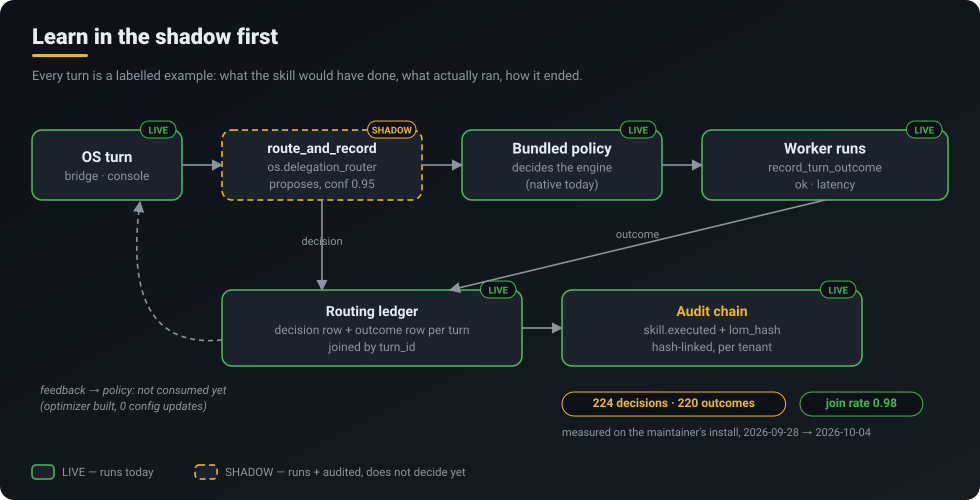
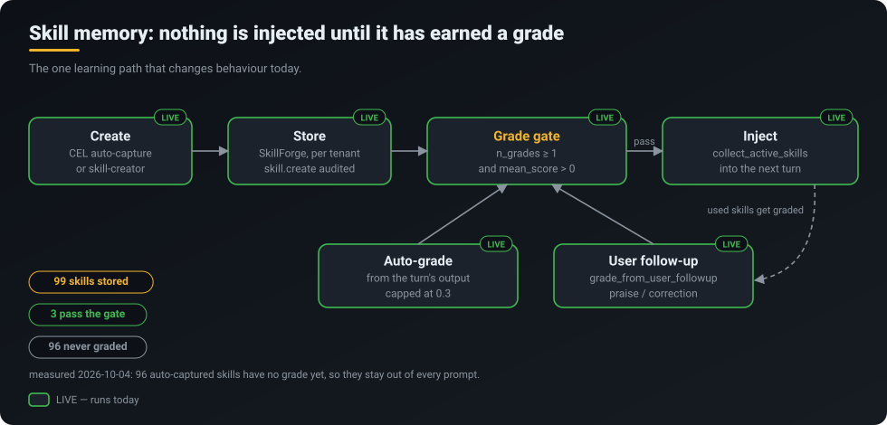
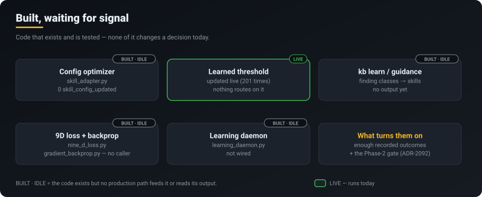

<p align="center">
  <a href="../../README.md"></a>
</p>
<p align="center">
  <a href="../../README.md">Home</a> &middot;
  <a href="token-savings.md">Token savings</a> &middot;
  <strong>Self-learning</strong> &middot;
  <a href="skills-acp.md">Skills 2.0 &amp; ACP</a> &middot;
  <a href="operating-system.md">CorvinOS as an OS</a> &middot;
  <a href="organizations.md">Organizations</a> &middot;
  <a href="a2a.md">A2A</a> &middot;
  <a href="video.md">Video</a> &middot;
  <a href="marketplace.md">Marketplace &amp; plugins</a> &middot;
  <a href="extensibility.md">Extensibility</a>
</p>

# Self-learning

> **CorvinOS records every decision and its outcome as an audited, labelled example, and lets a learned component act only after the evidence holds up.**

<p align="center"></p>

## What you get

- **A skill memory that has to earn its place.** SkillForge stores working methods, and a
  skill is injected into a turn only after it has been graded. Automatic grades are capped,
  so the system cannot promote its own output.
- **A closed, audited record of routing.** Every OS turn writes a decision row (what the
  routing Skill proposed, what actually ran) and an outcome row (did it succeed, how long
  it took). The two join on `turn_id`: 98% of decisions have their outcome.
- **Learning that cannot surprise you.** The routing Skill runs in **shadow**: it is
  executed, audited and measured, but the bundled policy still decides. It gets a say only
  after a published gate holds (see [Skills 2.0 & ACP](skills-acp.md)).
- **Everything is evidence.** Each learning event goes to the tenant's hash-chained audit
  log *before* it is stored. A record the chain did not accept is never written.

## How it works

The usual "self-learning" pitch is an optimiser that rewrites behaviour from day one. CorvinOS
works the other way round: **learn in the shadow first.** A component that wants to make
decisions has to run alongside the existing one, record what it would have done, and build
up enough matched outcomes for anyone to check whether it would have done better. Promoting it
to a decision-maker is a separate, gated step.

That is a safety property, not a missing feature. A router that learned the wrong thing from
200 examples would quietly send work to the wrong engine. A router that has to show 500
recorded decisions, a 0.95 outcome join rate and per-surface evidence first cannot do that
without anyone noticing.

### Loop 1: routing, recorded in shadow

On every OS turn, from both the chat bridges and the web console,
`delegation_policy.route_and_record` runs the `os.delegation_router` Skill and appends a
decision row to `<tenant>/learning/routing/routing_ledger.jsonl`. The row holds the turn's
coarse features (complexity bucket, length bucket, code/table flags), the Skill's proposal
and confidence, the bundled answer and the engine that was actually used. When the worker
finishes, `record_turn_outcome` appends the outcome. In the same turn the Skill run is written
to the audit chain as `skill.executed` with a `lom_hash`, and the outcome goes through
`core/learning/outcome_sink.py` into the audit-first `EventStore`.

Measured on the maintainer's install, 2026-09-28 to 2026-10-04: **444 ledger rows: 224
decisions, 220 outcomes, join rate 0.98** (bridge 205, console 19). The Skill has not disagreed
with the bundled policy once yet: all 224 decisions are `native`, confidence 0.95. That
agreement is what shadow mode exists to measure before anything is allowed to change.

### Loop 2: skill memory, gated by grades

<p align="center"></p>

This is the one learning path that **changes behaviour today**. Skills are created by the
context engine's auto-capture or by the skill-creator, and stored per tenant in SkillForge
(`skill.create` is audited). Before every turn, `collect_active_skills` picks the skills to
inject, and it skips any skill with `n_grades < 1` or `mean_score <= 0`. Grades come from two
places:

- `auto_grade_from_output` grades a skill that was injected, from the turn's output. Its
  score is capped at `_AUTO_GRADE_CAP_MAX = 0.3`, so a skill cannot vote itself to the top.
- `grade_from_user_followup` grades from what you say next: praise or a correction.

Measured 2026-10-04: **99 skills stored, 3 graded, and those 3 pass the gate.** The other 96
(auto-captured) have no grade, so they are never injected. That is the gate doing its job. An
ungraded skill is a candidate, not an instruction.

### Built, waiting for signal

<p align="center"></p>

Several pieces of the learning stack exist and are tested but have nothing to act on yet. The
`skill_adapter` config optimizer has emitted 0 `skill_config_updated` events. The learned
threshold store updates a success statistic live (201 `learned_threshold_updated` events; the
`complex` bucket shows 152 samples at 98% success), but no routing decision reads it.
`kb learn` / `kb guidance` can turn recurring review findings into guidance skills, and have
produced none so far. `nine_d_loss.py`, `gradient_backprop.py` and `learning_daemon.py` have
no production caller.

## What runs today

| Capability | Status | Where |
|---|---|---|
| Skill grade gate + injection | **LIVE** | `corvin_operator/bridges/shared/skill_inject.py` (`collect_active_skills`) |
| Auto-grade (capped at 0.3) + user follow-up grade | **LIVE** | `skill_inject.py` (`auto_grade_from_output`, `grade_from_user_followup`) |
| Routing decision + outcome ledger | **SHADOW** | `corvin_operator/bridges/shared/delegation_policy.py`, `core/skills/os_skills/monitoring/routing_ledger.py` |
| Outcome sink, audit-first event store | **LIVE** | `core/learning/outcome_sink.py`, `core/learning/event_store.py` |
| Learned threshold statistic | **LIVE** (read by nothing) | `core/learning/learned_threshold_store.py` |
| Skill config optimizer | **PARTIAL** (built, never fired) | `core/skills/os_skills/skill_adapter.py` |
| Phase 2: routing Skill may decide | **GATED** (refused until ADR-2092 gates hold) | `core/skills/os_skills/monitoring/dual_write.py` |
| `kb learn` / `kb guidance` | **PARTIAL** (built, no output yet) | `Corvin-Knowledge/scripts/kb.py` |
| 9D loss, gradient backprop, learning daemon | **NOT BUILT** into any live path | `core/learning/nine_d_loss.py`, `core/learning/gradient_backprop.py`, `core/background/learning_daemon.py` |

The model-tier router (Haiku / Sonnet / Opus per turn) is a rule-based classifier, not a learned
one. See [Token savings](token-savings.md).

## Try it

```bash
# The routing ledger: one decision row and one outcome row per turn
tail -n 4 .corvin/tenants/_default/learning/routing/routing_ledger.jsonl | jq -c .

# Decisions vs outcomes so far
jq -r .kind .corvin/tenants/_default/learning/routing/routing_ledger.jsonl | sort | uniq -c

# Guidance mined from recurring review findings (Corvin-Knowledge)
python3 scripts/kb.py learn
python3 scripts/kb.py guidance pending
```

- **Console → Learnings** (`/app/vibe-engineering`): learnings view across skills and loops.
- **Console → Models** (`/app/models`): routing, usage and cost in one panel.
- In chat, praise or correct an answer that used a skill. `grade_from_user_followup` turns
  that into a grade, which decides whether the skill is injected next time.

## Honest limits

- **Nothing learned changes routing today.** The routing Skill is in shadow; the bundled policy
  decides every turn.
- **The feedback loop is recorded, not consumed.** Decisions and outcomes are joined, but no
  optimiser has tuned a config from them yet (0 `skill_config_updated`).
- **The Phase-2 gate is not met.** It needs at least 500 decisions; 224 are recorded. Proxy
  evidence per surface is not yet shown.
- **Most skills are inert.** 96 of 99 stored skills have never been graded and are never injected.
- **No gradient descent, no multi-dimensional loss in a live path.** Those modules exist and
  have no caller.
- All numbers above come from one install (the maintainer's), measured 2026-10-04.

## Under the hood

- Learning events and persistence: ADR-0314. Loop closure (shadow source → outcome sink →
  audit-first store → consumer): ADR-0613.
- Routing Skill shadow mode and Phase-2 activation gates: ADR-2092.
- OS Skills architecture, manifests, composition: ADR-0532, ADR-0533, ADR-0535. Learning
  trust boundary for feedback: ADR-0534 (proposed).
- Ledger: `core/skills/os_skills/monitoring/routing_ledger.py`. Gate logic:
  `core/skills/os_skills/monitoring/dual_write.py` (`CORVIN_ACP_PHASE`; `phase2_real` is
  always refused).
- Related: [Skills 2.0 & the Agentic Control Plane](skills-acp.md) ·
  [Token savings](token-savings.md) · [CorvinOS as an OS](operating-system.md)
