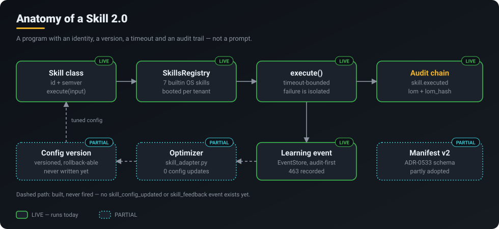
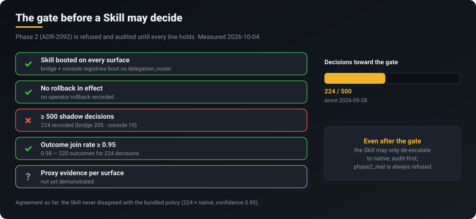

<p align="center">
  <a href="../../README.md"></a>
</p>
<p align="center">
  <a href="../../README.md">Home</a> &middot;
  <a href="token-savings.md">Token savings</a> &middot;
  <a href="self-learning.md">Self-learning</a> &middot;
  <strong>Skills 2.0 &amp; ACP</strong> &middot;
  <a href="operating-system.md">CorvinOS as an OS</a> &middot;
  <a href="organizations.md">Organizations</a> &middot;
  <a href="a2a.md">A2A</a> &middot;
  <a href="video.md">Video</a> &middot;
  <a href="marketplace.md">Marketplace &amp; plugins</a> &middot;
  <a href="extensibility.md">Extensibility</a>
</p>

# Skills 2.0 &amp; the Agentic Control Plane

> **Each OS subsystem becomes a versioned, audited program called a Skill, and a Skill earns the right to decide in shadow mode first.**

<p align="center"></p>

## What you get

- **Subsystems you can inspect, version and replace.** A Skill is a Python class with an id,
  a semantic version and an `execute()` method, held in one registry. It is a program, not a
  prompt.
- **Every decision on the record.** Each `execute()` writes `skill.executed` to the tenant's
  hash-chained audit log, with a line-of-moral-responsibility (`lom`) and its `lom_hash`, plus
  a learning event.
- **A crash or hang stays contained.** `execute()` is bounded by a timeout. An overrun is
  reported as `timeout` and the turn goes on.
- **No silent take-over.** A new Skill runs beside the existing logic, gets measured, and is
  promoted only through a published, audited gate.

## How it works

### The idea: a control plane made of Skills

Today most of what an agent platform does between the message and the model is hard-coded:
which engine runs, what context goes in, which checks apply. The Agentic Control Plane (ACP)
turns each of those decisions into a Skill: a small program that owns one domain, runs
deterministic code, may call a model where judgement is needed, and records everything it does.
Because every Skill has the same shape (identity, version, timeout, audit trail, learning
events), a subsystem can be swapped, rolled back or compared against its predecessor without
rebuilding the platform.

The plan covers five layers. Two exist in code, and both run in shadow:

| Layer | Skill | Today |
|---|---|---|
| L5 Routing | `os.delegation_router` | **SHADOW**: 224 decisions recorded, the bundled policy still decides |
| L10 Context | `os.context_adapter` | **SHADOW**: wired into the context-engineering pipeline, 0 runs recorded on this install |
| L22 Workflow | `os.workflow_optimizer` | **NOT BUILT** |
| L16 Security | `os.security_orchestrator` | **NOT BUILT** |
| L34 Data flow | `os.flow_guard` | **NOT BUILT** |

The deterministic gates that protect a turn today (path gate, consent gate, the L34 data
classifier, house rules) stay **LIVE** and fail-closed. In this design a Skill can add to a
compliance mechanism but never replace or switch one off.

### Anatomy of a Skill

<p align="center"></p>

`core/skills/skill_registry_phase1.py` holds the `SkillsRegistry`. At boot,
`core/skills/os_skills_phase1.py` registers seven builtin OS Skills (`BUILTIN_SKILL_IDS`):
`os.delegation_router`, `os.vibe_engineering`, `os.context_adapter`,
`os.plugin_health_monitoring`, `os.headless_mode`, `os.plugin_builder` and `os.capabilities`.
The bridge adapter and the console each boot an audited registry per tenant.

Some of them do a lot of work already. On the maintainer's install (audit chain since
2026-09-24, counted 2026-10-04): `os.capabilities` 28,391 runs, `os.headless_mode` 145,
`os.plugin_health_monitoring` 47, `os.plugin_builder` 20, `os.delegation_router` 224.

The right-hand half of the loop, where feedback goes to the optimizer, the optimizer writes a
new config version and the next run uses it, is built (`skill_adapter.py`, versioned
config with rollback) and **has never fired**: there are 0 `skill_config_updated` and 0
`skill_feedback` events. Self-tuning Skills are the roadmap, not the present.

### The gate before a Skill may decide

<p align="center"></p>

Setting `CORVIN_ACP_PHASE=phase2_dual_write` asks for the routing Skill to take part in
decisions. `core/skills/os_skills/monitoring/dual_write.py` **refuses the request and audits
the refusal** until every ADR-2092 condition holds for that surface:

- the Skill booted, and no rollback is in effect;
- at least 500 recorded decisions (224 today);
- an outcome join rate of at least 0.95 (0.98 today);
- proxy evidence that the Skill's choices would have done at least as well.

Even after the gate opens, the Skill may only **de-escalate to native**, and that is audited
first. `phase2_real` is always refused. Turning a learned component into a decision-maker is
meant to be slow, measurable and reversible.

## What runs today

| Capability | Status | Where |
|---|---|---|
| Skill class: id, semver, `execute()` with timeout | **LIVE** | `core/skills/skill_registry_phase1.py` |
| Registry with 7 builtin OS Skills, booted on bridge and console | **LIVE** | `core/skills/os_skills_phase1.py` |
| `skill.executed` audit with `lom` / `lom_hash` (allowlisted) | **LIVE** | registry audit backend → tenant audit chain |
| Learning event per execution | **LIVE** | `core/learning/event_store.py` |
| L5 routing Skill | **SHADOW** | `corvin_operator/bridges/shared/delegation_policy.py` |
| L10 context Skill | **SHADOW** (wired, 0 runs here) | CEL stage `l10_adapter` |
| Phase 2 dual-write | **GATED** (refused until ADR-2092 gates hold) | `core/skills/os_skills/monitoring/dual_write.py` |
| Manifest v2, config versioning + rollback | **PARTIAL** | `core/skills/manifest_v2.py`, `core/skills/os_skills/skill_adapter.py` |
| Self-tuning from feedback | **PARTIAL** (built, never fired) | `skill_adapter.py` |
| L22 / L16 / L34 Skills | **NOT BUILT** | ADR-0532 roadmap |
| Forge 2.0 modules (`creator_2_0`, `knowledge_graph`, `marketplace_hub`, `datahub_unified`) | **PARTIAL** (code exists, not wired) | `core/skills/os_skills/` |

## Try it

```bash
# Which Skills booted, and their ids
grep -n -A8 "BUILTIN_SKILL_IDS" core/skills/os_skills_phase1.py

# The routing Skill's shadow record (decision + outcome per turn)
jq -c 'select(.kind=="decision") | {surface, bundled, skill, skill_conf, used}' \
  .corvin/tenants/_default/learning/routing/routing_ledger.jsonl | tail -5
```

Requesting Phase 2 (`CORVIN_ACP_PHASE=phase2_dual_write` in the service environment) is safe to
try: while the gates do not hold, the request is refused and the refusal is audited.

- **Console → Learnings** (`/app/vibe-engineering`): Skill and learning activity.
- **Console → Models** (`/app/models`): routing decisions next to usage and cost.

## Honest limits

- **Two of five layers exist, both in shadow.** No Skill makes a routing or context decision today.
- **L10 has no recorded run on the maintainer's install** (0 `context.adapted`); its bridge path
  is not yet proven end to end.
- **No Skill has tuned itself.** The optimizer and config versioning are built; the loop has
  not closed.
- **The Phase-2 gate is not met:** 224 of 500 decisions, and proxy evidence is not yet shown.
- **"LLM-generated logic", composition DAGs in production and an OS-Skill marketplace are
  roadmap.** ADR-0535 (composition) is decided but not built.
- An accepted ADR means *decided*, not *built*. ADR-0314, 0613, 0532, 0533, 0535 and 2092 are
  accepted; ADR-0534 and ADR-2044 are proposed.

## Roadmap

1. **Phase 1, now:** L5 and L10 Skills in shadow, every run audited, ledger joined to outcomes.
2. **Phase 2:** once the ADR-2092 gates hold, the routing Skill may de-escalate to native; the
   optimizer starts tuning configs from recorded feedback, each change written as
   `skill_config_updated` with its delta.
3. **Phase 3:** `os.workflow_optimizer`, `os.security_orchestrator`, `os.flow_guard`, Skill
   composition (ADR-0535) and OS Skills distributed through the marketplace.

## Under the hood

- Architecture: ADR-0532 (OS Skills), ADR-0533 (manifest and versioning), ADR-0535
  (composition and dependencies), ADR-2044 (Skills audit completeness, proposed).
- Learning loop: ADR-0314 (events), ADR-0613 (loop closure), ADR-0534 (feedback trust boundary, proposed).
- Phase-2 activation: ADR-2092.
- Related: [Self-learning](self-learning.md) · [CorvinOS as an OS](operating-system.md) ·
  [Marketplace & plugins](marketplace.md)
