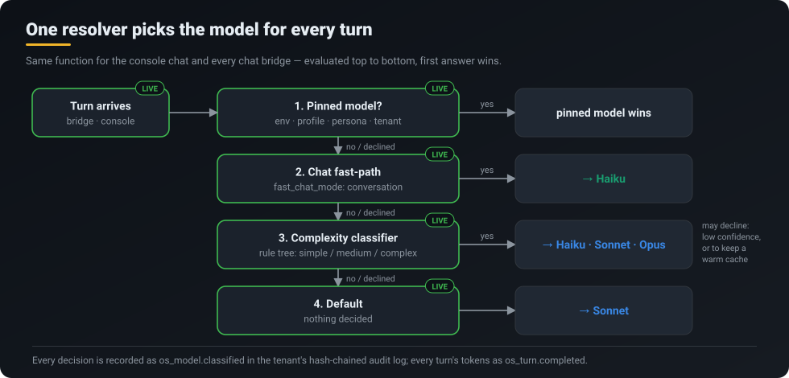
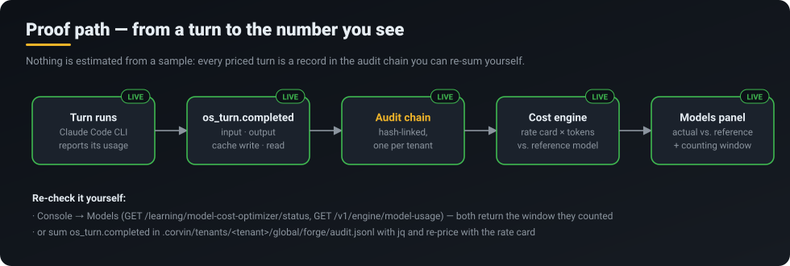
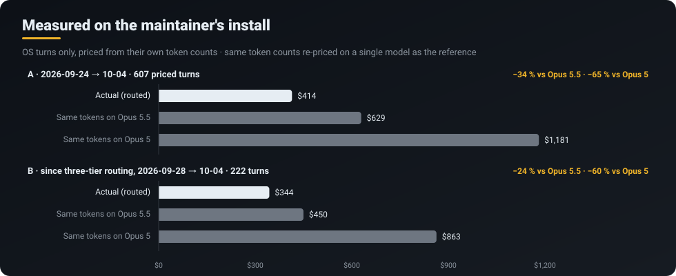
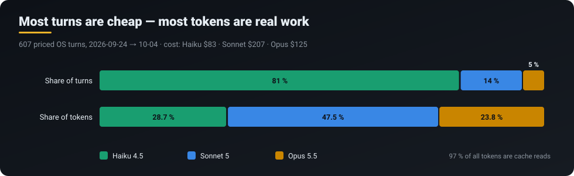

<p align="center">
  <a href="../../README.md"></a>
</p>
<p align="center">
  <a href="../../README.md">Home</a> &middot;
  <strong>Token savings</strong> &middot;
  <a href="self-learning.md">Self-learning</a> &middot;
  <a href="skills-acp.md">Skills 2.0 &amp; ACP</a> &middot;
  <a href="operating-system.md">CorvinOS as an OS</a> &middot;
  <a href="organizations.md">Organizations</a> &middot;
  <a href="a2a.md">A2A</a> &middot;
  <a href="video.md">Video</a> &middot;
  <a href="marketplace.md">Marketplace &amp; plugins</a> &middot;
  <a href="extensibility.md">Extensibility</a>
</p>

# Token savings — with the receipts

> **CorvinOS sends every turn to the cheapest model that fits it, and records the tokens of every turn in a hash-chained log — so the saving is something you can re-add yourself, not a claim.**

<p align="center"></p>

## What you get

- **The right model per turn.** Conversation goes to Haiku, ordinary work to Sonnet, ADR, review and Markdown-document work to Opus — decided per turn, on every surface (console chat and every chat bridge), by one shared resolver.
- **Your choice still wins.** A pinned model (environment, profile, persona or tenant setting) is never overridden by the router.
- **A number with a source.** Every turn's four token counts (input, output, cache write, cache read) are written to the tenant's audit chain; the console prices them from a rate card and shows the counting window next to the total.
- **No silent drift.** When the classifier is unsure, or switching would throw away a warm prompt cache, it declines and the turn stays where it is — and that decision is recorded too.

## How it works

`resolve_os_model` walks four tiers top to bottom; the first one that answers wins:

1. **Pins** — an explicit model from env, profile, persona or `spec.engine_models.<engine>.os_model`.
2. **Chat fast-path** — with `fast_chat_mode` on, plain conversation goes straight to Haiku.
3. **Complexity classifier** — a rule tree (not a learned model) labels the turn `simple`, `medium` or `complex` and maps it to Haiku, Sonnet or the newest Opus. It declines on low confidence or when a cache-warm turn would be downgraded.
4. **Default** — Sonnet.

Every priced number then follows one path:

<p align="center"></p>

The cost engine (`compute_cost_efficiency`) prices each completed turn from its own token split and compares it with **the same tokens re-priced on one reference model**. It skips turns with an unknown model or no token data and reports how many it counted.

## Measured, not modelled

These are the figures from the maintainer's own install, read from its audit chain on 2026-10-04. The chain on that machine starts on 2026-09-24 (an earlier chain was lost and the loss is recorded in the chain itself), so that is where the window starts.

<p align="center"></p>

| Window | Priced OS turns | Actual | Same tokens on Opus 5.5 | Same tokens on Opus 5 |
|---|---|---|---|---|
| 2026-09-24 → 10-04 | 607 of 613 | **$414.21** | $629.15 (−34 %) | $1,181.21 (−65 %) |
| 2026-09-28 → 10-04 (three-tier routing live) | 222 of 228 | **$343.80** | $449.79 (−24 %) | $863.01 (−60 %) |

<p align="center"></p>

| Model | Turns | Share of turns | Share of tokens | Cost |
|---|---|---|---|---|
| Haiku 4.5 | 492 | 81 % | 28.7 % | $82.68 |
| Sonnet 5 | 86 | 14 % | 47.5 % | $206.81 |
| Opus 5.5 | 29 | 5 % | 23.8 % | $124.71 |

Rates are the ones in the code's rate card (input/output per million tokens: Haiku 4.5 $1/$5, Sonnet 5 $2/$10, Opus 5.5 $4/$20; cache writes 1.25×, cache reads 0.1× the input rate).

### How to read these numbers

- **The honest headline is 24–34 %** — the saving against running the same turns on the newest Opus. The 60–65 % figure is against Opus 5, the reference the code still uses; Opus 5.5 is itself cheaper per token, so part of that gap is the newer model, not routing.
- **It is a counterfactual.** "Same tokens on another model" assumes the other model would have produced the same token counts. That is the standard way to compare, and it is a modelling choice, not an observation.
- **The first window includes three days before routing was switched on** (2026-09-24 → 26, Haiku only), which is why window B exists.
- **97 % of all tokens are cache reads** — most of the cost is re-sending context, which is why the classifier refuses to switch a turn away from a warm cache.
- **One install, one operator, ten days.** Your mix will differ; the point of the console panel is that it shows *your* numbers with *your* window.

## What runs today

| Capability | Status | Where |
|---|---|---|
| Per-turn model resolver (pins → fast-path → classifier → default) | **LIVE** | `corvin_operator/bridges/shared/model_selector.py` (`resolve_os_model`) |
| Same resolver on console and bridges | **LIVE** | console `chat_runtime.py`, bridge `adapter.py` |
| Newest model of a family per tier, retirement on CLI error only | **LIVE** | `model_selector.tier_model()`, `model_lineage` |
| Token split per turn in the audit chain | **LIVE** | `os_turn.completed` |
| Cost vs. reference, with counting window | **LIVE** | `core/learning/model_selection_learner.py` (`compute_cost_efficiency`), console *Models* panel |
| Reset the counting window without touching the chain | **LIVE** | `<tenant>/global/usage_epoch.json` |
| Delegated worker runs priced | **PARTIAL** — spans are emitted, but on this install 0 of 6 worker runs carried token data | `engine_span.usage_split()` |
| Delegation router (which engine/agent does the work) | **SHADOW** — decides nothing yet | `os.delegation_router` → [Self-learning](self-learning.md) |

## Try it

- **Console → Models**: actual vs. reference cost, model mix, and the window they were counted over.
- **API** (same data): `GET /learning/model-cost-optimizer/status` and `GET /v1/engine/model-usage` on `http://127.0.0.1:8765`.
- **By hand**, from the audit chain:
  ```bash
  jq -c 'select(.event_type=="os_turn.completed")' \
     .corvin/tenants/_default/global/forge/audit.jsonl | head
  ```
  Each record carries the four token fields; multiply by the rate card and compare.
- **Pin a model** when you want one: Console → Settings → AI Engines (pins always win).

## Honest limits

- The router is a **rule tree**, not a learned policy. Learning is recorded in the shadow first — see [Self-learning](self-learning.md).
- **Worker cost is not yet visible** on this install (no token data on delegated runs), so the numbers above cover OS turns only.
- About 370 turns in the first window have **no tier record**, and the chat fast-path's chosen model is not yet written to the audit chain — the token counts are complete, the *reason* for some choices is not.
- Prices come from the code's rate card (verified 2026-09-15); if Anthropic changes prices, the card must be updated.

## Under the hood

- Resolver, tiers and pins: ADR-0952 · model lineage (always the newest model of a family): ADR-2090
- Engine spans, four-way token split, pricing every worker path: ADR-0759
- Counting window ("epoch") instead of trimming the audit chain: ADR-0760
- Related: [CorvinOS as an OS](operating-system.md) · [Self-learning](self-learning.md) · [Skills 2.0 & ACP](skills-acp.md)
