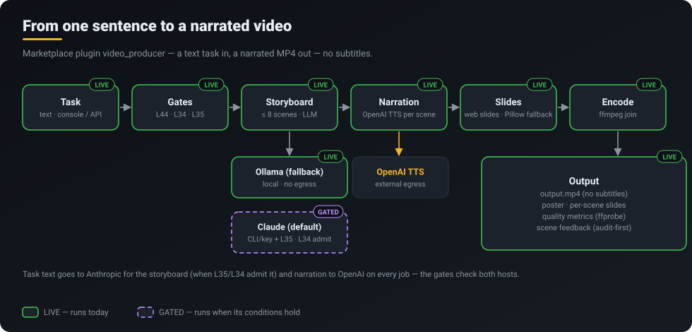
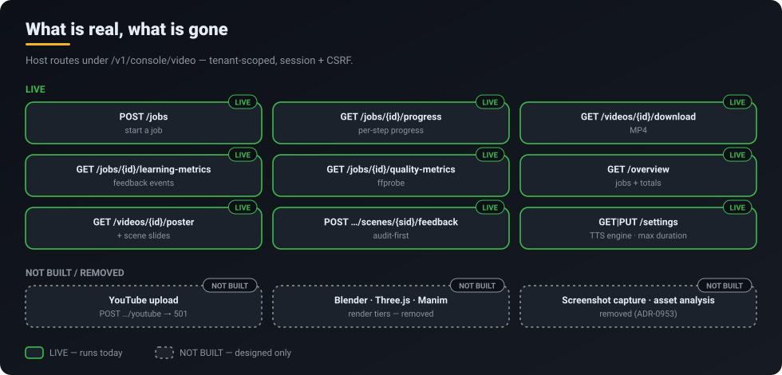

<p align="center">
  <a href="../../README.md"></a>
</p>
<p align="center">
  <a href="../../README.md">Home</a> &middot;
  <a href="token-savings.md">Token savings</a> &middot;
  <a href="self-learning.md">Self-learning</a> &middot;
  <a href="skills-acp.md">Skills 2.0 &amp; ACP</a> &middot;
  <a href="operating-system.md">CorvinOS as an OS</a> &middot;
  <a href="organizations.md">Organizations</a> &middot;
  <a href="a2a.md">A2A</a> &middot;
  <strong>Video</strong> &middot;
  <a href="marketplace.md">Marketplace &amp; plugins</a> &middot;
  <a href="extensibility.md">Extensibility</a>
</p>

# Video producer

> **Type one sentence, get back a narrated explainer video with captions — produced on your own machine, behind the same gates as every other CorvinOS run.**

<p align="center"></p>

## What you get

- **A finished artefact, not a prompt.** One task text produces `output.mp4` plus `output.srt`, a poster image and one slide per scene.
- **Local by default.** The storyboard is written by a local Ollama model unless you deliberately provide an Anthropic key — and even then only if the L35 egress gate admits it for your tenant.
- **Gated like any other run.** The task passes the acceptable-use gate (L44), data classification (L34) and the egress gate (L35) before anything is generated.
- **Measurable output.** Each job reports per-step progress and ffprobe quality metrics; feedback on a single scene is recorded in the audit chain before it is stored.
- **A plugin you can take out.** It ships through the Corvin Marketplace; uninstall it and the sidebar entry is gone.

## How it works

1. **Task.** You submit a text task in the Video panel or with `POST /v1/console/video/jobs`. The job runs in the background; the request returns a `job_id` immediately.
2. **Gates.** The same pre-spawn function every console spawn site calls checks L44 acceptable use, capabilities, L34 classification and L35 egress — under the `video_producer` engine profile, because the narration text is sent to a cloud TTS service on every job.
3. **Storyboard.** An LLM turns the task into at most six scenes, each with narration and slide text. Default backend: local Ollama (`qwen3:1.7b`, sized for a CPU-only host). Anthropic is used only when `ANTHROPIC_API_KEY` is set and L35 admits `api.anthropic.com` for the tenant; any doubt or failure falls back to Ollama — the plugin never upgrades a job to more egress on its own.
4. **Narration.** gTTS synthesises one audio track per scene. **This calls Google's TTS endpoint** — the narration text leaves your machine.
5. **Slides.** Pillow renders one image per scene.
6. **Encode.** ffmpeg turns each slide plus its audio into a clip and joins them; captions are written as SRT from the scene timings.

<p align="center"></p>

### Where it fits

| Use | Why it works here |
|---|---|
| Onboarding and how-to clips for a team | A paragraph of process text becomes a one-minute narrated walkthrough with captions |
| Internal release notes | The changelog paragraph is the task; the SRT doubles as a transcript |
| Drafts for a human editor | Slides, poster and per-scene audio are separate artefacts you can rework |
| Privacy-sensitive drafts | Not a fit while narration uses gTTS — the text reaches Google |

### What each job leaves behind

- `output.mp4` — the joined clip, one slide per scene with its narration.
- `output.srt` — scene-timed captions, also usable as a transcript.
- `scenes/scene_NNN.{mp4,mp3,png}` — each scene's clip, voice track and slide, plus `metadata.json` and the storyboard.
- A poster image and one slide image per scene (`GET /videos/{id}/poster`, `GET /videos/{id}/scenes/{index}/slide`).
- Quality metrics measured from those files (`GET /jobs/{id}/quality-metrics`): ffprobe stream facts, caption coverage, planned vs rendered duration per scene, and a checklist whose score names its denominator — a check whose input is missing is `skip`, never a pass.
- The job record (status, current step, timings, error) in the tenant's video store. The output folder is fixed per tenant and cannot be redirected through settings.

The plugin's code lives entirely in the Marketplace (`plugins/contributor/media/video_producer`, about 1,000 lines). CorvinOS only hosts the HTTP routes and the panel slot; every route is tenant-scoped through the session record and writes need the session's CSRF token.

## What runs today

| Capability | Status | Where |
|---|---|---|
| Job API: create, list, status, per-step progress | **LIVE** | `core/console/corvin_console/routes/video_producer_api.py` |
| Storyboard (Ollama default, ≤ 6 scenes) | **LIVE** | Marketplace `video_producer/src/skill.py` |
| Storyboard via Anthropic | **GATED** — key set + L35 admits | `_storyboard_backend()` in the routes |
| gTTS narration, Pillow slides, ffmpeg encode + join, SRT | **LIVE** | Marketplace `video_producer/src/` |
| Pre-spawn gates L44 / L34 / L35 (engine profile `video_producer`) | **LIVE** | `core/console/corvin_console/_spawn_gates.py` |
| Download, captions, poster, per-scene slide | **LIVE** | `video_producer_api.py` |
| Quality metrics measured from the artefacts (ffprobe), overview | **LIVE** | `core/console/corvin_console/video_quality.py` |
| Scene feedback, audit-first | **LIVE** | `POST /jobs/{id}/scenes/{scene_id}/feedback` |
| Settings (TTS engine, max duration; output folder fixed per tenant) | **LIVE** | `GET/PUT /settings` |
| Sidebar entry | **LIVE** when the plugin is installed and enabled | console manifest |
| Video Quality panel | **GATED** — flag `video_producer_enabled` | console |
| YouTube upload | **NOT BUILT** — answers 501 | `POST /jobs/{id}/youtube` |
| Blender / Three.js / Manim tiers, screenshot capture, asset analysis in the **plugin** | **NOT BUILT** — removed from the plugin by its plugin-local ADR-0953 (Marketplace `video_producer/docs/`) | — (the scripted Maestro pipeline below still has Blender, screenshots and analysis) |

## Scripted pipeline (Maestro)

Separate from the plugin above, `core/skills/video_producer/maestro.py` is a
phase-gated pipeline driven from Python render scripts (the projects under
`Corvin-Videos/*/source/`). The console routes do **not** call it, and
neither does `scripts/produce_production_video.py` (that script imports the
workers but never runs them). A phase counts as passed only when its result
says `success: true` explicitly; anything else stops the job where it is.

| Phase | Worker | Notes |
|---|---|---|
| `ANALYSIS` | `AssetAnalyzerWorker` | heuristic: whole-word hedge phrases (English and German, `hedges.py`) block the job; opposite word pairs in two sentences only warn. The approved narration is frozen — editing `job.narration` afterwards fails the VOICE gate |
| `VOICE` | `VoiceSynthesizerWorker` | OpenAI TTS, then edge-tts, then piper; every scene must be a readable audio stream (ffprobe), whatever the provider claims, or the phase fails; loudness-normalised to -23 LUFS (`None` when any scene was not normalised) |
| `IMAGE_RESEARCH` | `ImageResearchWorker` | optional — only when the job has `research_queries`. Wikimedia Commons only (machine-readable licence on every file), licence allowlist, files whose licence requires attribution but name no author are skipped, every redirect hop re-checked, full pixel decode, 24 MP cap (ADR-2221) |
| `DIAGRAM_RENDER` or `SCREENSHOTS` | `DiagramRendererWorker` / `ScreenshotCapturerWorker` | diagram specs (`box`, `arrow`, `grid`, `brace`, `highlight`, `text`, `image`) render with JavaScript off and all network blocked; screenshots are 1920x1080 viewport captures of the local console |
| `ASSEMBLY` | `VideoAssemblerWorker` | ffmpeg, CBR 600 kbps; each scene's frames share that scene's narration time; refuses a video with no frames, no narration, under 5 s, or whose measured length is more than 0.5 s off the narration |
| `YOUTUBE` | `YouTubeUploaderWorker` | **NOT BUILT** — prepares metadata, then fails the phase |

An `image` element accepts only `src: "research:<ref>"` — never a path or
URL — must lie fully on the canvas, be at least 320 px wide, may not overlap
another image, and must be tall enough for its citation at the widest glyph
(CJK counted double). The compiler draws the caption from the research
result in a flex layout (the caption takes its real height, the picture
shrinks) and paints images above every other element, so a spec cannot
drop, cover or cut the attribution. A spec that names a reference the job
never researched fails the render. On an EU_PRODUCTION tenant
`commons.wikimedia.org`, `upload.wikimedia.org` and `thumb.wikimedia.org`
must be added to `spec.egress.allowed_hosts` before the phase can run.

Scenes are joined with `transitions.build_av_crossfade_chain`, which fades
picture and voice at the same offsets and pads each join with a held frame
and silence — the older `build_crossfade_chain` fades the picture only, and
muxing concatenated audio onto it drifts by one transition per join.

The pipeline's events go to an in-memory list on the orchestrator; they are
**not** written to the tenant audit chain.

## Try it

1. Install the system tools: `ffmpeg`, plus Python packages `gTTS` and `Pillow` (the plugin's `requirements.txt` lists them). For the default storyboard, run [Ollama](https://ollama.com) locally and pull `qwen3:1.7b`.
2. In the console, open **Marketplace**, install **video_producer** and enable it. A **Video** entry appears in the sidebar.
3. Enter a task, for example *"Explain in one minute how our onboarding works"*, and watch the step progress. Download the MP4 and the SRT when it finishes.

From a script on the same machine, with a console session cookie and its CSRF token:

```bash
curl -s -X POST http://127.0.0.1:8765/v1/console/video/jobs \
  -H 'Content-Type: application/json' -H "X-CSRF-Token: $CSRF" -b "$COOKIE" \
  -d '{"task": "Explain in one minute how our onboarding works"}'
# → {"job_id": "job_1a2b3c4d", "status": "pending", "created_at": "…"}
curl -s -b "$COOKIE" http://127.0.0.1:8765/v1/console/video/jobs/job_1a2b3c4d/progress
curl -s -b "$COOKIE" -o video.mp4 http://127.0.0.1:8765/v1/console/video/videos/job_1a2b3c4d/download
```

## Honest limits

- **Narration goes to Google.** gTTS calls Google's TTS endpoint on every job. Do not put confidential text into a task unless that egress is acceptable; the L34/L35 gates exist precisely to refuse it where it is not.
- **Slides, not footage.** The plugin's output is narrated still slides. Its 3D and animation tiers (Blender, Three.js, Manim), screenshot capture and asset analysis were removed by the plugin-local ADR-0953 in the Marketplace repo — they had no working path there. The separate scripted Maestro pipeline (below) is not affected by that removal.
- **No publishing.** YouTube upload answers 501.
- **Small storyboards.** At most six scenes; the default local model is chosen for CPU-only hosts, not for prose quality.
- **Console-only API.** The routes sit behind the single-operator console session; there is no separate public video API.

## Under the hood

- Host routes: `core/console/corvin_console/routes/video_producer_api.py`; spawn gates `core/console/corvin_console/_spawn_gates.py`.
- Plugin source: `Corvin-Marketplace/plugins/contributor/media/video_producer/` (`src/skill.py` storyboard + pipeline, `src/async_runner.py`, `src/storage.py`, `panel/`).
- `core/skills/video_producer/` in CorvinOS is maintainer tooling, not the shipped plugin.
- ADRs: plugin-local ADR-0953 in `Corvin-Marketplace/plugins/contributor/media/video_producer/docs/` (removal of the dead render tiers — not Corvin-Knowledge ADR-0953, which is an unrelated console decision); Corvin-Knowledge ADR-2219 (diagram phase), ADR-2221 (image research).
- Related: [Marketplace &amp; plugins](marketplace.md) · [CorvinOS as an OS](operating-system.md) · [Extensibility](extensibility.md)
