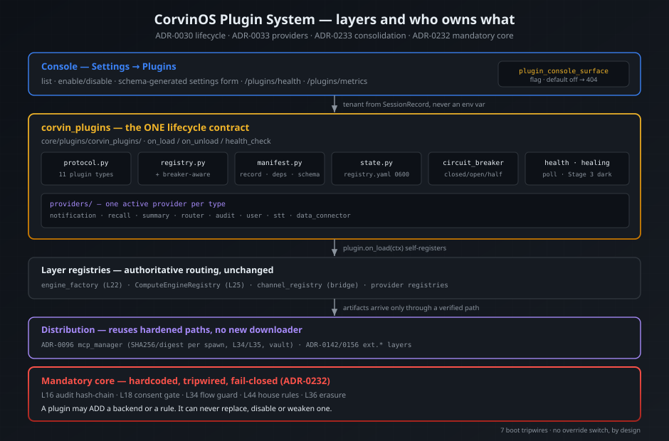
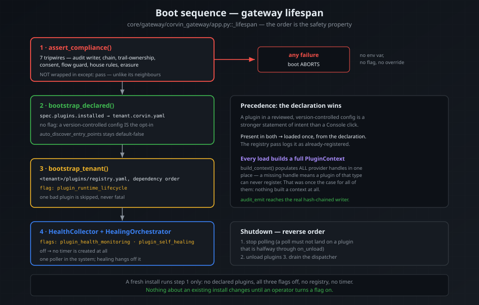
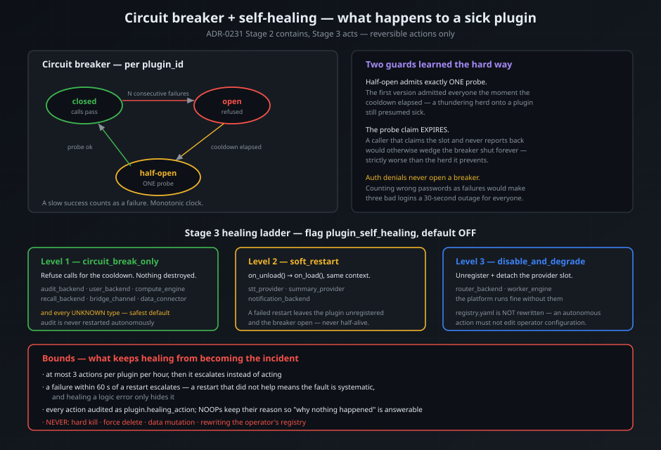

# Plugin System — Architecture



CorvinOS is extended by **plugins**: a Python class that implements one lifecycle
contract and registers itself with the layer it extends. This document is the
complete picture — the contract, the two load paths, what happens when a plugin
misbehaves, and the compliance boundary that no plugin can cross.

For the four *declarative* extension surfaces (personas, Forge tools, SkillForge
skills, bridge config) see [Plugin System](plugin-system.md). Those need no code.
This document is about the code path.

**Decisions of record:** ADR-0030 (lifecycle contract), ADR-0033 (provider abstractions), ADR-0233 (consolidation), ADR-0231 (compartmentalization, health, healing), ADR-0232 (mandatory core), ADR-0124 (runtime-extensibility invariants). See Corvin-ADR repo for details.

---

## 1. The contract

A plugin implements **two** things: the lifecycle protocol, and the capability
protocol of the layer it extends.

```python
from corvin_plugins.protocol import HealthStatus, PluginContext

class MyNotifier:
    plugin_id    = "com.example.my-notifier"   # reverse-domain, lower-case
    plugin_type  = "notification_backend"      # one of KNOWN_PLUGIN_TYPES
    version      = "1.0.0"
    display_name = "My Notifier"

    # ── lifecycle (ADR-0030) ─────────────────────────────────────────────
    def on_load(self, ctx: PluginContext) -> None:
        # Self-register with the layer registry via the handles on ctx.
        ctx.notification_registry.set_active(self)

    def on_unload(self) -> None:
        ...                       # close connections, flush queues

    def health_check(self) -> HealthStatus:
        return HealthStatus(ok=True, message="ok")   # must return within 2 s

    # ── capability (ADR-0033) ────────────────────────────────────────────
    def notify(self, event, payload, *, tenant_id="_default", severity="info"):
        ...
```

`plugin_id` is validated against an allowlist (`[a-z0-9][a-z0-9._-]{0,63}`, no `..`)
because it is also used as a directory name. A denylist that only rejected `/`
once let `..\..\etc` through, which is a real traversal on Windows and lands in
`shutil.rmtree` on uninstall.

### The eleven extension points

| `plugin_type` | Layer | Registers with |
|---|---|---|
| `worker_engine` | L22 | `engine_factory` |
| `compute_engine` | L25 | `ComputeEngineRegistry` |
| `bridge_channel` | Bridge | `channel_registry` |
| `stt_provider` | L23 | `providers.stt_provider` |
| `data_connector` | L24 | `providers.data_connector` |
| `audit_backend` | L16 | `providers.audit_backend` |
| `user_backend` | L18–21 | `providers.user_backend` |
| `notification_backend` | L3+ | `providers.notification_backend` |
| `recall_backend` | L28 | `providers.recall_backend` |
| `summary_provider` | L11 | `providers.summary_provider` |
| `router_backend` | L5 | `providers.router_backend` |

`build_context()` populates **every** handle in one place. A missing handle means a
plugin of that type can never register — which was the case for all of them at one
point, because nothing constructed a context at all.

---

## 2. How a plugin gets loaded



Two paths, and the order matters.

### Declarative — `spec.plugins.installed`

```yaml
# <corvin_home>/tenants/<tid>/global/tenant.corvin.yaml
spec:
  plugins:
    installed:
      - id: com.example.my-notifier
        class_path: my_package.my_module:MyNotifier
        config:
          channel: ops
    auto_discover_entry_points: false   # default
```

Loaded **unconditionally at boot**, with no feature flag: writing a plugin into a
version-controlled tenant config *is* the explicit opt-in ADR-0030 asks for.
`auto_discover_entry_points: true` additionally loads every installed
`corvin.plugins` entry point — it stays default-false, because on a machine with
third-party packages around, flipping it means loading code nobody listed.

### Runtime — the per-tenant registry

```
<corvin_home>/tenants/<tid>/plugins/
├── registry.yaml            # records: atomic write, mode 0600
└── instances/<plugin_id>/   # per-plugin state, removed on uninstall
```

Managed from **Settings → Plugins** and gated on `plugin_runtime_lifecycle`. With
the flag off the registry is read-only at runtime.

### Precedence

**The declaration wins.** A plugin in a reviewed, version-controlled config is a
stronger statement of intent than a Console click. A plugin present in both loads
exactly once, from the declaration; the registry pass logs it as already-registered
rather than colliding.

### Hot-reload

`enable()` loads and registers in the same call; `disable()` unregisters and clears
the provider slot. A failed `on_load()` **rolls the enable back on disk** — the
registry never claims an active plugin that is not running. Before this, enable
only wrote a flag: the toggle showed on while the plugin stayed inert until the next
boot, which is a false display, not a delay.

---

## 3. Settings without UI code

A plugin declares a JSON Schema; the Console renders the form from it and the
backend re-validates against the same schema before persisting. A rejected write
leaves the previous configuration intact.

```json
{
  "type": "object",
  "properties": {
    "channel": {"type": "string", "title": "Channel", "default": "ops"},
    "depth":   {"type": "integer", "minimum": 1, "maximum": 5, "default": 3},
    "verbose": {"type": "boolean", "default": false}
  },
  "required": ["channel"],
  "additionalProperties": false
}
```

String → text, enum → select, bounded integer → slider, boolean → checkbox, object →
nested fieldset. A shape the form cannot render is shown read-only rather than
dropped, because a setting the operator cannot see is worse than an ugly one.

---

## 4. Compliance boundary — additive only

This is the part that constrains everything else. **A plugin may add. It can never
replace, disable or weaken a mandatory mechanism** (ADR-0232, ADR-0233 D4).

### Audit

Core writes every event to its own hash-chained `audit.jsonl` **first and
unconditionally**. Only afterwards does `audit.py` hand a *copy* to an installed
`audit_backend`:

```
write_event(hash_chain=True)   →  committed
        ↓
providers.audit_backend.fanout(event, details)   ← a plugin sees it here
```

By the time a plugin runs, the compliance-relevant write has already happened. A
buggy, slow or hostile backend cannot suppress, rewrite, reorder or delay it.

**Fan-out is a hand-off, not a call.** The core enqueues the copy and returns; a
daemon thread delivers it. Without that, a backend with a 400 ms `fanout()` added
2.07 s to five `audit_event()` calls — it slowed every bridge turn, login and tool
use. The queue is bounded (4096); when a sink cannot keep up the *oldest monitoring
copy* is dropped, because the authoritative record is already on disk while a
blocked caller is an outage of every audited action. A sink slower than 2 s per
event is counted as a breaker failure, so a backend that never raises but crawls is
still visible.

Both the delivery function and the drain loop are fully guarded: if that thread
died, every later copy would sit in the queue and monitoring would go silent with no
signal at all.

On shutdown the gateway flushes the queue **before** unloading plugins — `on_unload()`
detaches the backend and discards the queue on purpose, so without the flush every
clean shutdown lost whatever was pending. The flush waits on the *unfinished-task*
count, not on the queue being empty: an empty queue only means the worker has picked
the last item up, and returning there dropped the copy in flight. It is bounded, and
the bound is real because the caller never delivers anything itself — a version that
did made the timeout a lie, letting one wedged sink hold the shutdown open for 30 s
against a 0.5 s limit. The fan-out call also sits *outside* the core write's `try/except` —
inside it, a leak was logged as "audit_event dropped" although the record had
committed, which is a false compliance alarm on a healthy chain.

### Users

`providers.user_backend` has **no default backend**: `get_active()` returning `None`
means "core auth is responsible". `authenticate()` collapses exception, timeout,
non-dict and missing `user_id` into `None` = **deny**, and strips secret-shaped keys
from the principal. There is no guest fallback anywhere.

**All of which is unreached (verified 2026-07-27).** No caller exists because no
credential auth path exists — see the "Never invoked" section below. The deny
semantics are implemented and unit-tested; they bind the first credential login
that is built. On today's surfaces the "never guest" invariant has no subject,
because a localhost-only login admits no guest to fall back to.

### Boot tripwires

`assert_compliance()` runs eight checks. Seven **abort the boot** on failure; one
records and reports. There is no override on either — no env var, no config key, no
flag.

| Layer | Tripwire | Fails when | On failure |
|---|---|---|---|
| L16 | `audit_writer_reachable` | the audit directory is not writable | aborts boot |
| L16 | `audit_chain_intact` | the **last 200** records do not chain | aborts boot |
| L16 | `audit_chain_history_clean` | any record in the file does not verify | **records + reports** |
| L16 | `core_audit_owns_the_trail` | the audit provider grew a trail-owning API | aborts boot |
| L18 | `consent_gate_denies_by_default` | `is_granted` admits an unknown uid, or the TTL cap is gone | aborts boot |
| L34 | `flow_guard_present` | `DataFlowGuard` / `DataFlowDenied` is missing | aborts boot |
| L44 | `house_rules_gate_intact` | the policy integrity hash fails | aborts boot |
| L36 | `erasure_orchestrator_present` | the subject-id validator accepts an empty id | aborts boot |

They are deliberately cheap: no model call, no network. One of them was written
with inverted logic first — it treated `is_granted`'s `(granted, reason)` tuple as a
boolean, which is always truthy, and being fail-closed it would have blocked *every*
boot. **A fail-closed check with inverted logic is a denial of service, not a safety
net.**

**Why the chain check is split** (see ADR-0234 in Corvin-ADR repo).
`audit_chain_intact` started as a full-file verify, and on the maintainer's own
machine it made CorvinOS unbootable: the live chain carries a historical HMAC
key-mismatch window (380 records, ~77 000 records before the tail), so the gate fired
on every boot. The log is append-only, so that break is permanent — the "safety
state" was permanent too, the trail stopped entirely, and the only escape was
deleting the audit log. A gate whose only escape is destroying evidence incentivises
destroying evidence.

So the boot gate asks "**is the writer sound right now**" (the tail chains), and a
second, reporting-only check asks "**has this file ever been broken**". A failure of
the second is not silenced: `assert_all()` appends a `compliance.chain_discontinuity`
event *into the chain* on every boot — before any blocking check raises, so the
finding is itself tamper-evident — it surfaces in the Console, and `voice-audit
verify` still exits 1. What changed is only whether it takes the platform down.
Tampering with an old record is still detected and recorded; it is no longer a
denial-of-service primitive.

### Flow declarations

Every record declares where it runs and what it talks to, in L34's vocabulary:

| Field | Values | Default |
|---|---|---|
| `locality` | `local` · `eu_cloud` · `us_cloud` · `unknown` | `unknown` |
| `network_egress` | `none` · `local` · `external` | `external` |
| `egress_hosts` | declared hosts (L35) | `[]` |

The defaults are the **least trusted** combination. `enable()` refuses a community
plugin that wants the open internet without naming a host, and refuses high-PII with
unknown locality. A cloud locality with `network_egress: none` is rejected at
construction — that contradiction is a MUST NOT in ADR-0124.

### Consent

A plugin whose `origin` is `community`, or whose declared `pii_risk` is `high`,
cannot be enabled without an explicit confirmation, and the grant is recorded in the
audit chain (GDPR Art. 6, 7).

---

## 5. When a plugin misbehaves



### Containment (always on)

Each plugin has a circuit breaker: closed → open → half-open, keyed by `plugin_id`,
on a monotonic clock. A slow success counts as a failure, because a plugin that
takes 30 s to answer correctly is still an outage. Half-open admits **exactly one**
probe, and that claim **expires** — a caller that claims the slot and never reports
back would otherwise wedge the breaker shut forever, which is strictly worse than
the thundering herd the slot prevents.

Auth *denials* never open a breaker. Counting wrong passwords as failures would turn
three bad logins into a 30-second outage for everyone.

### Health (flag: `plugin_health_monitoring`)

A collector polls `health_check_all()` on an interval, keeps the latest snapshot,
and writes `plugin.health_alert` to the audit chain after N consecutive failures
(once per streak) plus `plugin.health_recovered` when it clears. With the flag off,
**no timer is created at all**; the health route still answers from breaker state.

`GET /plugins/metrics` serves Prometheus 0.0.4 text — health, consecutive failures,
check duration, breaker state and counters. `plugin_id` is a label but capped at 64
distinct values, because unbounded cardinality is its own outage.

### Healing (flag: `plugin_self_healing`, default off)

Three **reversible** actions, chosen per plugin:

| Policy | Action | Default for |
|---|---|---|
| `circuit_break_only` | refuse calls for the cooldown | audit, user, compute, recall, bridge, data_connector — **and every unknown type** |
| `soft_restart` | `on_unload()` → `on_load()`, same context | stt, summary, notification |
| `disable_and_degrade` | unregister + detach the provider slot | router, worker engine |
| `none` | opt out entirely | — |

Bounded so that healing cannot become the incident: at most 3 actions per plugin per
hour, and a failure within 60 s of a restart **escalates instead of restarting
again** — a restart that did not help means the fault is systematic, and healing a
logic error only hides it. Every action is audited; NOOPs keep their reason so "why
did nothing happen" is answerable from the history.

**Never**: hard kill, force delete, data mutation, or rewriting `registry.yaml`. An
autonomous action must not edit the operator's configuration; re-enabling is a human
act. A test greps the module for `os.kill`, `SIGKILL`, `rmtree` and `TenantRegistry`
so this cannot regress.

**Why it ships dark.** ADR-0231 approves Stages 1–2 and gates Stage 3 on Stage 2
being stable for a release. A default-off flag is how that gate is honoured: the
mechanism is present, tested and provably working, and the operator enables it once
they have the evidence the ADR asks for. Turn it on in **Settings → Features**.

Stage 4 (LDD-tuned healing policies) is **not built** and should not be until there
is production MTTR data to tune against. Auto-tuning from invented numbers would
repeat a mistake this project has already made once.

---

## 6. Observability

`core/observability/corvin_logging/` emits one JSON record per event:

```json
{"timestamp":"2026-07-26T10:30:45.123Z","level":"ERROR","component":"plugins",
 "plugin_id":"acme-notify","tenant_id":"_default","correlation_id":"req-a1b2c3d4",
 "operation":"health_check","error_code":"TimeoutError","recovered":false,
 "message":"health_check failed","context":{"breaker":{"state":"open"}}}
```

`error_code` carries the exception **class**, never `str(exc)`. A PII scrubber
redacts email addresses, tokens, JWTs, URL credentials, IBANs, card numbers, SSNs
and non-loopback IPs, and marks the record `pii_redacted: true` — it redacts rather
than raising, because a logger that raises fails the work it was describing.

Correlation state uses `contextvars`, not a thread-local: the gateway, console and
adapter are asyncio, so many tasks share one thread and a thread-local id leaks
between concurrent requests.

**The same gate covers `health_check()`'s own return value.** Reducing the exception
path to a class name is only half the surface: a plugin returning
`HealthStatus(ok=False, message="auth failed for alice@corp.com")` is the *normal*
path, and that text reaches the hash-chained audit log (`plugin.health_alert`,
`plugin.healing_action`), the Console and the log stream. The audit chain is
append-only — rewriting `audit.jsonl` breaks the chain — so a leak there is
permanent. `health_check_all()` therefore scrubs the plugin's `message` and its
free-form `details` dict at the single call site, caps the message at 240
characters, and merges the trusted breaker stats on top afterwards. If the scrubber
is unavailable the text is **dropped**, not forwarded: losing a diagnostic string is
recoverable, an un-redactable audit record is not.

The package is deliberately **not** called `logging` — a package with that name
shadows the standard library the moment its parent lands on `sys.path`.

---

## 7. Distribution

There is no new downloader, by decision (ADR-0233 D3). Artifacts arrive through
paths that already verify them:

- **tool-shaped** extensions through ADR-0096's `mcp_manager`: npm/pip/GitHub/Docker/local with SHA256 and digest pinning verified
  **on every spawn**, L34 locality, L35 egress, vault secret injection, and a
  fail-closed `mcp_plugin.spawn_blocked`;
- **layer-shaped** extensions through ADR-0142 / ADR-0156: the `ext.<vendor>.*` namespace with a capability tier and a license gate. (See Corvin-ADR repo for details.)

An installer that downloads and executes third-party code is the highest-blast-radius
feature class in this repo; the failure mode is remote code execution. A marketplace
*catalog surface* on top of those paths is possible and needs its own ADR — a
marketplace *installer* beside them is not.

**Vocabulary:** "tier" always means ADR-0156's capability boundary (with its license
consequence). Provenance is a separate field, `origin ∈ {builtin, vetted,
community}`. Three different meanings of "Tier A/B/C" existed before that rule.

---

## 8. Writing one

Nine templates live in `core/plugins/templates/` — worker engine, compute engine,
bridge channel, notification, recall, summary, router, audit backend, user backend.
Each carries the invariants for its type in comments (an audit backend must not
block, a user backend must deny on error, and so on). `test_template_conformance.py`
imports every one of them and checks it against the live protocol, so a template
that drifts fails here rather than on an author's machine.

### `corvin plugin` (ADR-0244)

```bash
corvin plugin types              # what can I build — and will anything call it?
corvin plugin new <type> <id>    # scaffold from the shipped template
corvin plugin check <path>       # would the registry accept this?
corvin plugin check <path> --no-import   # manifest only, do not execute plugin.py
```

`corvin plugin new` writes `plugin.py`, `plugin.yaml` (least-privileged defaults:
`layer: installed`, `origin: community`), a `pyproject.toml` carrying the
`corvin.plugins` entry point, and a README. `corvin plugin check` runs the **real**
`PluginRecord` invariants, the protocol checks, and a registration into a
throwaway registry — it holds no copy of any rule, is advisory only, and never
writes to the audit chain. Errors mean the registry would reject the plugin;
warnings do not affect the exit code, and there is no `--strict` or `--force`
(ADR-0247).

The code-level checks **import and execute `plugin.py`**, which is unavoidable:
no static analysis substitutes for `registry.register()` accepting the class.
Use `--no-import` when reviewing a plugin you do not yet trust — it checks the
manifest only and says so rather than reporting a bare "OK".

There is no `corvin plugin list`: live plugin state belongs to the running gateway,
and answering from the CLI process would show an empty registry and read as
"nothing installed". Use the health route below.

### Provenance and operator consent (ADR-0249)

A plugin is in-process Python. Once loaded it runs with the privileges of the
process holding the audit writer, the consent gate and the tenant keys.

> **A manifest is a declaration, not a sandbox.** `network_egress: none` records
> what the author *says*. It is not enforced by the interpreter. This model buys
> **attribution, not containment** — real containment needs the subprocess
> isolation of ADR-0241.

| `origin` | Meaning | Requirement |
|---|---|---|
| `builtin` | Ships in the wheel | In-tree, maintainer-reviewed |
| `vetted` | Reviewed and signed | Ed25519 over the manifest digest from a **pinned** trust anchor |
| `community` | Unreviewed | Explicit per-plugin operator approval, audited |

The signing construction is `awpkg`'s (Ed25519 over the SHA-256 digest of the
canonical JSON with `signature` removed, fail-closed) — **not** ADR-0141's LIP,
which is RS256 against a different anchor. With one addition: `awpkg` verifies
against the key *inside* the manifest, which proves tamper-freedom but not
provenance. For `vetted`, the key must also be pinned via
`~/.corvin/global/plugin_trust_anchors.txt` or `CORVIN_PLUGIN_TRUST_ANCHORS`.
**No anchor ships**, so nothing reaches `vetted` until the maintainer deposits
one — a key committed to a public repo is not a trust anchor.

Enforcement sits behind `spec.features.plugin_trust_enforcement`, **default off**.
Off means the verdict is still computed and shown, but nothing is refused, so an
existing install with community plugins boots unchanged. On means a `vetted`
claim without a valid pinned signature is **refused, never downgraded** (a
stripped signature must not become a quiet demotion), and a `community` plugin
needs a per-plugin approval — not a blanket "allow community" switch, because the
operator who flips that in month one is not the one who inherits the tenth plugin
in month nine. The gate runs in `_load_one` **before** `load_from_class_path`,
since a check after the import asks "may we run this?" about running code.

### Start by checking whether your type is called

**Six of the eleven plugin types register successfully and are never invoked.**
A plugin of one of those types loads, registers, reports healthy, appears in the
Console — and nothing ever calls it. There is no error and no log line.

**Consumed (6).** `router_backend`, `summary_provider`, `notification_backend` and
`recall_backend` are all called from `operator/bridges/shared/adapter.py`;
`audit_backend` from the gateway; `compute_engine` from the compute worker
(`corvin_compute/cli.py`), which is a different PROCESS — the one that
dispatches engines.

**Never invoked (5),** for **three** different reasons — re-verified 2026-07-27,
when a re-audit found the earlier "two reasons" over-generalised and false for
three of the six rows. `compute_engine` has since left this list; its entry is
kept below because how it left is the useful part:

- `stt_provider`, `data_connector` — registry and ctx handle exist and are
  populated; nothing outside `corvin_plugins` calls `get_active()`. L23 and L24
  each resolve their own chain and never ask the registry. **This is the only
  group where wiring the call site is the whole fix.**
- `user_backend` — **its consumer does not exist.** Not "someone forgot to call
  it": CorvinOS has no credential auth path. The only live login is
  localhost-only and credential-less (the TCP peer *is* the authorisation), the
  `/auth/login` in `gateway/console_api.py` is dead demo code imported by
  nothing, and OIDC is unbuilt. Handing empty credentials to a correctly-written
  backend yields a rejection, rejection means deny, and deny on the only login
  path locks the operator out of their own install. See
  [`PLUGIN_SYSTEM_ACTIVATION_PLAN.md`](implementation/PLUGIN_SYSTEM_ACTIVATION_PLAN.md)
  Stage 2.
- `compute_engine` — **live since 2026-07-27**, and it moved out of this list
  the hard way. The line above used to say "the genuine unpassed-handle case…
  one line at the call site", and that was wrong: `corvin_compute.engine_registry`
  had no reader (`WorkerServer` dispatches through its own `_extra_engines`, and
  `register_engine()` had no production caller), and it was in the wrong process
  — `WorkerServer` is constructed only in the `corvin-compute worker`
  subprocess. The fix loads `compute_engine` plugins **in the worker**, filtered
  to that one type so the compute process does not also start the tenant's
  bridge daemons. See `corvin_compute/cli.py::_load_compute_engine_plugins`.
- `worker_engine`, `bridge_channel` — **the target does not exist.** L22's
  `engine_registry.py` builds engines from a hard-coded `_ENGINE_BUILDERS` dict
  and has no `register()`; there is no `channel_registry` class anywhere in the
  tree. Passing the handle would change nothing. Both are the design question
  ADR-0245 deferred, not activation work.

The distinction is load-bearing for anyone reading `surface_map.py`: for three of
these rows, "pass the handle" is an instruction that does nothing.

`corvin plugin types` prints this, `corvin plugin check` warns on it, and
`corvin plugin new` warns before you write a line. The map lives in
`corvin_plugins/surface_map.py` and `test_surface_map.py` verifies every column
against the tree — including a test that fails when a dead type becomes live, so
the map cannot quietly keep calling a working mechanism dead.

```bash
# 1. corvin plugin new <type> <id>   (or copy a template by hand)
# 2. declare it (no flag needed):
#    spec.plugins.installed: [{id: ..., class_path: ...}]
#    — an entry point ALONE is not enough: spec.plugins.auto_discover_entry_points
#      defaults to false, and an unresolvable plugin is skipped at debug level
# 3. or install it at runtime with plugin_runtime_lifecycle on:
#    Settings → Plugins → Install
# 4. watch it:
curl -s localhost:8765/v1/console/plugins/health | jq
curl -s localhost:8765/v1/console/plugins/metrics
```

**Must NOT**, for any plugin: import `anthropic` directly (CI AST lint enforces),
put message content or PII into a notification payload, store un-redacted text in a
recall backend, let a router backend raise, or reach the core audit chain.

→ Technical reference: [Layer Plugins](claude-ref/layer-plugins.md) ·
Declarative surfaces: [Plugin System](plugin-system.md) ·
Compliance baseline: [Audit & Compliance](audit-and-compliance.md)
